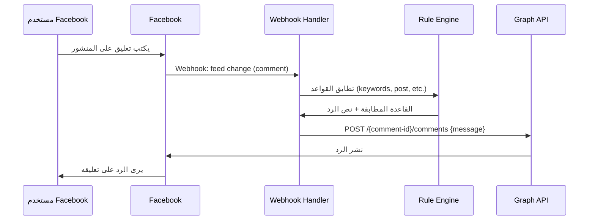

# 📄 واجهة برمجة صفحات Facebook (Pages API)

> مرجع شامل لجميع Endpoints المتعلقة بصفحات Facebook — المنشورات، التعليقات، الاشتراكات، وتعليقات Instagram لمشروع Hubqa.

---

## جدول المحتويات

- [نظرة عامة](#نظرة-عامة)
- [الصلاحيات المطلوبة](#الصلاحيات-المطلوبة)
- [الحصول على قائمة الصفحات](#الحصول-على-قائمة-الصفحات)
- [تفاصيل الصفحة](#تفاصيل-الصفحة)
- [المنشورات: Feed vs Posts](#المنشورات-feed-vs-posts)
- [قراءة التعليقات](#قراءة-التعليقات)
- [الرد على التعليقات](#الرد-على-التعليقات)
- [اشتراك Webhooks للصفحة](#اشتراك-webhooks-للصفحة)
- [تعليقات Instagram](#تعليقات-instagram)
- [في مشروعنا (Hubqa)](#في-مشروعنا-hubqa)

---

## نظرة عامة

Pages API تتيح لك إدارة صفحات Facebook برمجياً:

- قراءة المنشورات والتعليقات
- الرد على التعليقات
- الاشتراك بالـ Webhooks لتلقي الإشعارات الفورية
- الحصول على إحصائيات الصفحة

**Base URL:**
```
https://graph.facebook.com/v25.0
```

---

## الصلاحيات المطلوبة

| الصلاحية | الوصف | متى تحتاجها |
|----------|-------|-------------|
| `pages_show_list` | عرض قائمة صفحات المستخدم | عند استدعاء `/me/accounts` |
| `pages_manage_metadata` | إدارة إعدادات الصفحة | اشتراك Webhooks |
| `pages_read_engagement` | قراءة التعليقات والتفاعلات | قراءة التعليقات على المنشورات |
| `pages_manage_engagement` | إدارة التعليقات والتفاعلات | الرد على التعليقات |
| `pages_messaging` | إرسال واستقبال رسائل Messenger | الرسائل الخاصة والردود |
| `pages_manage_posts` | إنشاء وتعديل المنشورات | نشر محتوى على الصفحة |

> [!IMPORTANT]
> جميع هذه الصلاحيات تتطلب **App Review** من Meta قبل استخدامها في بيئة الإنتاج. في وضع التطوير، تعمل فقط مع المستخدمين المضافين كـ testers/admins في التطبيق.

---

## الحصول على قائمة الصفحات

### `GET /me/accounts` — صفحات المستخدم

يُرجع جميع الصفحات التي يديرها المستخدم مع Page Access Tokens الخاصة بكل صفحة.

```bash
GET https://graph.facebook.com/v25.0/me/accounts?fields=id,name,access_token,category,picture&access_token=USER_TOKEN
```

### الاستجابة

```json
{
  "data": [
    {
      "id": "123456789012345",
      "name": "متجر Hubqa",
      "access_token": "EAAGm0PX4ZCpsBAxxxxxxxxxxxxxxxxxxxxxxxxxxxxxxxxxxxxxxxxxxxxxxx",
      "category": "E-commerce website",
      "picture": {
        "data": {
          "url": "https://scontent.xx.fbcdn.net/v/t1.6435-1/..."
        }
      }
    },
    {
      "id": "987654321098765",
      "name": "خدمة عملاء Hubqa",
      "access_token": "EAAGm0PX4ZCpsBAyyyyyyyyyyyyyyyyyyyyyyyyyyyyyyyyyyyyyyyyyyyyyyy",
      "category": "Product/service",
      "picture": {
        "data": {
          "url": "https://scontent.xx.fbcdn.net/v/t1.6435-1/..."
        }
      }
    }
  ],
  "paging": {
    "cursors": {
      "before": "MTIzNDU2Nzg5",
      "after": "OTg3NjU0MzIx"
    }
  }
}
```

> [!NOTE]
> الـ Page Token المُستخرج من Long-Lived User Token **لا تنتهي صلاحيته** طالما User Token الأصلي صالح. راجع [03-oauth-login.md](./03-oauth-login.md) لتفاصيل التوكنات.

---

## تفاصيل الصفحة

### `GET /{page-id}` — معلومات الصفحة

```bash
GET https://graph.facebook.com/v25.0/{page-id}?fields=name,about,picture,fan_count,category,website,link,phone,emails&access_token=PAGE_TOKEN
```

### الاستجابة

```json
{
  "id": "123456789012345",
  "name": "متجر Hubqa",
  "about": "منصة الرد التلقائي للأعمال",
  "picture": {
    "data": {
      "height": 100,
      "is_silhouette": false,
      "url": "https://scontent.xx.fbcdn.net/v/t1.6435-1/...",
      "width": 100
    }
  },
  "fan_count": 15420,
  "category": "E-commerce website",
  "website": "https://hubqa.com",
  "link": "https://www.facebook.com/hubqa",
  "phone": "+966xxxxxxxxx",
  "emails": ["support@hubqa.com"]
}
```

### الحقول المتاحة

| الحقل | النوع | الوصف |
|-------|-------|-------|
| `id` | string | معرّف الصفحة الفريد |
| `name` | string | اسم الصفحة |
| `about` | string | وصف الصفحة |
| `picture` | object | صورة الصفحة |
| `fan_count` | integer | عدد المعجبين (اللايكات) |
| `category` | string | تصنيف الصفحة |
| `website` | string | رابط الموقع |
| `link` | string | رابط الصفحة على Facebook |
| `phone` | string | رقم الهاتف |
| `emails` | array | البريد الإلكتروني |
| `followers_count` | integer | عدد المتابعين |
| `new_like_count` | integer | اللايكات الجديدة |

---

## المنشورات: Feed vs Posts

### الفرق بين `/feed` و `/posts`

| Endpoint | ما يُرجعه |
|----------|-----------|
| `GET /{page-id}/feed` | **كل** المنشورات: منشورات الصفحة + منشورات الزوار على الصفحة |
| `GET /{page-id}/posts` | **فقط** منشورات الصفحة نفسها (بدون منشورات الزوار) |

> [!TIP]
> في مشروع Hubqa، نستخدم `/posts` غالباً لأننا نريد منشورات الصفحة فقط لإعداد قواعد الرد التلقائي.

### `GET /{page-id}/feed` — جميع المنشورات

```bash
GET https://graph.facebook.com/v25.0/{page-id}/feed?fields=id,message,created_time,from,type,permalink_url,attachments{media_type,url,title}&limit=25&access_token=PAGE_TOKEN
```

### `GET /{page-id}/posts` — منشورات الصفحة فقط

```bash
GET https://graph.facebook.com/v25.0/{page-id}/posts?fields=id,message,created_time,type,permalink_url,full_picture,attachments{media_type,url,title}&limit=25&access_token=PAGE_TOKEN
```

### الاستجابة

```json
{
  "data": [
    {
      "id": "123456789012345_111222333444555",
      "message": "عرض خاص! خصم 50% على جميع الخطط 🎉",
      "created_time": "2026-07-15T10:30:00+0000",
      "type": "photo",
      "permalink_url": "https://www.facebook.com/hubqa/posts/111222333444555",
      "full_picture": "https://scontent.xx.fbcdn.net/v/...",
      "attachments": {
        "data": [
          {
            "media_type": "photo",
            "url": "https://www.facebook.com/photo/...",
            "title": "عرض خاص"
          }
        ]
      }
    }
  ],
  "paging": {
    "cursors": {
      "before": "Q2c4TUxxxxxxxxxxx",
      "after": "Q2c4TUyyyyyyyyyyy"
    },
    "next": "https://graph.facebook.com/v25.0/123456789/posts?after=Q2c4TUyyyyyyyyyyy"
  }
}
```

### Post ID Format

```
{page-id}_{post-id}
مثال: 123456789012345_111222333444555
```

> [!NOTE]
> معرّف المنشور يتكون دائماً من `{page-id}_{post-id}`. تحتاج المعرّف الكامل في جميع الاستدعاءات.

---

## قراءة التعليقات

### `GET /{post-id}/comments` — تعليقات المنشور

```bash
GET https://graph.facebook.com/v25.0/{post-id}/comments?fields=id,message,from{id,name,picture},created_time,like_count,comment_count,attachment,parent&order=reverse_chronological&filter=stream&access_token=PAGE_TOKEN
```

### المعاملات

| المعامل | القيم | الوصف |
|---------|-------|-------|
| `order` | `reverse_chronological` (افتراضي), `chronological` | ترتيب التعليقات |
| `filter` | `stream` (افتراضي), `toplevel` | `toplevel` يُرجع تعليقات المستوى الأول فقط (بدون ردود) |
| `limit` | 1-100 | عدد النتائج في الصفحة |
| `summary` | `true` | إضافة ملخص العدد الكلي |

### الاستجابة

```json
{
  "data": [
    {
      "id": "111222333444555_666777888999000",
      "message": "كم السعر؟ 💰",
      "from": {
        "id": "999888777666555",
        "name": "أحمد محمد",
        "picture": {
          "data": {
            "url": "https://scontent.xx.fbcdn.net/v/..."
          }
        }
      },
      "created_time": "2026-07-15T11:45:00+0000",
      "like_count": 3,
      "comment_count": 1,
      "attachment": null,
      "parent": null
    },
    {
      "id": "111222333444555_777888999000111",
      "message": "ممتاز! أريد الاشتراك",
      "from": {
        "id": "888777666555444",
        "name": "سارة أحمد"
      },
      "created_time": "2026-07-15T12:00:00+0000",
      "like_count": 0,
      "comment_count": 0
    }
  ],
  "paging": {
    "cursors": {
      "before": "WTI5dGJXVnVkRjlqxxxxxx",
      "after": "WTI5dGJXVnVkRjlqyyyyyy"
    }
  },
  "summary": {
    "total_count": 42,
    "can_comment": true
  }
}
```

### قراءة الردود على تعليق معين

```bash
# الردود على تعليق (comment replies)
GET https://graph.facebook.com/v25.0/{comment-id}/comments?fields=id,message,from,created_time&access_token=PAGE_TOKEN
```

---

## الرد على التعليقات

### `POST /{comment-id}/comments` — الرد على تعليق Facebook

```bash
POST https://graph.facebook.com/v25.0/{comment-id}/comments
Content-Type: application/json

{
  "message": "شكراً لسؤالك! السعر 99 ريال شهرياً 🎉",
  "access_token": "PAGE_TOKEN"
}
```

### الاستجابة

```json
{
  "id": "111222333444555_888999000111222"
}
```

### الرد على تعليق بصورة

```bash
POST https://graph.facebook.com/v25.0/{comment-id}/comments
Content-Type: application/json

{
  "message": "إليك قائمة الأسعار 👇",
  "attachment_url": "https://example.com/prices.jpg",
  "access_token": "PAGE_TOKEN"
}
```

> [!WARNING]
> الصفحة يمكنها فقط الرد على التعليقات في منشوراتها الخاصة. لا يمكن الرد على تعليقات في صفحات أخرى.

### نشر تعليق جديد (ليس رد)

```bash
POST https://graph.facebook.com/v25.0/{post-id}/comments
Content-Type: application/json

{
  "message": "تعليق جديد على المنشور",
  "access_token": "PAGE_TOKEN"
}
```

---

## اشتراك Webhooks للصفحة

### `POST /{page-id}/subscribed_apps` — الاشتراك

يربط تطبيقك بالصفحة لتلقي إشعارات Webhooks.

```bash
POST https://graph.facebook.com/v25.0/{page-id}/subscribed_apps
Content-Type: application/json

{
  "subscribed_fields": "messages,messaging_postbacks,feed,message_reactions",
  "access_token": "PAGE_TOKEN"
}
```

### الاستجابة

```json
{
  "success": true
}
```

### الحقول المتاحة للاشتراك

| الحقل | الوصف | مطلوب لمشروعنا؟ |
|-------|-------|------------------|
| `messages` | رسائل Messenger الواردة | ✅ نعم |
| `messaging_postbacks` | ردود الأزرار والقوائم | ✅ نعم |
| `feed` | تغييرات المنشورات والتعليقات | ✅ نعم |
| `message_reactions` | ردود الفعل على الرسائل | ✅ نعم |
| `messaging_referrals` | إحالات من الإعلانات | اختياري |
| `messaging_optins` | اشتراكات المستخدمين | اختياري |
| `messaging_handovers` | تسليم المحادثة | اختياري |
| `mention` | الإشارات للصفحة | اختياري |

### في مشروعنا — الاشتراك

```typescript
// channels.service.ts — سطر 297-299
await axios.post(
  `${GRAPH_API_BASE}/${pageId}/subscribed_apps`,
  {
    subscribed_fields: 'messages,messaging_postbacks,feed,message_reactions',
    access_token: pageToken,
  }
);
```

### `GET /{page-id}/subscribed_apps` — التحقق من الاشتراك

```bash
GET https://graph.facebook.com/v25.0/{page-id}/subscribed_apps?access_token=PAGE_TOKEN
```

### الاستجابة

```json
{
  "data": [
    {
      "id": "APP_ID",
      "name": "Hubqa",
      "subscribed_fields": [
        "messages",
        "messaging_postbacks",
        "feed",
        "message_reactions"
      ]
    }
  ]
}
```

### `DELETE /{page-id}/subscribed_apps` — إلغاء الاشتراك

```bash
DELETE https://graph.facebook.com/v25.0/{page-id}/subscribed_apps?access_token=PAGE_TOKEN
```

```json
{
  "success": true
}
```

---

## تعليقات Instagram

### الرد على تعليق Instagram

```bash
POST https://graph.facebook.com/v25.0/{ig-comment-id}/replies
Content-Type: application/json

{
  "message": "شكراً لتعليقك! تواصل معنا عبر الرسائل الخاصة 📩",
  "access_token": "PAGE_TOKEN"
}
```

### الاستجابة

```json
{
  "id": "17858893269xxxxxx"
}
```

### نشر تعليق على منشور Instagram

```bash
POST https://graph.facebook.com/v25.0/{ig-media-id}/comments
Content-Type: application/json

{
  "message": "تعليق جديد على المنشور ✨",
  "access_token": "PAGE_TOKEN"
}
```

### الفرق بين Facebook و Instagram في الردود

| العملية | Facebook Endpoint | Instagram Endpoint |
|---------|-------------------|-------------------|
| رد على تعليق | `POST /{comment-id}/comments` | `POST /{ig-comment-id}/replies` |
| تعليق جديد | `POST /{post-id}/comments` | `POST /{ig-media-id}/comments` |
| قراءة تعليقات | `GET /{post-id}/comments` | `GET /{ig-media-id}/comments` |

> [!IMPORTANT]
> لاحظ أن Instagram يستخدم `/replies` بينما Facebook يستخدم `/comments` للردود. هذا الفرق مهم في بناء URL الرد.

### في مشروعنا — بناء رابط الرد

```typescript
// webhooks.service.ts — commentReplyUrl()
function commentReplyUrl(commentId: string, platform: 'facebook' | 'instagram'): string {
  if (platform === 'instagram') {
    // Instagram: POST /{comment-id}/replies
    return `${GRAPH_API_BASE}/${commentId}/replies`;
  }
  // Facebook: POST /{comment-id}/comments
  return `${GRAPH_API_BASE}/${commentId}/comments`;
}

// الاستخدام
const url = commentReplyUrl(commentId, channel.platform);
await axios.post(url, {
  message: replyText,
  access_token: channel.pageToken,
});
```

---

## في مشروعنا (Hubqa)

### ملخص الملفات المرتبطة

| الملف | الوظيفة |
|-------|---------|
| `backend/src/common/graph-api.ts` | ثوابت API (الإصدار، Base URL) |
| `backend/src/channels/channels.service.ts` | إدارة القنوات، الاشتراك، الصفحات |
| `backend/src/webhooks/webhooks.service.ts` | معالجة الـ Webhooks، الرد على التعليقات |

### تدفق الرد التلقائي على التعليقات



### أمثلة حقيقية من المشروع

```typescript
// قراءة منشورات الصفحة (لعرضها في لوحة التحكم)
async getPagePosts(pageId: string, token: string) {
  const url = `${GRAPH_API_BASE}/${pageId}/posts?fields=id,message,created_time,full_picture,permalink_url&limit=25`;
  const response = await this.httpService.get(url, {
    headers: { Authorization: `Bearer ${token}` },
  });
  return response.data.data;
}

// الاشتراك بالـ Webhooks عند إضافة قناة جديدة
async subscribePageWebhooks(pageId: string, token: string) {
  const url = `${GRAPH_API_BASE}/${pageId}/subscribed_apps`;
  await this.httpService.post(url, {
    subscribed_fields: 'messages,messaging_postbacks,feed,message_reactions',
    access_token: token,
  });
}

// الرد على تعليق
async replyToComment(commentId: string, message: string, token: string, platform: string) {
  const edge = platform === 'instagram' ? 'replies' : 'comments';
  const url = `${GRAPH_API_BASE}/${commentId}/${edge}`;
  const response = await this.httpService.post(url, {
    message,
    access_token: token,
  });
  return response.data.id;
}
```

---

## حالات خاصة وملاحظات

### 1. تعليقات بأسماء مستعارة (Anonymous)

بعض التعليقات في المجموعات قد تكون مجهولة الهوية. في هذه الحالة، حقل `from` يكون `null`.

### 2. حد التعليقات

- لا يوجد حد رسمي لعدد التعليقات التي يمكنك نشرها، لكن النشر المتكرر قد يُعتبر spam
- Meta قد تحظر التطبيق مؤقتاً إذا اكتشفت نمط spam

### 3. التعليقات المحذوفة

```json
// Webhook لتعليق محذوف
{
  "field": "feed",
  "value": {
    "item": "comment",
    "verb": "remove",
    "comment_id": "111222333444555_666777888999000",
    "post_id": "111222333444555",
    "parent_id": "111222333444555"
  }
}
```

### 4. الإشارات في التعليقات (Mentions)

```bash
# يمكن الإشارة لصفحة أخرى في التعليق
POST /{comment-id}/comments

{
  "message": "شكراً @[PAGE_ID] على المشاركة!",
  "access_token": "PAGE_TOKEN"
}
```

---

> **آخر تحديث:** يوليو 2026  
> **الإصدار المُوثّق:** v25.0  
> **المشروع:** Hubqa — منصة الرد التلقائي SaaS
