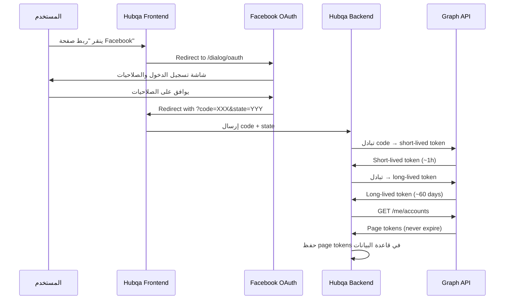
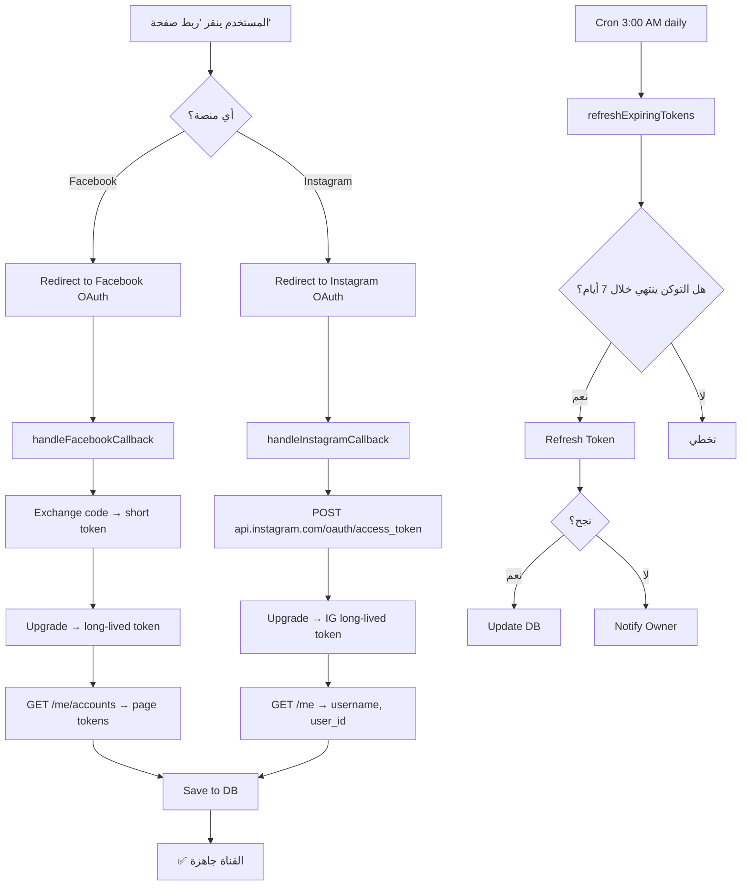

# 🔐 تدفق المصادقة OAuth 2.0 — Facebook و Instagram

> مرجع شامل لتدفق المصادقة عبر OAuth 2.0 لكل من Facebook وInstagram، بما في ذلك تبادل التوكنات، التوكنات طويلة الأجل، وتجديد التوكنات لمشروع Hubqa.

---

## جدول المحتويات

- [نظرة عامة على التدفق](#نظرة-عامة-على-التدفق)
- [Facebook OAuth — الخطوات الكاملة](#facebook-oauth--الخطوات-الكاملة)
  - [الخطوة 1: توجيه المستخدم](#الخطوة-1-توجيه-المستخدم)
  - [الخطوة 2: معالجة الرد](#الخطوة-2-معالجة-الرد)
  - [الخطوة 3: تبادل الكود بتوكن](#الخطوة-3-تبادل-الكود-بتوكن)
  - [الخطوة 4: التوكن طويل الأجل](#الخطوة-4-التوكن-طويل-الأجل)
  - [الخطوة 5: الحصول على Page Tokens](#الخطوة-5-الحصول-على-page-tokens)
- [Instagram OAuth — تدفق منفصل](#instagram-oauth--تدفق-منفصل)
- [الصلاحيات (Scopes)](#الصلاحيات-scopes)
- [تجديد التوكنات تلقائياً](#تجديد-التوكنات-تلقائياً)
- [التحقق من صلاحية التوكن](#التحقق-من-صلاحية-التوكن)
- [في مشروعنا (Hubqa)](#في-مشروعنا-hubqa)
- [الأخطاء الشائعة](#الأخطاء-الشائعة)

---

## نظرة عامة على التدفق



---

## Facebook OAuth — الخطوات الكاملة

### الخطوة 1: توجيه المستخدم

وجّه المستخدم إلى صفحة تسجيل الدخول لـ Facebook:

```
https://www.facebook.com/v25.0/dialog/oauth?
  client_id={APP_ID}
  &redirect_uri={REDIRECT_URI}
  &response_type=code
  &state={CSRF_TOKEN}
  &scope=pages_show_list,pages_manage_metadata,pages_read_engagement,pages_manage_engagement,pages_manage_posts,pages_messaging,instagram_basic,instagram_manage_comments,instagram_manage_messages
```

### المعاملات

| المعامل | مطلوب | الوصف |
|---------|-------|-------|
| `client_id` | ✅ | معرّف التطبيق (App ID) |
| `redirect_uri` | ✅ | رابط إعادة التوجيه (يجب أن يتطابق مع إعدادات التطبيق) |
| `response_type` | ✅ | يجب أن يكون `code` |
| `state` | ✅ | سلسلة عشوائية لحماية CSRF — **يجب التحقق منها عند العودة** |
| `scope` | ✅ | الصلاحيات المطلوبة (مفصولة بفاصلة) |
| `config_id` | اختياري | معرّف تكوين Facebook Login |

### مثال TypeScript

```typescript
// Frontend: توليد رابط OAuth
function generateFacebookOAuthUrl(): string {
  const params = new URLSearchParams({
    client_id: process.env.FB_APP_ID,
    redirect_uri: `${process.env.APP_URL}/api/auth/facebook/callback`,
    response_type: 'code',
    state: generateCSRFToken(), // احفظه في الجلسة للتحقق لاحقاً
    scope: [
      'pages_show_list',
      'pages_manage_metadata',
      'pages_read_engagement',
      'pages_manage_engagement',
      'pages_manage_posts',
      'pages_messaging',
      'instagram_basic',
      'instagram_manage_comments',
      'instagram_manage_messages',
    ].join(','),
  });
  
  return `https://www.facebook.com/v25.0/dialog/oauth?${params.toString()}`;
}
```

> [!CAUTION]
> **`state` مهم جداً!** بدونه، تطبيقك معرّض لهجمات CSRF. استخدم سلسلة عشوائية فريدة لكل طلب واحفظها في الجلسة للتحقق عند العودة.

---

### الخطوة 2: معالجة الرد

بعد موافقة المستخدم، Facebook يعيد توجيهه إلى `redirect_uri` مع:

```
https://your-app.com/api/auth/facebook/callback?code=AQDfG...xyz&state=YOUR_CSRF_TOKEN
```

#### حالة الرفض

إذا رفض المستخدم الصلاحيات:
```
https://your-app.com/api/auth/facebook/callback?error=access_denied&error_reason=user_denied&error_description=Permissions+error
```

### التحقق والمعالجة

```typescript
// Backend: معالجة callback
async handleFacebookCallback(code: string, state: string): Promise<void> {
  // 1. تحقق من state لمنع CSRF
  if (state !== session.savedState) {
    throw new Error('CSRF validation failed! State mismatch.');
  }
  
  // 2. تبادل code بتوكن (الخطوة التالية)
  const shortLivedToken = await exchangeCodeForToken(code);
  
  // 3. تحويل إلى long-lived token
  const longLivedToken = await getLongLivedToken(shortLivedToken);
  
  // 4. الحصول على Page Tokens
  const pages = await getPageTokens(longLivedToken);
  
  // 5. حفظ في قاعدة البيانات
  await saveChannels(pages, longLivedToken);
}
```

> [!WARNING]
> **يجب التحقق من `state`!** تأكد أن القيمة المُرجعة تتطابق مع القيمة المحفوظة في الجلسة. أي عدم تطابق يعني محاولة هجوم محتملة.

---

### الخطوة 3: تبادل الكود بتوكن

```bash
GET https://graph.facebook.com/v25.0/oauth/access_token?
  client_id={APP_ID}
  &redirect_uri={REDIRECT_URI}
  &client_secret={APP_SECRET}
  &code={CODE}
```

### الاستجابة

```json
{
  "access_token": "EAAGm0PX4ZCpsBAxxxxxxxxxxxxxxx",
  "token_type": "bearer",
  "expires_in": 5183944
}
```

### مثال TypeScript

```typescript
async function exchangeCodeForToken(code: string): Promise<string> {
  const response = await axios.get(
    'https://graph.facebook.com/v25.0/oauth/access_token',
    {
      params: {
        client_id: process.env.FB_APP_ID,
        redirect_uri: `${process.env.APP_URL}/api/auth/facebook/callback`,
        client_secret: process.env.FB_APP_SECRET,
        code: code,
      },
    }
  );

  return response.data.access_token; // Short-lived token (~1-2 hours)
}
```

> [!IMPORTANT]
> هذا التوكن **قصير الأجل** (حوالي ساعة إلى ساعتين). يجب تحويله إلى توكن طويل الأجل فوراً.

---

### الخطوة 4: التوكن طويل الأجل

حوّل Short-Lived Token إلى Long-Lived Token (صالح لـ 60 يوم):

```bash
GET https://graph.facebook.com/v25.0/oauth/access_token?
  grant_type=fb_exchange_token
  &client_id={APP_ID}
  &client_secret={APP_SECRET}
  &fb_exchange_token={SHORT_LIVED_TOKEN}
```

### الاستجابة

```json
{
  "access_token": "EAAGm0PX4ZCpsBAyyyyyyyyyyyyyy_LONG_LIVED",
  "token_type": "bearer",
  "expires_in": 5183999
}
```

> `expires_in` هو عدد الثواني. `5183999` ≈ 60 يوم.

### مثال TypeScript

```typescript
async function getLongLivedToken(shortLivedToken: string): Promise<{token: string, expiresAt: Date}> {
  const response = await axios.get(
    'https://graph.facebook.com/v25.0/oauth/access_token',
    {
      params: {
        grant_type: 'fb_exchange_token',
        client_id: process.env.FB_APP_ID,
        client_secret: process.env.FB_APP_SECRET,
        fb_exchange_token: shortLivedToken,
      },
    }
  );

  const expiresAt = new Date(Date.now() + response.data.expires_in * 1000);
  
  return {
    token: response.data.access_token,
    expiresAt,
  };
}
```

---

### الخطوة 5: الحصول على Page Tokens

استخدم Long-Lived User Token للحصول على Page Tokens:

```bash
GET https://graph.facebook.com/v25.0/me/accounts?
  fields=id,name,access_token,category,picture
  &access_token={LONG_LIVED_USER_TOKEN}
```

### الاستجابة

```json
{
  "data": [
    {
      "id": "123456789012345",
      "name": "متجر Hubqa",
      "access_token": "EAAGm0PX4ZCpsBA_PAGE_TOKEN_NEVER_EXPIRES_xxxxx",
      "category": "E-commerce website",
      "picture": {
        "data": {
          "url": "https://scontent.xx.fbcdn.net/v/..."
        }
      }
    }
  ]
}
```

> [!TIP]
> **Page Tokens المستخرجة من Long-Lived User Token لا تنتهي صلاحيتها** طالما أن User Token الأصلي صالح والمستخدم لم يُلغِ صلاحيات التطبيق. لكن يجب تجديد User Token قبل انتهائه كل 60 يوم.

### مخطط أنواع التوكنات وعلاقتها

```
Authorization Code (مؤقت، استخدام واحد)
    ↓ تبادل
Short-Lived User Token (~1-2 ساعة)
    ↓ ترقية
Long-Lived User Token (~60 يوم)  ← يجب تجديده!
    ↓ استخراج
Page Access Token (لا تنتهي*)     ← نحفظه في قاعدة البيانات

* طالما Long-Lived User Token صالح
```

---

## Instagram OAuth — تدفق منفصل

> [!IMPORTANT]
> Instagram يستخدم تدفق OAuth منفصل عن Facebook عبر `api.instagram.com`. المتطلبات: حساب Instagram Business أو Creator مرتبط بصفحة Facebook.

### الخطوة 1: توجيه المستخدم

```
https://api.instagram.com/oauth/authorize?
  client_id={INSTAGRAM_APP_ID}
  &redirect_uri={REDIRECT_URI}
  &scope=instagram_basic,instagram_manage_comments,instagram_manage_messages,instagram_content_publish
  &response_type=code
  &state={CSRF_TOKEN}
```

### الخطوة 2: تبادل الكود بتوكن (POST Form Data)

```bash
POST https://api.instagram.com/oauth/access_token
Content-Type: application/x-www-form-urlencoded

client_id={INSTAGRAM_APP_ID}
&client_secret={INSTAGRAM_APP_SECRET}
&grant_type=authorization_code
&redirect_uri={REDIRECT_URI}
&code={CODE}
```

> [!WARNING]
> انتبه! Instagram OAuth يستخدم `POST` مع **form data** وليس `GET` كما في Facebook.

### الاستجابة

```json
{
  "access_token": "IGQVJWxxxxxxxxxxxxxxx",
  "user_id": 17841405793187218
}
```

> هذا التوكن **قصير الأجل** (صالح لساعة واحدة).

### الخطوة 3: ترقية إلى Long-Lived Token

```bash
GET https://graph.instagram.com/access_token?
  grant_type=ig_exchange_token
  &client_secret={INSTAGRAM_APP_SECRET}
  &access_token={SHORT_LIVED_TOKEN}
```

### الاستجابة

```json
{
  "access_token": "IGQVJWyyyyyyyyyy_LONG_LIVED",
  "token_type": "bearer",
  "expires_in": 5184000
}
```

### الخطوة 4: الحصول على معلومات الحساب

```bash
GET https://graph.instagram.com/me?
  fields=user_id,username,account_type,media_count
  &access_token={LONG_LIVED_TOKEN}
```

### الاستجابة

```json
{
  "user_id": "17841405793187218",
  "username": "hubqa_official",
  "account_type": "BUSINESS",
  "media_count": 142
}
```

### تجديد Instagram Token

```bash
GET https://graph.instagram.com/refresh_access_token?
  grant_type=ig_refresh_token
  &access_token={VALID_LONG_LIVED_TOKEN}
```

```json
{
  "access_token": "IGQVJWzzzzzzzzz_REFRESHED",
  "token_type": "bearer",
  "expires_in": 5184000
}
```

### مثال TypeScript كامل لـ Instagram OAuth

```typescript
async function handleInstagramCallback(code: string, state: string) {
  // 1. التحقق من state
  validateCSRF(state);

  // 2. تبادل الكود بتوكن (POST form data)
  const tokenResponse = await axios.post(
    'https://api.instagram.com/oauth/access_token',
    new URLSearchParams({
      client_id: process.env.IG_APP_ID,
      client_secret: process.env.IG_APP_SECRET,
      grant_type: 'authorization_code',
      redirect_uri: `${process.env.APP_URL}/api/auth/instagram/callback`,
      code: code,
    }),
    {
      headers: { 'Content-Type': 'application/x-www-form-urlencoded' },
    }
  );

  const shortLivedToken = tokenResponse.data.access_token;
  const userId = tokenResponse.data.user_id;

  // 3. ترقية إلى long-lived token
  const longLivedResponse = await axios.get(
    'https://graph.instagram.com/access_token',
    {
      params: {
        grant_type: 'ig_exchange_token',
        client_secret: process.env.IG_APP_SECRET,
        access_token: shortLivedToken,
      },
    }
  );

  const longLivedToken = longLivedResponse.data.access_token;
  const expiresIn = longLivedResponse.data.expires_in;

  // 4. الحصول على معلومات الحساب
  const profileResponse = await axios.get(
    'https://graph.instagram.com/me',
    {
      params: {
        fields: 'user_id,username,account_type',
        access_token: longLivedToken,
      },
    }
  );

  // 5. حفظ في قاعدة البيانات
  await saveInstagramChannel({
    platformId: userId.toString(),
    username: profileResponse.data.username,
    accessToken: longLivedToken,
    expiresAt: new Date(Date.now() + expiresIn * 1000),
  });
}
```

---

## الصلاحيات (Scopes)

### صلاحيات Facebook

| الصلاحية | الوصف | مطلوب؟ |
|----------|-------|--------|
| `pages_show_list` | عرض قائمة الصفحات | ✅ |
| `pages_manage_metadata` | إدارة إعدادات الصفحة، الاشتراك بـ Webhooks | ✅ |
| `pages_read_engagement` | قراءة التعليقات والتفاعلات | ✅ |
| `pages_manage_engagement` | الرد على التعليقات | ✅ |
| `pages_manage_posts` | نشر منشورات | ✅ |
| `pages_messaging` | إرسال/استقبال رسائل Messenger | ✅ |

### صلاحيات Instagram

| الصلاحية | الوصف | مطلوب؟ |
|----------|-------|--------|
| `instagram_basic` | قراءة بيانات الحساب | ✅ |
| `instagram_manage_comments` | إدارة التعليقات | ✅ |
| `instagram_manage_messages` | إرسال/استقبال رسائل Instagram | ✅ |
| `instagram_content_publish` | نشر محتوى | اختياري |

### سلسلة الصلاحيات الكاملة لمشروعنا

```
pages_show_list,pages_manage_metadata,pages_read_engagement,pages_manage_engagement,pages_manage_posts,pages_messaging,instagram_basic,instagram_manage_comments,instagram_manage_messages
```

---

## تجديد التوكنات تلقائياً

### في مشروعنا — Cron Job يومي

```typescript
// channels.service.ts — refreshExpiringTokens()
// يعمل يومياً الساعة 3 صباحاً

@Cron('0 3 * * *') // كل يوم الساعة 3:00 AM
async refreshExpiringTokens(): Promise<void> {
  // 1. جلب جميع القنوات التي ستنتهي توكناتها خلال 7 أيام
  const expiringChannels = await this.channelRepo.find({
    where: {
      tokenExpiresAt: LessThan(new Date(Date.now() + 7 * 24 * 60 * 60 * 1000)),
      platform: In(['facebook', 'instagram']),
      isActive: true,
    },
  });

  for (const channel of expiringChannels) {
    try {
      if (channel.platform === 'facebook') {
        // تجديد Facebook Long-Lived Token
        const response = await axios.get(
          'https://graph.facebook.com/v25.0/oauth/access_token',
          {
            params: {
              grant_type: 'fb_exchange_token',
              client_id: process.env.FB_APP_ID,
              client_secret: process.env.FB_APP_SECRET,
              fb_exchange_token: channel.userAccessToken,
            },
          }
        );

        channel.userAccessToken = response.data.access_token;
        channel.tokenExpiresAt = new Date(
          Date.now() + response.data.expires_in * 1000
        );

        // تحديث Page Token أيضاً
        const pagesResponse = await axios.get(
          `https://graph.facebook.com/v25.0/me/accounts`,
          {
            params: {
              fields: 'id,access_token',
              access_token: response.data.access_token,
            },
          }
        );
        
        const page = pagesResponse.data.data.find(
          (p: any) => p.id === channel.platformId
        );
        if (page) {
          channel.pageAccessToken = page.access_token;
        }

      } else if (channel.platform === 'instagram') {
        // تجديد Instagram Long-Lived Token
        const response = await axios.get(
          'https://graph.instagram.com/refresh_access_token',
          {
            params: {
              grant_type: 'ig_refresh_token',
              access_token: channel.accessToken,
            },
          }
        );

        channel.accessToken = response.data.access_token;
        channel.tokenExpiresAt = new Date(
          Date.now() + response.data.expires_in * 1000
        );
      }

      await this.channelRepo.save(channel);
      this.logger.log(`✅ Refreshed token for ${channel.platform} channel: ${channel.name}`);

    } catch (error) {
      this.logger.error(
        `❌ Failed to refresh token for ${channel.name}: ${error.message}`
      );
      // إرسال إشعار للمستخدم لإعادة الربط يدوياً
      await this.notifyOwner(channel, 'token_refresh_failed');
    }
  }
}
```

### جدول التجديد

```
┌─────────────────────────────────────────────────┐
│ اليوم 0:   المستخدم يسجل الدخول                  │
│ اليوم 1-53: التوكن صالح — لا شيء مطلوب           │
│ اليوم 53:   ⚠️ Cron يكتشف أن التوكن سينتهي       │
│              خلال 7 أيام → يُجدّد تلقائياً          │
│ اليوم 53+:  توكن جديد صالح 60 يوم إضافي           │
│              (العداد يبدأ من جديد)                  │
│ اليوم 60:   ❌ بدون تجديد → ينتهي التوكن          │
│              → يجب تسجيل الدخول مجدداً             │
└─────────────────────────────────────────────────┘
```

---

## التحقق من صلاحية التوكن

### Debug Token API

```bash
GET https://graph.facebook.com/v25.0/debug_token?
  input_token={TOKEN_TO_CHECK}
  &access_token={APP_ID}|{APP_SECRET}
```

### الاستجابة

```json
{
  "data": {
    "app_id": "123456789",
    "type": "PAGE",
    "application": "Hubqa",
    "data_access_expires_at": 1753108800,
    "expires_at": 0,
    "is_valid": true,
    "issued_at": 1721203200,
    "scopes": [
      "pages_show_list",
      "pages_manage_metadata",
      "pages_read_engagement",
      "pages_manage_engagement",
      "pages_manage_posts",
      "pages_messaging"
    ],
    "granular_scopes": [
      {
        "scope": "pages_show_list",
        "target_ids": ["123456789012345"]
      }
    ],
    "user_id": "987654321"
  }
}
```

| الحقل | المعنى |
|-------|--------|
| `is_valid` | `true` = التوكن صالح |
| `expires_at` | `0` = لا ينتهي، غير ذلك = Unix timestamp |
| `scopes` | الصلاحيات الممنوحة |
| `data_access_expires_at` | متى تنتهي صلاحية الوصول للبيانات (يجب تجديد قبل هذا التاريخ) |

---

## في مشروعنا (Hubqa)

### ملخص الملفات المرتبطة

| الملف | الوظيفة |
|-------|---------|
| `backend/src/channels/channels.service.ts` | `handleFacebookCallback()` — معالجة callback Facebook |
| `backend/src/channels/channels.service.ts` | `handleInstagramCallback()` — معالجة callback Instagram |
| `backend/src/channels/channels.service.ts` | `refreshExpiringTokens()` — تجديد التوكنات (Cron يومي 3 AM) |

### التدفق الكامل في المشروع



---

## الأخطاء الشائعة

### 1. `Invalid redirect_uri`

```json
{
  "error": {
    "message": "Invalid redirect_uri: Given URL is not allowed by the Application configuration.",
    "type": "OAuthException",
    "code": 191
  }
}
```

**الحل:** تأكد أن `redirect_uri` مطابق **تماماً** لما هو مسجل في إعدادات التطبيق (Facebook Login → Valid OAuth Redirect URIs).

### 2. `Code has expired`

```json
{
  "error": {
    "message": "This authorization code has expired.",
    "type": "OAuthException",
    "code": 100
  }
}
```

**الحل:** Authorization code صالح لـ **10 دقائق فقط**. تأكد من تبادله فوراً.

### 3. `Token expired`

```json
{
  "error": {
    "message": "Error validating access token: Session has expired.",
    "type": "OAuthException",
    "code": 190,
    "error_subcode": 463
  }
}
```

**الحل:** جدّد التوكن باستخدام `fb_exchange_token` أو `ig_refresh_token`.

### 4. `Permissions error`

```json
{
  "error": {
    "message": "(#200) Requires pages_messaging permission",
    "type": "OAuthException",
    "code": 200
  }
}
```

**الحل:** المستخدم لم يمنح هذه الصلاحية. أعد توجيهه إلى OAuth مع الصلاحيات المطلوبة.

### 5. `App not live`

```json
{
  "error": {
    "message": "Application does not have permission for this action",
    "type": "OAuthException",
    "code": 10
  }
}
```

**الحل:** التطبيق في وضع التطوير. يجب إكمال App Review ونشر التطبيق للإنتاج.

---

## ملاحظات أمنية

> [!CAUTION]
> - **لا تُخزّن `client_secret` في الـ Frontend أبداً.** يجب أن يكون فقط في الـ Backend.
> - **لا تُمرّر التوكنات عبر URL params في الإنتاج.** استخدم `Authorization: Bearer` header.
> - **شفّر التوكنات** في قاعدة البيانات (AES-256 أو ما يعادله).
> - **سجّل** كل عملية تبادل توكن لأغراض التتبع والأمان.
> - **حدّد redirect_uri بدقة** في إعدادات التطبيق — لا تستخدم wildcards.

---

> **آخر تحديث:** يوليو 2026  
> **الإصدار المُوثّق:** v25.0  
> **المشروع:** Hubqa — منصة الرد التلقائي SaaS
