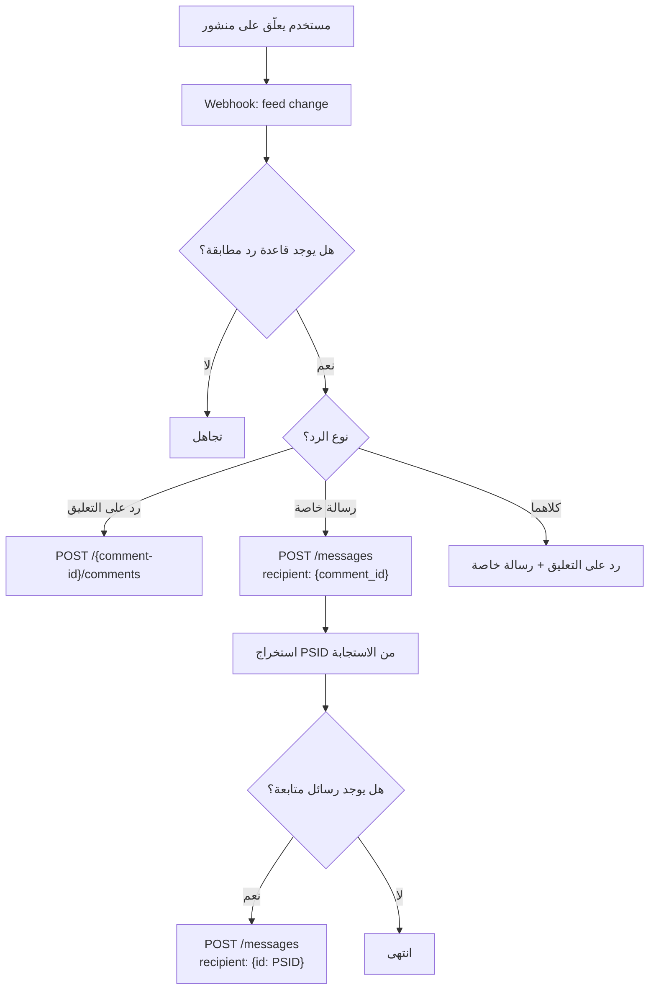

# 💬 منصة Messenger (Messenger Platform)

> مرجع شامل لـ Messenger Platform API — إرسال الرسائل، القوالب، الردود السريعة، نافذة الـ 24 ساعة، الردود الخاصة، ورسائل Instagram لمشروع Hubqa.

---

## جدول المحتويات

- [نظرة عامة](#نظرة-عامة)
- [Send API — إرسال الرسائل](#send-api--إرسال-الرسائل)
- [أنواع الرسائل](#أنواع-الرسائل)
  - [رسالة نصية](#رسالة-نصية)
  - [رسالة بوسائط (صورة، فيديو، ملف)](#رسالة-بوسائط)
  - [القوالب (Templates)](#القوالب-templates)
  - [الردود السريعة (Quick Replies)](#الردود-السريعة-quick-replies)
- [إجراءات المُرسِل (Sender Actions)](#إجراءات-المُرسِل-sender-actions)
- [نافذة المراسلة — 24 ساعة](#نافذة-المراسلة--24-ساعة)
- [علامات الرسائل (Message Tags)](#علامات-الرسائل-message-tags)
- [الردود الخاصة — من تعليق إلى رسالة خاصة](#الردود-الخاصة--من-تعليق-إلى-رسالة-خاصة)
- [رسائل Instagram](#رسائل-instagram)
- [Ice Breakers — بادئات المحادثة](#ice-breakers--بادئات-المحادثة)
- [في مشروعنا (Hubqa)](#في-مشروعنا-hubqa)

---

## نظرة عامة

Messenger Platform تتيح لك إرسال واستقبال رسائل عبر Facebook Messenger وInstagram Direct.

**Endpoint الرئيسي:**
```
POST https://graph.facebook.com/v25.0/{PAGE_ID}/messages
```

أو الاختصار:
```
POST https://graph.facebook.com/v25.0/me/messages
```

> عند استخدام `/me/messages`، يتم تحديد الصفحة تلقائياً من Page Access Token المُرسَل.

---

## Send API — إرسال الرسائل

### البنية الأساسية

```bash
POST https://graph.facebook.com/v25.0/{PAGE_ID}/messages
Content-Type: application/json
Authorization: Bearer {PAGE_ACCESS_TOKEN}

{
  "messaging_type": "RESPONSE",
  "recipient": {
    "id": "{PSID}"
  },
  "message": {
    "text": "مرحباً! كيف يمكنني مساعدتك؟"
  }
}
```

### الاستجابة الناجحة

```json
{
  "recipient_id": "1234567890",
  "message_id": "mid.$cAAJsujCd2ORjxxxxxxx"
}
```

### أنواع `messaging_type`

| النوع | الاستخدام | القيود |
|-------|-----------|--------|
| `RESPONSE` | رد على رسالة المستخدم | داخل نافذة 24 ساعة فقط |
| `UPDATE` | تحديث غير مرتبط برسالة المستخدم | داخل نافذة 24 ساعة فقط |
| `MESSAGE_TAG` | رسالة خارج نافذة 24 ساعة | يجب تحديد `tag` صالح |

### أنواع `recipient`

```json
// 1. إرسال إلى PSID (Page-Scoped ID) — الطريقة الأكثر شيوعاً
{ "recipient": { "id": "1234567890" } }

// 2. إرسال رد خاص على تعليق (Private Reply)
{ "recipient": { "comment_id": "123456789_987654321" } }

// 3. إرسال إلى رقم هاتف (Customer Matching — محدود)
{ "recipient": { "phone_number": "+1234567890" } }
```

---

## أنواع الرسائل

### رسالة نصية

```bash
POST /v25.0/{PAGE_ID}/messages

{
  "messaging_type": "RESPONSE",
  "recipient": {
    "id": "1234567890"
  },
  "message": {
    "text": "مرحباً بك في Hubqa! 🎉\nكيف يمكنني مساعدتك اليوم؟"
  }
}
```

> الحد الأقصى للنص: **2000 حرف**.

---

### رسالة بوسائط

#### صورة

```json
{
  "messaging_type": "RESPONSE",
  "recipient": { "id": "1234567890" },
  "message": {
    "attachment": {
      "type": "image",
      "payload": {
        "url": "https://example.com/image.jpg",
        "is_reusable": true
      }
    }
  }
}
```

#### فيديو

```json
{
  "messaging_type": "RESPONSE",
  "recipient": { "id": "1234567890" },
  "message": {
    "attachment": {
      "type": "video",
      "payload": {
        "url": "https://example.com/video.mp4",
        "is_reusable": true
      }
    }
  }
}
```

#### ملف صوتي

```json
{
  "messaging_type": "RESPONSE",
  "recipient": { "id": "1234567890" },
  "message": {
    "attachment": {
      "type": "audio",
      "payload": {
        "url": "https://example.com/audio.mp3",
        "is_reusable": true
      }
    }
  }
}
```

#### مستند (ملف)

```json
{
  "messaging_type": "RESPONSE",
  "recipient": { "id": "1234567890" },
  "message": {
    "attachment": {
      "type": "file",
      "payload": {
        "url": "https://example.com/document.pdf",
        "is_reusable": true
      }
    }
  }
}
```

> [!TIP]
> عند استخدام `"is_reusable": true`، يحفظ Facebook الوسائط ويعطيك `attachment_id` في الاستجابة. يمكنك إعادة استخدامه لاحقاً بدلاً من رفع الملف مجدداً:
> ```json
> "payload": { "attachment_id": "123456789" }
> ```

### حدود حجم الوسائط

| النوع | الحد الأقصى |
|-------|------------|
| صورة | 8 MB |
| فيديو | 25 MB |
| صوت | 25 MB |
| مستند | 25 MB |

---

### القوالب (Templates)

#### Generic Template — القالب العام (Carousel)

يعرض بطاقات (cards) قابلة للتمرير أفقياً. كل بطاقة يمكن أن تحتوي على صورة، عنوان، وصف، وأزرار.

```json
{
  "messaging_type": "RESPONSE",
  "recipient": { "id": "1234567890" },
  "message": {
    "attachment": {
      "type": "template",
      "payload": {
        "template_type": "generic",
        "elements": [
          {
            "title": "خطة Starter — 49 ريال/شهر",
            "subtitle": "مناسبة للمشاريع الصغيرة — حتى 3 صفحات",
            "image_url": "https://hubqa.com/images/starter-plan.jpg",
            "default_action": {
              "type": "web_url",
              "url": "https://hubqa.com/pricing"
            },
            "buttons": [
              {
                "type": "web_url",
                "url": "https://hubqa.com/subscribe/starter",
                "title": "اشترك الآن"
              },
              {
                "type": "postback",
                "title": "مزيد من التفاصيل",
                "payload": "PLAN_DETAILS_STARTER"
              }
            ]
          },
          {
            "title": "خطة Pro — 99 ريال/شهر",
            "subtitle": "للأعمال المتوسطة — حتى 10 صفحات + WhatsApp",
            "image_url": "https://hubqa.com/images/pro-plan.jpg",
            "buttons": [
              {
                "type": "web_url",
                "url": "https://hubqa.com/subscribe/pro",
                "title": "اشترك الآن"
              },
              {
                "type": "postback",
                "title": "مزيد من التفاصيل",
                "payload": "PLAN_DETAILS_PRO"
              }
            ]
          },
          {
            "title": "خطة Enterprise — 299 ريال/شهر",
            "subtitle": "للشركات الكبيرة — صفحات غير محدودة + API",
            "image_url": "https://hubqa.com/images/enterprise-plan.jpg",
            "buttons": [
              {
                "type": "web_url",
                "url": "https://hubqa.com/subscribe/enterprise",
                "title": "اشترك الآن"
              },
              {
                "type": "postback",
                "title": "تواصل مع المبيعات",
                "payload": "CONTACT_SALES"
              }
            ]
          }
        ]
      }
    }
  }
}
```

> **حدود Generic Template:** حتى **10 عناصر** (elements)، كل عنصر حتى **3 أزرار**.

#### Button Template — قالب الأزرار

يعرض نصاً مع أزرار بدون صورة.

```json
{
  "messaging_type": "RESPONSE",
  "recipient": { "id": "1234567890" },
  "message": {
    "attachment": {
      "type": "template",
      "payload": {
        "template_type": "button",
        "text": "ماذا تريد أن تفعل؟",
        "buttons": [
          {
            "type": "web_url",
            "url": "https://hubqa.com",
            "title": "زيارة موقعنا"
          },
          {
            "type": "postback",
            "title": "تواصل مع الدعم",
            "payload": "CONTACT_SUPPORT"
          },
          {
            "type": "phone_number",
            "title": "اتصل بنا",
            "payload": "+966500000000"
          }
        ]
      }
    }
  }
}
```

> **حد الأزرار:** **3 أزرار** كحد أقصى.

#### Media Template — قالب الوسائط

```json
{
  "messaging_type": "RESPONSE",
  "recipient": { "id": "1234567890" },
  "message": {
    "attachment": {
      "type": "template",
      "payload": {
        "template_type": "media",
        "elements": [
          {
            "media_type": "image",
            "url": "https://www.facebook.com/photo/?fbid=123456789",
            "buttons": [
              {
                "type": "web_url",
                "url": "https://hubqa.com",
                "title": "عرض التفاصيل"
              }
            ]
          }
        ]
      }
    }
  }
}
```

#### Receipt Template — قالب الفاتورة

```json
{
  "messaging_type": "RESPONSE",
  "recipient": { "id": "1234567890" },
  "message": {
    "attachment": {
      "type": "template",
      "payload": {
        "template_type": "receipt",
        "recipient_name": "أحمد محمد",
        "order_number": "ORD-2026-001",
        "currency": "SAR",
        "payment_method": "Visa 1234",
        "order_url": "https://hubqa.com/orders/ORD-2026-001",
        "timestamp": "1721203200",
        "elements": [
          {
            "title": "خطة Pro — اشتراك سنوي",
            "subtitle": "12 شهر",
            "quantity": 1,
            "price": 999,
            "currency": "SAR",
            "image_url": "https://hubqa.com/images/pro-plan.jpg"
          }
        ],
        "summary": {
          "subtotal": 999,
          "shipping_cost": 0,
          "total_tax": 149.85,
          "total_cost": 1148.85
        }
      }
    }
  }
}
```

### ملخص القوالب

| القالب | الوصف | الحدود |
|--------|-------|--------|
| `generic` | بطاقات Carousel | 10 عناصر × 3 أزرار |
| `button` | نص + أزرار | 3 أزرار |
| `media` | صورة/فيديو + زر | 1 وسائط + 1 زر |
| `receipt` | فاتورة/إيصال | عنصر واحد لكل طلب |

---

### الردود السريعة (Quick Replies)

تظهر كأزرار أسفل الرسالة تختفي بعد النقر عليها.

```json
{
  "messaging_type": "RESPONSE",
  "recipient": { "id": "1234567890" },
  "message": {
    "text": "كيف يمكنني مساعدتك؟ اختر أحد الخيارات:",
    "quick_replies": [
      {
        "content_type": "text",
        "title": "الأسعار 💰",
        "payload": "QR_PRICING",
        "image_url": "https://hubqa.com/icons/pricing.png"
      },
      {
        "content_type": "text",
        "title": "الدعم الفني 🔧",
        "payload": "QR_SUPPORT"
      },
      {
        "content_type": "text",
        "title": "الأسئلة الشائعة ❓",
        "payload": "QR_FAQ"
      },
      {
        "content_type": "user_phone_number"
      },
      {
        "content_type": "user_email"
      }
    ]
  }
}
```

### أنواع Quick Replies

| `content_type` | الوصف | هل يحتاج `title` و `payload`? |
|----------------|-------|-------------------------------|
| `text` | زر نصي مخصص | ✅ نعم |
| `user_phone_number` | يطلب رقم الهاتف من المستخدم | ❌ لا |
| `user_email` | يطلب البريد الإلكتروني من المستخدم | ❌ لا |

> **الحد الأقصى:** **13 زر** quick reply لكل رسالة. طول العنوان: **20 حرف** كحد أقصى.

---

## إجراءات المُرسِل (Sender Actions)

تُظهر للمستخدم أن الصفحة "تكتب" أو "شاهدت" رسالته.

```json
// إظهار "يكتب..." (typing indicator)
{
  "recipient": { "id": "1234567890" },
  "sender_action": "typing_on"
}
```

```json
// إخفاء "يكتب..."
{
  "recipient": { "id": "1234567890" },
  "sender_action": "typing_off"
}
```

```json
// تعليم الرسالة كمقروءة
{
  "recipient": { "id": "1234567890" },
  "sender_action": "mark_seen"
}
```

### استخدام عملي في المشروع

```typescript
// إظهار typing indicator ثم إرسال الرد
async function sendReplyWithTyping(pageId: string, psid: string, text: string, token: string) {
  const url = `${GRAPH_API_BASE}/${pageId}/messages`;
  
  // 1. إظهار typing
  await axios.post(url, {
    recipient: { id: psid },
    sender_action: 'typing_on',
  }, {
    headers: { Authorization: `Bearer ${token}` },
  });
  
  // 2. تأخير قصير لجعل المحادثة طبيعية
  await delay(1000);
  
  // 3. إرسال الرد
  await axios.post(url, {
    messaging_type: 'RESPONSE',
    recipient: { id: psid },
    message: { text },
  }, {
    headers: { Authorization: `Bearer ${token}` },
  });
}
```

---

## نافذة المراسلة — 24 ساعة

> [!IMPORTANT]
> بعد أن يُرسل المستخدم رسالة، لديك **24 ساعة** فقط لإرسال ردود حرة. بعد 24 ساعة، يجب استخدام **Message Tags** أو **قوالب مدفوعة** (Sponsored Messages).

### القواعد

```
┌──────────────────────────────────────────────────┐
│  المستخدم يُرسل رسالة ← تبدأ نافذة 24 ساعة       │
│                                                    │
│  ⏱️ 0-24 ساعة:                                    │
│    ✅ RESPONSE — ردود حرة                          │
│    ✅ UPDATE — تحديثات                             │
│                                                    │
│  ⏱️ بعد 24 ساعة:                                  │
│    ❌ RESPONSE — محظور                             │
│    ❌ UPDATE — محظور                               │
│    ✅ MESSAGE_TAG — مع tag صالح فقط               │
│                                                    │
│  ↩️ كل رسالة جديدة من المستخدم تُعيد تعيين        │
│     النافذة لـ 24 ساعة جديدة                       │
└──────────────────────────────────────────────────┘
```

---

## علامات الرسائل (Message Tags)

تتيح لك إرسال رسائل خارج نافذة 24 ساعة لأغراض محددة.

```json
{
  "messaging_type": "MESSAGE_TAG",
  "recipient": { "id": "1234567890" },
  "tag": "CONFIRMED_EVENT_UPDATE",
  "message": {
    "text": "تذكير: موعدك غداً الساعة 10 صباحاً ✅"
  }
}
```

### العلامات المتاحة

| Tag | الوصف | مدة الصلاحية |
|-----|-------|--------------|
| `CONFIRMED_EVENT_UPDATE` | تحديثات أحداث مؤكدة (مواعيد، حجوزات) | بدون حد |
| `POST_PURCHASE_UPDATE` | تحديثات ما بعد الشراء (شحن، تتبع) | بدون حد |
| `ACCOUNT_UPDATE` | تحديثات الحساب (تغيير إعدادات، تنبيهات) | بدون حد |
| `HUMAN_AGENT` | وكيل بشري يرد على استفسار سابق | **7 أيام** فقط |

> [!WARNING]
> **`HUMAN_AGENT`** هو الأكثر مرونة لكنه **ينتهي بعد 7 أيام** من آخر رسالة من المستخدم. ويتطلب تفعيلاً خاصاً من Meta.
>
> **لا تسيء استخدام Message Tags!** إرسال محتوى ترويجي أو spam باستخدامها يعرّض تطبيقك للحظر.

---

## الردود الخاصة — من تعليق إلى رسالة خاصة

### Private Reply — الرسالة الأولى

عندما يعلّق شخص على منشور صفحتك، يمكنك إرسال **رسالة خاصة أولى** ردًا على تعليقه:

```json
{
  "messaging_type": "RESPONSE",
  "recipient": {
    "comment_id": "123456789012345_111222333444555"
  },
  "message": {
    "text": "مرحباً! شكراً لتعليقك 😊\nيمكنني مساعدتك هنا في الخاص. ما سؤالك؟"
  }
}
```

### الاستجابة — استخراج PSID

```json
{
  "recipient_id": "9876543210",
  "message_id": "mid.$cAAJsujCd2ORjxxxxxxx"
}
```

> `recipient_id` هو **PSID** (Page-Scoped User ID). احفظه لإرسال رسائل لاحقة.

### المتابعة — الرسائل اللاحقة

بعد الرسالة الأولى، استخدم PSID مباشرة:

```json
{
  "messaging_type": "RESPONSE",
  "recipient": {
    "id": "9876543210"
  },
  "message": {
    "text": "إليك رابط الأسعار: https://hubqa.com/pricing"
  }
}
```

> [!IMPORTANT]
> **قيود Private Reply:**
> - يمكن إرسال **رسالة خاصة واحدة فقط** لكل تعليق
> - بعدها يجب استخدام PSID المُستخرَج من `recipient_id`
> - المستخدم يجب أن يكون قد فعّل إمكانية تلقي الرسائل
> - تفتح نافذة 24 ساعة جديدة

### في مشروعنا — تدفق Private Reply

```typescript
// webhooks.service.ts — executeRule()
async executeRule(rule: AutoReplyRule, commentId: string, pageToken: string) {
  // 1. إرسال رد خاص على التعليق
  const response = await axios.post(
    `${GRAPH_API_BASE}/${pageId}/messages`,
    {
      messaging_type: 'RESPONSE',
      recipient: { comment_id: commentId },
      message: { text: rule.privateReplyText },
    },
    { headers: { Authorization: `Bearer ${pageToken}` } }
  );

  // 2. استخراج PSID من الاستجابة
  const psid = response.data.recipient_id;

  // 3. حفظ PSID للمتابعة المستقبلية
  await this.saveConversation({
    psid,
    commentId,
    pageId,
    startedAt: new Date(),
  });

  // 4. إرسال رسائل إضافية إذا لزم الأمر (مثل: قائمة أسعار)
  if (rule.followUpMessages?.length) {
    for (const followUp of rule.followUpMessages) {
      await delay(1000); // تأخير بين الرسائل
      await axios.post(
        `${GRAPH_API_BASE}/${pageId}/messages`,
        {
          messaging_type: 'RESPONSE',
          recipient: { id: psid }, // نستخدم PSID الآن
          message: followUp,
        },
        { headers: { Authorization: `Bearer ${pageToken}` } }
      );
    }
  }
}
```

---

## رسائل Instagram

### نفس الـ Endpoint!

رسائل Instagram Direct تستخدم **نفس** Send API:

```json
POST /v25.0/{PAGE_ID}/messages

{
  "messaging_type": "RESPONSE",
  "recipient": {
    "id": "{IGSID}"
  },
  "message": {
    "text": "مرحباً عبر Instagram! 📸"
  }
}
```

> [!NOTE]
> **IGSID** (Instagram-Scoped ID) يختلف عن **PSID** (Messenger). نفس الشخص له معرّفان مختلفان على كل منصة.

### الفرق في الـ Webhooks

```json
// Webhook رسالة Messenger
{
  "object": "page",
  "entry": [{
    "messaging": [{
      "sender": { "id": "PSID" },
      "recipient": { "id": "PAGE_ID" },
      "message": { "text": "مرحباً" }
    }]
  }]
}

// Webhook رسالة Instagram
{
  "object": "instagram",
  "entry": [{
    "messaging": [{
      "sender": { "id": "IGSID" },
      "recipient": { "id": "IG_USER_ID" },
      "message": { "text": "مرحباً" }
    }]
  }]
}
```

> لاحظ الفرق: `"object": "page"` لـ Messenger مقابل `"object": "instagram"` لـ Instagram.

### قيود Instagram Messaging

| الميزة | Messenger | Instagram |
|--------|-----------|-----------|
| Generic Template (Carousel) | ✅ | ✅ (محدود) |
| Button Template | ✅ | ❌ |
| Quick Replies | ✅ (13 زر) | ✅ (13 زر) |
| Sender Actions | ✅ | ✅ |
| Message Tags | ✅ | ❌ |
| Private Reply | ✅ | ✅ |

---

## Ice Breakers — بادئات المحادثة

أسئلة مُعدّة مسبقاً تظهر للمستخدمين الجدد عند فتح محادثة لأول مرة.

### إعداد Ice Breakers

```bash
POST https://graph.facebook.com/v25.0/{PAGE_ID}/messenger_profile
Content-Type: application/json

{
  "ice_breakers": [
    {
      "call_to_action": {
        "type": "postback",
        "title": "ما هي أسعاركم؟ 💰",
        "payload": "ICE_PRICING"
      }
    },
    {
      "call_to_action": {
        "type": "postback",
        "title": "كيف أبدأ؟ 🚀",
        "payload": "ICE_GET_STARTED"
      }
    },
    {
      "call_to_action": {
        "type": "postback",
        "title": "تواصل مع الدعم 🔧",
        "payload": "ICE_SUPPORT"
      }
    }
  ],
  "access_token": "PAGE_TOKEN"
}
```

### قراءة Ice Breakers الحالية

```bash
GET https://graph.facebook.com/v25.0/{PAGE_ID}/messenger_profile?fields=ice_breakers&access_token=PAGE_TOKEN
```

### حذف Ice Breakers

```bash
DELETE https://graph.facebook.com/v25.0/{PAGE_ID}/messenger_profile

{
  "fields": ["ice_breakers"],
  "access_token": "PAGE_TOKEN"
}
```

---

## في مشروعنا (Hubqa)

### ملخص الملفات المرتبطة

| الملف | الوظيفة |
|-------|---------|
| `backend/src/webhooks/webhooks.service.ts` | `executeRule()` — تنفيذ قواعد الرد (Private Reply + PSID) |
| `backend/src/webhooks/webhooks.service.ts` | `processPrivateDM()` — معالجة الرسائل الواردة |
| `backend/src/common/graph-api.ts` | ثوابت API |

### التدفق الكامل للرد التلقائي عبر Messenger



### مثال كامل من المشروع

```typescript
// webhooks.service.ts — معالجة Webhook قادم من Messenger
async processMessengerWebhook(body: any) {
  const entry = body.entry?.[0];
  const messaging = entry?.messaging?.[0];
  
  if (!messaging) return;
  
  const senderId = messaging.sender.id;   // PSID
  const pageId = messaging.recipient.id;   // Page ID
  
  // تحديد نوع الحدث
  if (messaging.message) {
    // رسالة واردة
    const text = messaging.message.text;
    const attachments = messaging.message.attachments;
    
    await this.processIncomingMessage(senderId, pageId, text, attachments);
    
  } else if (messaging.postback) {
    // نقر على زر أو Ice Breaker
    const payload = messaging.postback.payload;
    
    await this.processPostback(senderId, pageId, payload);
    
  } else if (messaging.reaction) {
    // ردة فعل على رسالة
    const emoji = messaging.reaction.emoji;
    const action = messaging.reaction.action; // 'react' or 'unreact'
    
    await this.processReaction(senderId, pageId, emoji, action);
  }
}
```

---

## أخطاء شائعة في Send API

| الخطأ | السبب | الحل |
|-------|-------|------|
| `(#10) This message is sent outside of allowed window` | خارج نافذة 24 ساعة | استخدم Message Tag أو انتظر رسالة من المستخدم |
| `(#100) No matching user found` | PSID غير صحيح | تحقق من صحة PSID |
| `(#200) Requires pages_messaging permission` | صلاحية ناقصة | أضف `pages_messaging` في OAuth |
| `(#551) This person isn't available right now` | المستخدم حذف المحادثة أو حظر الصفحة | لا يمكن إرسال رسائل لهذا المستخدم |
| `(#2022) The send API rate limit has been reached` | تجاوز حد الإرسال | أبطئ سرعة الإرسال |

---

> **آخر تحديث:** يوليو 2026  
> **الإصدار المُوثّق:** v25.0  
> **المشروع:** Hubqa — منصة الرد التلقائي SaaS
