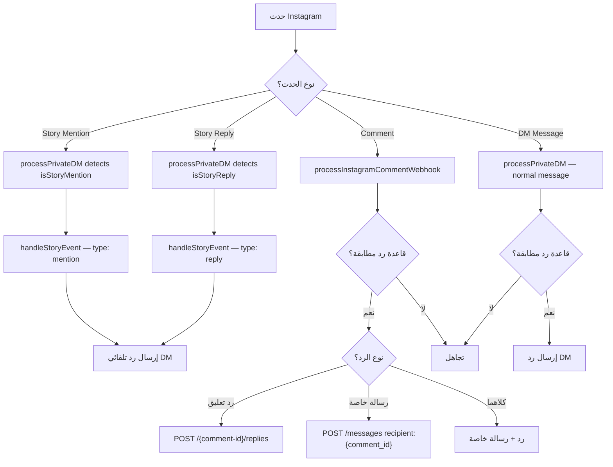

# 📸 واجهة برمجة Instagram API

> مرجع شامل لـ Instagram Graph API — الحسابات التجارية، Story Mentions/Replies، التعليقات، المنشورات، الـ Webhooks، وحدود الاستخدام لمشروع Hubqa.

---

## جدول المحتويات

- [المتطلبات الأساسية](#المتطلبات-الأساسية)
- [Instagram Business Login](#instagram-business-login)
- [الصلاحيات المطلوبة](#الصلاحيات-المطلوبة)
- [Webhooks — Story Mentions](#webhooks--story-mentions)
- [Webhooks — Story Replies](#webhooks--story-replies)
- [Webhooks — التعليقات](#webhooks--التعليقات)
- [Instagram Media API](#instagram-media-api)
- [الرد على التعليقات](#الرد-على-التعليقات)
- [حدود الاستخدام (Rate Limits)](#حدود-الاستخدام-rate-limits)
- [في مشروعنا (Hubqa)](#في-مشروعنا-hubqa)

---

## المتطلبات الأساسية

لاستخدام Instagram API، يجب توفر:

| المتطلب | الوصف |
|---------|-------|
| **نوع الحساب** | حساب Instagram **Business** أو **Creator** (ليس Personal) |
| **ربط بصفحة Facebook** | يجب ربط حساب Instagram بصفحة Facebook |
| **تطبيق Facebook** | تطبيق مسجل في [Meta for Developers](https://developers.facebook.com) |
| **App Review** | الصلاحيات تتطلب مراجعة من Meta للإنتاج |

### تحويل الحساب إلى Business

```
Instagram Settings → Account → Switch to Professional Account → Business
→ Connect to Facebook Page
```

> [!WARNING]
> الحسابات الشخصية (Personal) **لا يمكنها** استخدام Instagram Graph API. يجب التحويل إلى Business أو Creator أولاً.

---

## Instagram Business Login

Instagram يستخدم تدفق OAuth **منفصل** عن Facebook. راجع [03-oauth-login.md](./03-oauth-login.md) للتفاصيل الكاملة.

### ملخص سريع

```
1. Redirect → https://api.instagram.com/oauth/authorize?...
2. Exchange code → POST https://api.instagram.com/oauth/access_token
3. Upgrade → GET https://graph.instagram.com/access_token?grant_type=ig_exchange_token
4. Profile → GET https://graph.instagram.com/me?fields=user_id,username
```

### مثال الحصول على معلومات الحساب

```bash
GET https://graph.instagram.com/me?fields=user_id,username,account_type,media_count&access_token=IG_TOKEN
```

```json
{
  "user_id": "17841405793187218",
  "username": "hubqa_official",
  "account_type": "BUSINESS",
  "media_count": 142
}
```

---

## الصلاحيات المطلوبة

| الصلاحية | الوصف | مطلوب لمشروعنا؟ |
|----------|-------|------------------|
| `instagram_basic` | قراءة بيانات الحساب والملف الشخصي | ✅ نعم |
| `instagram_manage_comments` | قراءة وكتابة التعليقات | ✅ نعم |
| `instagram_manage_messages` | إرسال واستقبال رسائل Direct | ✅ نعم |
| `instagram_content_publish` | نشر محتوى (صور، فيديو، Reels) | اختياري |

---

## Webhooks — Story Mentions

### ما هو Story Mention؟

عندما يذكر مستخدم حسابك التجاري في قصته (Story) باستخدام `@mention`، يصل Webhook إلى تطبيقك.

### بنية الـ Webhook

```json
{
  "object": "instagram",
  "entry": [
    {
      "id": "17841405793187218",
      "time": 1721203200,
      "messaging": [
        {
          "sender": {
            "id": "5544332211"
          },
          "recipient": {
            "id": "17841405793187218"
          },
          "timestamp": 1721203200,
          "message": {
            "mid": "aWdfxxxxxxxxxxxxxxx",
            "attachments": [
              {
                "type": "story_mention",
                "payload": {
                  "url": "https://scontent.xx.fbcdn.net/v/t51.29350-15/..."
                }
              }
            ]
          }
        }
      ]
    }
  ]
}
```

### تفاصيل مهمة

| المعلومة | التفاصيل |
|----------|----------|
| **نوع المرفق** | `story_mention` |
| **رابط CDN** | الرابط في `payload.url` |
| **مدة صلاحية الرابط** | **24 ساعة** (ينتهي مع انتهاء القصة) |
| **تخزين المحتوى** | ⛔ **ممنوع** تخزين محتوى الوسائط |
| **الحسابات الخاصة** | يعمل فقط إذا كان المستخدم **يتابع** حسابك التجاري |

> [!CAUTION]
> **يجب عدم تخزين محتوى الوسائط!** رابط CDN صالح لـ 24 ساعة فقط ويتعارض مع سياسات Meta تخزين محتوى Stories. يمكنك فقط تخزين metadata (مثل: sender ID، timestamp).

### في مشروعنا — كشف Story Mention

```typescript
// webhooks.service.ts — processPrivateDM()
async processPrivateDM(messaging: any, channel: Channel) {
  const senderId = messaging.sender.id;
  const message = messaging.message;
  
  // كشف Story Mention
  const isStoryMention = message?.attachments?.some(
    (att: any) => att.type === 'story_mention'
  );
  
  if (isStoryMention) {
    const storyUrl = message.attachments[0].payload.url;
    
    await this.handleStoryEvent({
      type: 'mention',
      senderId,
      channelId: channel.id,
      storyUrl, // ⚠️ ينتهي بعد 24 ساعة
      timestamp: messaging.timestamp,
    });
    
    return; // لا نعالج كرسالة عادية
  }
  
  // ... معالجة الرسائل العادية
}
```

---

## Webhooks — Story Replies

### ما هو Story Reply؟

عندما يرد مستخدم على قصتك (Story) برسالة نصية، يصل Webhook مع حقل `reply_to.story`.

### بنية الـ Webhook

```json
{
  "object": "instagram",
  "entry": [
    {
      "id": "17841405793187218",
      "time": 1721203200,
      "messaging": [
        {
          "sender": {
            "id": "5544332211"
          },
          "recipient": {
            "id": "17841405793187218"
          },
          "timestamp": 1721203200,
          "message": {
            "mid": "aWdfxxxxxxxxxxxxxxx",
            "text": "واو! منتج رائع 😍 كم سعره؟",
            "reply_to": {
              "story": {
                "url": "https://scontent.xx.fbcdn.net/v/t51.29350-15/...",
                "id": "17854360229xxxxxx"
              }
            }
          }
        }
      ]
    }
  ]
}
```

### مقارنة: Story Mention vs Story Reply

| الخاصية | Story Mention | Story Reply |
|---------|---------------|-------------|
| **كيف يحدث** | مستخدم يذكر @حسابك في قصته | مستخدم يرد على قصتك |
| **أين يظهر** | `attachments[].type = 'story_mention'` | `reply_to.story` |
| **نص الرسالة** | لا يوجد نص (فقط وسائط) | يوجد نص في `message.text` |
| **رابط الوسائط** | في `attachments[].payload.url` | في `reply_to.story.url` |
| **Story ID** | غير متوفر | في `reply_to.story.id` |
| **صلاحية الرابط** | 24 ساعة | 24 ساعة |

### في مشروعنا — كشف Story Reply

```typescript
// webhooks.service.ts — processPrivateDM()
async processPrivateDM(messaging: any, channel: Channel) {
  const senderId = messaging.sender.id;
  const message = messaging.message;
  
  // كشف Story Mention
  const isStoryMention = message?.attachments?.some(
    (att: any) => att.type === 'story_mention'
  );
  
  // كشف Story Reply
  const isStoryReply = !!message?.reply_to?.story;
  
  if (isStoryMention) {
    const storyUrl = message.attachments[0].payload.url;
    await this.handleStoryEvent({
      type: 'mention',
      senderId,
      channelId: channel.id,
      storyUrl,
      timestamp: messaging.timestamp,
    });
    return;
  }
  
  if (isStoryReply) {
    const storyData = message.reply_to.story;
    await this.handleStoryEvent({
      type: 'reply',
      senderId,
      channelId: channel.id,
      storyUrl: storyData.url,
      storyId: storyData.id,
      replyText: message.text,
      timestamp: messaging.timestamp,
    });
    return;
  }
  
  // ... معالجة الرسائل العادية
}
```

### `handleStoryEvent()` — معالجة أحداث القصص

```typescript
// webhooks.service.ts — handleStoryEvent()
async handleStoryEvent(event: StoryEvent) {
  const channel = await this.channelRepo.findOne({ id: event.channelId });
  
  // البحث عن قاعدة رد تلقائي لأحداث القصص
  const rule = await this.findMatchingRule({
    channelId: channel.id,
    triggerType: event.type === 'mention' ? 'story_mention' : 'story_reply',
    text: event.replyText, // فقط لـ story reply
  });
  
  if (!rule) return;
  
  // إرسال رد تلقائي عبر Instagram DM
  await axios.post(
    `${GRAPH_API_BASE}/${channel.platformId}/messages`,
    {
      messaging_type: 'RESPONSE',
      recipient: { id: event.senderId },
      message: { text: rule.replyText },
    },
    {
      headers: { Authorization: `Bearer ${channel.accessToken}` },
    }
  );
  
  this.logger.log(`📸 Story ${event.type} auto-reply sent to ${event.senderId}`);
}
```

---

## Webhooks — التعليقات

### الاشتراك بتعليقات Instagram

يجب الاشتراك بحقل `comments` في Webhooks:

```bash
POST https://graph.facebook.com/v25.0/{PAGE_ID}/subscribed_apps
Content-Type: application/json

{
  "subscribed_fields": "feed,comments",
  "access_token": "PAGE_TOKEN"
}
```

### بنية Webhook التعليق

```json
{
  "object": "instagram",
  "entry": [
    {
      "id": "17841405793187218",
      "time": 1721203200,
      "changes": [
        {
          "field": "comments",
          "value": {
            "id": "17858893269xxxxxx",
            "text": "كم سعر هذا المنتج؟ 💰",
            "from": {
              "id": "5544332211",
              "username": "user_123"
            },
            "media": {
              "id": "17854360229yyyyyy",
              "media_product_type": "FEED"
            },
            "timestamp": "2026-07-15T12:00:00+0000"
          }
        }
      ]
    }
  ]
}
```

### حقول Webhook التعليق

| الحقل | النوع | الوصف |
|-------|-------|-------|
| `id` | string | معرّف التعليق |
| `text` | string | نص التعليق |
| `from.id` | string | معرّف المُعلِّق |
| `from.username` | string | اسم مستخدم المُعلِّق |
| `media.id` | string | معرّف المنشور الذي عُلِّق عليه |
| `media.media_product_type` | string | نوع المنشور: `FEED`, `REELS`, `STORY` |
| `timestamp` | string | وقت التعليق |

### في مشروعنا — معالجة تعليقات Instagram

```typescript
// webhooks.service.ts
async processInstagramCommentWebhook(change: any, channel: Channel) {
  const comment = change.value;
  const commentId = comment.id;
  const commentText = comment.text;
  const mediaId = comment.media?.id;
  const fromId = comment.from?.id;
  
  // البحث عن قاعدة رد مطابقة
  const rule = await this.findMatchingRule({
    channelId: channel.id,
    triggerType: 'comment',
    postId: mediaId,
    text: commentText,
  });
  
  if (!rule) return;
  
  // تنفيذ الرد
  if (rule.commentReply) {
    // رد على التعليق
    await axios.post(
      `${GRAPH_API_BASE}/${commentId}/replies`,
      {
        message: rule.commentReplyText,
        access_token: channel.accessToken,
      }
    );
  }
  
  if (rule.privateReply) {
    // رسالة خاصة
    await axios.post(
      `${GRAPH_API_BASE}/${channel.platformId}/messages`,
      {
        messaging_type: 'RESPONSE',
        recipient: { comment_id: commentId },
        message: { text: rule.privateReplyText },
      },
      { headers: { Authorization: `Bearer ${channel.accessToken}` } }
    );
  }
}
```

---

## Instagram Media API

### قراءة منشورات Instagram

```bash
GET https://graph.facebook.com/v25.0/{ig-user-id}/media?fields=id,caption,media_type,media_url,timestamp,permalink,comments_count,like_count,thumbnail_url&access_token=IG_TOKEN
```

### الاستجابة

```json
{
  "data": [
    {
      "id": "17854360229xxxxxx",
      "caption": "عرض خاص لعملاء Hubqa! 🎉 خصم 50% على جميع الخطط #hubqa #عروض",
      "media_type": "IMAGE",
      "media_url": "https://scontent.xx.fbcdn.net/v/t51.29350-15/...",
      "timestamp": "2026-07-15T10:30:00+0000",
      "permalink": "https://www.instagram.com/p/CxYzAbCdEf/",
      "comments_count": 24,
      "like_count": 156
    },
    {
      "id": "17854360229yyyyyy",
      "caption": "شاهد كيف يعمل الرد التلقائي 🤖",
      "media_type": "VIDEO",
      "media_url": "https://scontent.xx.fbcdn.net/v/...",
      "thumbnail_url": "https://scontent.xx.fbcdn.net/v/t51.29350-15/...",
      "timestamp": "2026-07-14T15:00:00+0000",
      "permalink": "https://www.instagram.com/p/AbCdEfGhIj/",
      "comments_count": 8,
      "like_count": 89
    },
    {
      "id": "17854360229zzzzzz",
      "caption": "تجربة عميل سعيد 😊",
      "media_type": "CAROUSEL_ALBUM",
      "timestamp": "2026-07-13T09:00:00+0000",
      "permalink": "https://www.instagram.com/p/GhIjKlMnOp/",
      "comments_count": 3,
      "like_count": 42
    }
  ],
  "paging": {
    "cursors": {
      "before": "QVFIxxxxxxx",
      "after": "QVFIyyyyyyy"
    },
    "next": "https://graph.facebook.com/v25.0/17841405793187218/media?after=QVFIyyyyyyy"
  }
}
```

### أنواع الوسائط

| `media_type` | الوصف |
|-------------|-------|
| `IMAGE` | صورة |
| `VIDEO` | فيديو (يشمل Reels) |
| `CAROUSEL_ALBUM` | ألبوم صور متعددة |

### الحقول المتاحة

| الحقل | الوصف |
|-------|-------|
| `id` | معرّف المنشور |
| `caption` | نص المنشور |
| `media_type` | نوع الوسائط |
| `media_url` | رابط الوسائط (غير متاح لـ CAROUSEL_ALBUM) |
| `timestamp` | وقت النشر |
| `permalink` | رابط المنشور الدائم |
| `comments_count` | عدد التعليقات |
| `like_count` | عدد الإعجابات |
| `thumbnail_url` | صورة مصغرة (للفيديو فقط) |
| `username` | اسم مستخدم الناشر |
| `children` | عناصر الألبوم (لـ CAROUSEL_ALBUM) |

### في مشروعنا — جلب منشورات Instagram

```typescript
// channels.service.ts — getChannelPosts() — سطر 566-568
async getChannelPosts(channel: Channel): Promise<Post[]> {
  if (channel.platform === 'instagram') {
    const url = `${GRAPH_API_BASE}/${channel.platformId}/media`;
    const response = await axios.get(url, {
      params: {
        fields: 'id,caption,media_type,media_url,timestamp,permalink,comments_count',
        access_token: channel.accessToken,
      },
    });
    
    return response.data.data.map((media: any) => ({
      id: media.id,
      message: media.caption,
      type: media.media_type.toLowerCase(),
      imageUrl: media.media_url,
      createdAt: media.timestamp,
      permalink: media.permalink,
      commentsCount: media.comments_count,
    }));
  }
  
  // ... Facebook posts logic
}
```

### قراءة تعليقات منشور Instagram

```bash
GET https://graph.facebook.com/v25.0/{ig-media-id}/comments?fields=id,text,from{id,username},timestamp,like_count,replies{id,text,from,timestamp}&access_token=IG_TOKEN
```

```json
{
  "data": [
    {
      "id": "17858893269xxxxxx",
      "text": "منتج رائع! كم السعر؟ 💰",
      "from": {
        "id": "5544332211",
        "username": "user_123"
      },
      "timestamp": "2026-07-15T12:00:00+0000",
      "like_count": 3,
      "replies": {
        "data": [
          {
            "id": "17858893269yyyyyy",
            "text": "@user_123 السعر 99 ريال! تواصل معنا 📩",
            "from": {
              "id": "17841405793187218",
              "username": "hubqa_official"
            },
            "timestamp": "2026-07-15T12:05:00+0000"
          }
        ]
      }
    }
  ]
}
```

---

## الرد على التعليقات

### `POST /{ig-comment-id}/replies` — الرد على تعليق Instagram

```bash
POST https://graph.facebook.com/v25.0/{ig-comment-id}/replies
Content-Type: application/json

{
  "message": "شكراً لتعليقك! السعر 99 ريال 🎉 تواصل معنا عبر الرسائل الخاصة للطلب 📩",
  "access_token": "IG_TOKEN"
}
```

### الاستجابة

```json
{
  "id": "17858893269zzzzzz"
}
```

> [!IMPORTANT]
> لاحظ الفرق:
> - **Facebook:** `POST /{comment-id}/comments` (edge: `comments`)
> - **Instagram:** `POST /{ig-comment-id}/replies` (edge: `replies`)

### نشر تعليق جديد على منشور

```bash
POST https://graph.facebook.com/v25.0/{ig-media-id}/comments
Content-Type: application/json

{
  "message": "منتج رائع! 🔥",
  "access_token": "IG_TOKEN"
}
```

### في مشروعنا — بناء رابط الرد

```typescript
// webhooks.service.ts — commentReplyUrl()
function commentReplyUrl(commentId: string, platform: 'facebook' | 'instagram'): string {
  if (platform === 'instagram') {
    // Instagram يستخدم /replies
    return `${GRAPH_API_BASE}/${commentId}/replies`;
  }
  // Facebook يستخدم /comments
  return `${GRAPH_API_BASE}/${commentId}/comments`;
}
```

---

## حدود الاستخدام (Rate Limits)

### الحد العام

| الحد | القيمة |
|------|--------|
| **API calls per user per hour** | **200 استدعاء** |
| **حد التعليقات** | يعتمد على عدد المتابعين |
| **حد الرسائل** | ضمن نافذة 24 ساعة |

> [!WARNING]
> حد الـ 200 استدعاء/ساعة/مستخدم خاص بـ **Instagram API** وهو أقل من Facebook! خطط لاستدعاءاتك بعناية.

### أفضل الممارسات لتجنب Rate Limiting

```typescript
// 1. تجميع الاستدعاءات — اطلب حقول متعددة في استدعاء واحد
// ❌ سيئ — 3 استدعاءات
GET /media?fields=id
GET /media?fields=caption
GET /media?fields=media_type

// ✅ جيد — استدعاء واحد
GET /media?fields=id,caption,media_type

// 2. استخدام Webhooks بدلاً من Polling
// ❌ سيئ — التحقق كل 30 ثانية من التعليقات الجديدة
setInterval(() => checkNewComments(), 30000);

// ✅ جيد — انتظار Webhook
app.post('/webhooks', (req, res) => handleNewComment(req.body));

// 3. التخزين المؤقت (Caching)
const cache = new Map();
async function getMediaData(mediaId: string) {
  if (cache.has(mediaId)) return cache.get(mediaId);
  const data = await fetchFromAPI(mediaId);
  cache.set(mediaId, data);
  setTimeout(() => cache.delete(mediaId), 5 * 60 * 1000); // 5 minutes
  return data;
}
```

### رؤوس Rate Limit

```http
X-IG-Usage: {"call_count":45,"total_cputime":12,"total_time":8}
```

```typescript
function checkInstagramRateLimit(headers: any) {
  const usage = JSON.parse(headers['x-ig-usage'] || '{}');
  if (usage.call_count > 80) {
    console.warn(`⚠️ Instagram rate limit: ${usage.call_count}%`);
    // تقليل سرعة الاستدعاءات أو الانتظار
  }
}
```

---

## في مشروعنا (Hubqa)

### ملخص الملفات المرتبطة

| الملف | الوظيفة | الأسطر المهمة |
|-------|---------|---------------|
| `webhooks.service.ts` | `processPrivateDM()` — كشف Story Mention/Reply | isStoryMention, isStoryReply |
| `webhooks.service.ts` | `handleStoryEvent()` — معالجة أحداث القصص | — |
| `webhooks.service.ts` | `commentReplyUrl()` — بناء رابط الرد | يُرجع `/replies` لـ Instagram |
| `channels.service.ts` | `getChannelPosts()` — جلب منشورات القناة | سطر 566-568 |
| `channels.service.ts` | `handleInstagramCallback()` — معالجة OAuth | — |

### التدفق الكامل لـ Instagram في المشروع



---

## أخطاء شائعة

| الخطأ | السبب | الحل |
|-------|-------|------|
| `(#100) You cannot reply to this comment` | التعليق محذوف أو المستخدم حظر حسابك | تجاهل التعليق |
| `(#10) This user is not available` | حساب المستخدم خاص أو معطل | لا يمكن التفاعل |
| `(#36000) Rate limit reached` | تجاوز 200 استدعاء/ساعة | الانتظار حتى الساعة التالية |
| `(#100) Invalid media_id` | معرّف المنشور غير صحيح | التحقق من المعرّف |
| `(#190) Access token expired` | التوكن منتهي الصلاحية | تجديد عبر `ig_refresh_token` |
| `(#200) Insufficient permissions` | صلاحية ناقصة | إعادة OAuth مع الصلاحيات المطلوبة |

---

## ملاحظات مهمة

> [!NOTE]
> **حول CDN URLs في القصص:**
> - روابط الوسائط في Story Mentions و Story Replies صالحة لـ **24 ساعة فقط**
> - لا تحاول تحميل أو تخزين المحتوى — هذا مخالف لسياسات Meta
> - يمكنك فقط تخزين metadata (sender ID، timestamp، نوع الحدث)

> [!TIP]
> **Story Mention يعمل فقط مع المتابعين:**
> - إذا كان حساب المستخدم خاصاً (private)، يجب أن يكون **متابعاً** لحسابك التجاري لتلقي الـ Webhook
> - الحسابات العامة (public) ترسل الـ Webhook بغض النظر

---

> **آخر تحديث:** يوليو 2026  
> **الإصدار المُوثّق:** v25.0  
> **المشروع:** Hubqa — منصة الرد التلقائي SaaS
