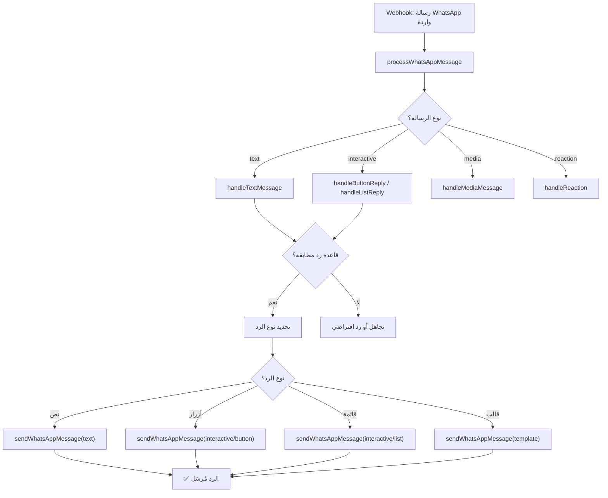

# 💚 واجهة برمجة WhatsApp Cloud API

> مرجع شامل لـ WhatsApp Cloud API — جميع أنواع الرسائل، القوالب، الوسائط، نافذة الخدمة، مستويات الإرسال، وجودة الحساب لمشروع Hubqa.

---

## جدول المحتويات

- [نظرة عامة](#نظرة-عامة)
- [الإعداد الأساسي](#الإعداد-الأساسي)
- [أنواع الرسائل — أمثلة JSON كاملة](#أنواع-الرسائل--أمثلة-json-كاملة)
  - [رسالة نصية](#1-رسالة-نصية-text)
  - [صورة](#2-صورة-image)
  - [فيديو](#3-فيديو-video)
  - [صوت](#4-صوت-audio)
  - [مستند](#5-مستند-document)
  - [ملصق](#6-ملصق-sticker)
  - [موقع](#7-موقع-location)
  - [جهات اتصال](#8-جهات-اتصال-contacts)
  - [ردة فعل](#9-ردة-فعل-reaction)
  - [أزرار تفاعلية](#10-أزرار-تفاعلية-interactive-buttons)
  - [قائمة تفاعلية](#11-قائمة-تفاعلية-interactive-list)
  - [رسالة قالب](#12-رسالة-قالب-template)
- [القوالب (Templates)](#القوالب-templates)
- [نافذة الخدمة — 24 ساعة](#نافذة-الخدمة--24-ساعة)
- [رفع الوسائط (Media Upload)](#رفع-الوسائط-media-upload)
- [مستويات الإرسال (Messaging Tiers)](#مستويات-الإرسال-messaging-tiers)
- [جودة الحساب (Quality Rating)](#جودة-الحساب-quality-rating)
- [WhatsApp Flows](#whatsapp-flows)
- [Webhooks — الأحداث الواردة](#webhooks--الأحداث-الواردة)
- [في مشروعنا (Hubqa)](#في-مشروعنا-hubqa)

---

## نظرة عامة

> [!WARNING]
> **On-Premises API تم إيقافها في أكتوبر 2025.** WhatsApp Cloud API هو الخيار **الوحيد** المتاح الآن لإرسال واستقبال رسائل WhatsApp Business عبر API.

### المعلومات الأساسية

| المعلومة | القيمة |
|----------|--------|
| **Base Endpoint** | `https://graph.facebook.com/v25.0/{phone-number-id}/messages` |
| **المصادقة** | `Authorization: Bearer {ACCESS_TOKEN}` |
| **Content-Type** | `application/json` |
| **API Version** | v25.0 (أحدث إصدار) |

---

## الإعداد الأساسي

### البنية الأساسية لكل طلب

```bash
POST https://graph.facebook.com/v25.0/{phone-number-id}/messages
Content-Type: application/json
Authorization: Bearer {ACCESS_TOKEN}

{
  "messaging_product": "whatsapp",
  "recipient_type": "individual",
  "to": "966500000000",
  "type": "text",
  "text": {
    "body": "مرحباً!"
  }
}
```

### الحقول الإلزامية في كل طلب

| الحقل | القيمة | الوصف |
|-------|--------|-------|
| `messaging_product` | `"whatsapp"` | **دائماً** `whatsapp` |
| `recipient_type` | `"individual"` | **دائماً** `individual` (حالياً الخيار الوحيد) |
| `to` | `"966500000000"` | رقم الهاتف بالتنسيق الدولي (بدون + أو 00) |
| `type` | `"text"`, `"image"`, etc. | نوع الرسالة |

### الاستجابة الناجحة

```json
{
  "messaging_product": "whatsapp",
  "contacts": [
    {
      "input": "966500000000",
      "wa_id": "966500000000"
    }
  ],
  "messages": [
    {
      "id": "wamid.HBgNOTY2NTAwMDAwMDAwFQIAERgSxxxxxxxxxxxxxxx",
      "message_status": "accepted"
    }
  ]
}
```

> `wamid` هو معرّف الرسالة الفريد. احفظه لتتبع حالة التسليم عبر Webhooks.

---

## أنواع الرسائل — أمثلة JSON كاملة

### 1. رسالة نصية (Text)

```json
{
  "messaging_product": "whatsapp",
  "recipient_type": "individual",
  "to": "966500000000",
  "type": "text",
  "text": {
    "preview_url": true,
    "body": "مرحباً بك في Hubqa! 🎉\n\nنحن منصة الرد التلقائي الأولى في المنطقة.\n\nتفضل بزيارة موقعنا: https://hubqa.com"
  }
}
```

> `preview_url: true` يعرض معاينة للروابط في الرسالة. الحد الأقصى للنص: **4096 حرف**.

---

### 2. صورة (Image)

#### عبر رابط URL

```json
{
  "messaging_product": "whatsapp",
  "recipient_type": "individual",
  "to": "966500000000",
  "type": "image",
  "image": {
    "link": "https://hubqa.com/images/promo-banner.jpg",
    "caption": "عرض خاص! خصم 50% على جميع الخطط 🎉"
  }
}
```

#### عبر Media ID (بعد الرفع)

```json
{
  "messaging_product": "whatsapp",
  "recipient_type": "individual",
  "to": "966500000000",
  "type": "image",
  "image": {
    "id": "1234567890",
    "caption": "عرض خاص! خصم 50% على جميع الخطط 🎉"
  }
}
```

---

### 3. فيديو (Video)

```json
{
  "messaging_product": "whatsapp",
  "recipient_type": "individual",
  "to": "966500000000",
  "type": "video",
  "video": {
    "link": "https://hubqa.com/videos/demo.mp4",
    "caption": "شاهد كيف يعمل الرد التلقائي في 60 ثانية ⏱️"
  }
}
```

---

### 4. صوت (Audio)

```json
{
  "messaging_product": "whatsapp",
  "recipient_type": "individual",
  "to": "966500000000",
  "type": "audio",
  "audio": {
    "id": "9876543210"
  }
}
```

> [!NOTE]
> الرسائل الصوتية **لا تدعم** حقل `caption`. يمكنك إرسال نص منفصل بعدها إذا أردت.

---

### 5. مستند (Document)

```json
{
  "messaging_product": "whatsapp",
  "recipient_type": "individual",
  "to": "966500000000",
  "type": "document",
  "document": {
    "link": "https://hubqa.com/docs/pricing-2026.pdf",
    "filename": "Hubqa-Pricing-2026.pdf",
    "caption": "قائمة الأسعار المحدّثة 📄"
  }
}
```

---

### 6. ملصق (Sticker)

```json
{
  "messaging_product": "whatsapp",
  "recipient_type": "individual",
  "to": "966500000000",
  "type": "sticker",
  "sticker": {
    "id": "1122334455"
  }
}
```

> الملصقات يجب أن تكون بتنسيق **WebP**. ثابتة: 100KB كحد أقصى. متحركة: 500KB كحد أقصى.

---

### 7. موقع (Location)

```json
{
  "messaging_product": "whatsapp",
  "recipient_type": "individual",
  "to": "966500000000",
  "type": "location",
  "location": {
    "latitude": 24.7136,
    "longitude": 46.6753,
    "name": "مقر Hubqa",
    "address": "طريق الملك فهد، الرياض، المملكة العربية السعودية"
  }
}
```

---

### 8. جهات اتصال (Contacts)

```json
{
  "messaging_product": "whatsapp",
  "recipient_type": "individual",
  "to": "966500000000",
  "type": "contacts",
  "contacts": [
    {
      "name": {
        "formatted_name": "دعم Hubqa",
        "first_name": "دعم",
        "last_name": "Hubqa"
      },
      "phones": [
        {
          "phone": "+966500000000",
          "type": "WORK",
          "wa_id": "966500000000"
        }
      ],
      "emails": [
        {
          "email": "support@hubqa.com",
          "type": "WORK"
        }
      ],
      "urls": [
        {
          "url": "https://hubqa.com",
          "type": "WORK"
        }
      ],
      "org": {
        "company": "Hubqa",
        "department": "Customer Support",
        "title": "Support Team"
      }
    }
  ]
}
```

---

### 9. ردة فعل (Reaction)

#### إضافة ردة فعل

```json
{
  "messaging_product": "whatsapp",
  "recipient_type": "individual",
  "to": "966500000000",
  "type": "reaction",
  "reaction": {
    "message_id": "wamid.HBgNOTY2NTAwMDAwMDAwFQIAERgSxxxxxxxxxxxxxxx",
    "emoji": "😀"
  }
}
```

#### إزالة ردة فعل

```json
{
  "messaging_product": "whatsapp",
  "recipient_type": "individual",
  "to": "966500000000",
  "type": "reaction",
  "reaction": {
    "message_id": "wamid.HBgNOTY2NTAwMDAwMDAwFQIAERgSxxxxxxxxxxxxxxx",
    "emoji": ""
  }
}
```

> إرسال `emoji` فارغ (`""`) يزيل ردة الفعل.

---

### 10. أزرار تفاعلية (Interactive Buttons)

```json
{
  "messaging_product": "whatsapp",
  "recipient_type": "individual",
  "to": "966500000000",
  "type": "interactive",
  "interactive": {
    "type": "button",
    "header": {
      "type": "text",
      "text": "🎉 عرض خاص"
    },
    "body": {
      "text": "اختر الخطة المناسبة لعملك.\nجميع الخطط تشمل فترة تجريبية مجانية 14 يوم."
    },
    "footer": {
      "text": "Hubqa — الرد التلقائي الذكي"
    },
    "action": {
      "buttons": [
        {
          "type": "reply",
          "reply": {
            "id": "btn_starter",
            "title": "خطة Starter"
          }
        },
        {
          "type": "reply",
          "reply": {
            "id": "btn_pro",
            "title": "خطة Pro"
          }
        },
        {
          "type": "reply",
          "reply": {
            "id": "btn_enterprise",
            "title": "خطة Enterprise"
          }
        }
      ]
    }
  }
}
```

> [!IMPORTANT]
> **الحد الأقصى:** **3 أزرار** فقط. طول عنوان الزر: **20 حرف**. طول `id`: **256 حرف**.

---

### 11. قائمة تفاعلية (Interactive List)

```json
{
  "messaging_product": "whatsapp",
  "recipient_type": "individual",
  "to": "966500000000",
  "type": "interactive",
  "interactive": {
    "type": "list",
    "header": {
      "type": "text",
      "text": "📋 خدمات Hubqa"
    },
    "body": {
      "text": "اختر الخدمة التي تهمك من القائمة أدناه"
    },
    "footer": {
      "text": "يمكنك اختيار خيار واحد"
    },
    "action": {
      "button": "عرض الخيارات",
      "sections": [
        {
          "title": "الخطط والأسعار",
          "rows": [
            {
              "id": "row_starter",
              "title": "خطة Starter",
              "description": "49 ريال/شهر — حتى 3 صفحات"
            },
            {
              "id": "row_pro",
              "title": "خطة Pro",
              "description": "99 ريال/شهر — حتى 10 صفحات + WhatsApp"
            },
            {
              "id": "row_enterprise",
              "title": "خطة Enterprise",
              "description": "299 ريال/شهر — غير محدود"
            }
          ]
        },
        {
          "title": "الدعم والمساعدة",
          "rows": [
            {
              "id": "row_faq",
              "title": "الأسئلة الشائعة",
              "description": "إجابات سريعة لأكثر الأسئلة شيوعاً"
            },
            {
              "id": "row_support",
              "title": "الدعم الفني",
              "description": "تواصل مع فريق الدعم"
            },
            {
              "id": "row_demo",
              "title": "طلب عرض تجريبي",
              "description": "جدول عرض مخصص لعملك"
            }
          ]
        }
      ]
    }
  }
}
```

> **حدود القائمة:** حتى **10 صفوف** (rows) إجمالاً عبر جميع الأقسام. حتى **10 أقسام** (sections). طول عنوان الصف: **24 حرف**. طول الوصف: **72 حرف**.

---

### 12. رسالة قالب (Template)

```json
{
  "messaging_product": "whatsapp",
  "recipient_type": "individual",
  "to": "966500000000",
  "type": "template",
  "template": {
    "name": "order_confirmation",
    "language": {
      "code": "ar"
    },
    "components": [
      {
        "type": "header",
        "parameters": [
          {
            "type": "image",
            "image": {
              "link": "https://hubqa.com/images/order-confirmed.jpg"
            }
          }
        ]
      },
      {
        "type": "body",
        "parameters": [
          {
            "type": "text",
            "text": "أحمد"
          },
          {
            "type": "text",
            "text": "ORD-2026-001"
          },
          {
            "type": "currency",
            "currency": {
              "fallback_value": "99.00 SAR",
              "code": "SAR",
              "amount_1000": 99000
            }
          }
        ]
      },
      {
        "type": "button",
        "sub_type": "quick_reply",
        "index": "0",
        "parameters": [
          {
            "type": "payload",
            "payload": "track_order_ORD-2026-001"
          }
        ]
      }
    ]
  }
}
```

---

## القوالب (Templates)

### تصنيفات القوالب

| التصنيف | الوصف | التكلفة | الاستخدام |
|---------|-------|---------|-----------|
| `MARKETING` | رسائل ترويجية وعروض | 💰 الأعلى | عروض، خصومات، إعلانات |
| `UTILITY` | إشعارات خدمية | 💰 متوسط | تأكيد طلب، تحديث شحن |
| `AUTHENTICATION` | رموز التحقق (OTP) | 💰 الأقل | كود تحقق، إعادة تعيين كلمة المرور |

### مكونات القالب

| المكون | الحد | ملاحظات |
|--------|------|---------|
| **HEADER** | 60 حرف | يمكن أن يكون نص أو صورة أو فيديو أو مستند |
| **BODY** | 1024 حرف | النص الرئيسي — يدعم المتغيرات `{{1}}`, `{{2}}` |
| **FOOTER** | 60 حرف | نص تذييل صغير (اختياري) |
| **BUTTONS** | 3 Quick Reply أو 2 CTA | أزرار تفاعلية |

### أنواع Header

```json
// Header نصي
{ "type": "header", "parameters": [{ "type": "text", "text": "تأكيد الطلب #123" }] }

// Header صورة
{ "type": "header", "parameters": [{ "type": "image", "image": { "link": "URL" } }] }

// Header فيديو
{ "type": "header", "parameters": [{ "type": "video", "video": { "link": "URL" } }] }

// Header مستند
{ "type": "header", "parameters": [{ "type": "document", "document": { "link": "URL", "filename": "invoice.pdf" } }] }
```

### أنواع الأزرار

```json
// Quick Reply buttons (حتى 3)
{
  "type": "button",
  "sub_type": "quick_reply",
  "index": "0",
  "parameters": [{ "type": "payload", "payload": "CONFIRM_YES" }]
}

// Call-to-Action: URL (حتى 2)
{
  "type": "button",
  "sub_type": "url",
  "index": "0",
  "parameters": [{ "type": "text", "text": "order123" }]  // suffix for dynamic URL
}

// Call-to-Action: Phone
{
  "type": "button",
  "sub_type": "phone_number",
  "index": "1",
  "parameters": [{ "type": "text", "text": "+966500000000" }]
}
```

> [!IMPORTANT]
> القوالب يجب أن تُعتمد من Meta قبل استخدامها. عملية المراجعة تستغرق عادة من دقائق إلى 24 ساعة. يمكن رفض القوالب إذا انتهكت سياسات WhatsApp.

---

## نافذة الخدمة — 24 ساعة

```
┌─────────────────────────────────────────────────────────┐
│  العميل يُرسل رسالة ← تبدأ نافذة الخدمة (24 ساعة)       │
│                                                           │
│  ⏱️ 0-24 ساعة (Service Window مفتوحة):                   │
│    ✅ رسائل حرة (Free-form): نص، صور، أزرار، قوائم        │
│    ✅ رسائل قوالب (Templates)                             │
│    💰 التكلفة: Service Conversation                       │
│                                                           │
│  ⏱️ بعد 24 ساعة (Service Window مغلقة):                  │
│    ❌ رسائل حرة — محظورة                                 │
│    ✅ رسائل قوالب فقط (Templates)                         │
│    💰 التكلفة: حسب تصنيف القالب                           │
│                                                           │
│  ↩️ كل رسالة جديدة من العميل تُعيد تعيين النافذة          │
└─────────────────────────────────────────────────────────┘
```

> [!TIP]
> **الفرق عن Messenger:** في WhatsApp، يمكنك إرسال **قوالب** (Templates) في أي وقت حتى خارج نافذة 24 ساعة. في Messenger، تحتاج **Message Tags** التي هي أكثر تقييداً.

---

## رفع الوسائط (Media Upload)

### رفع ملف

```bash
POST https://graph.facebook.com/v25.0/{phone-number-id}/media
Content-Type: multipart/form-data
Authorization: Bearer {ACCESS_TOKEN}

messaging_product=whatsapp
type=image/jpeg
file=@/path/to/image.jpg
```

### الاستجابة

```json
{
  "id": "1234567890"
}
```

### تحميل وسائط واردة

```bash
# 1. الحصول على رابط التحميل
GET https://graph.facebook.com/v25.0/{media-id}
Authorization: Bearer {ACCESS_TOKEN}

# الاستجابة
{
  "messaging_product": "whatsapp",
  "url": "https://lookaside.fbsbx.com/whatsapp_business/attachments/?mid=...",
  "mime_type": "image/jpeg",
  "sha256": "abc123...",
  "file_size": 234567,
  "id": "1234567890"
}

# 2. تحميل الملف
GET https://lookaside.fbsbx.com/whatsapp_business/attachments/?mid=...
Authorization: Bearer {ACCESS_TOKEN}
```

### حدود حجم الوسائط

| النوع | الحد الأقصى | الصيغ المدعومة |
|-------|------------|----------------|
| **صورة** | 5 MB | JPEG, PNG |
| **فيديو** | 16 MB | MP4, 3GPP |
| **صوت** | 16 MB | AAC, MP4, MPEG, AMR, OGG |
| **مستند** | 100 MB | PDF, DOC, DOCX, PPT, XLS, etc. |
| **ملصق ثابت** | 100 KB | WebP |
| **ملصق متحرك** | 500 KB | WebP |

> [!WARNING]
> **مدة صلاحية الوسائط:**
> - روابط الوسائط (`url`) تنتهي بعد **~5 دقائق** — حمّلها فوراً!
> - معرّفات الوسائط (`media_id`) من الـ Webhooks تنتهي بعد **7 أيام**

---

## مستويات الإرسال (Messaging Tiers)

### المستويات

| المستوى | الحد (لكل 24 ساعة) | متطلبات الترقية |
|---------|---------------------|-----------------|
| **Unverified** | 250 محادثة | — |
| **Tier 1** | 1,000 محادثة | التحقق من النشاط التجاري |
| **Tier 2** | 10,000 محادثة | ترقية تلقائية |
| **Tier 3** | 100,000 محادثة | ترقية تلقائية |
| **Unlimited** | غير محدود | ترقية تلقائية |

### الترقية التلقائية

```
┌──────────────────────────────────────────────────────┐
│  شروط الترقية التلقائية:                               │
│                                                        │
│  1. ✅ جودة الحساب متوسطة (Medium) أو عالية (High)     │
│  2. ✅ استخدام 50% أو أكثر من الحد الحالي             │
│  3. ⏱️ التحقق كل 6 ساعات                              │
│                                                        │
│  مثال:                                                 │
│  Tier 1 (1000) → استخدام 500+ محادثة → بعد 6h         │
│  → ترقية إلى Tier 2 (10,000)                          │
└──────────────────────────────────────────────────────┘
```

### معدل الإرسال (Throughput)

| المستوى | معدل الإرسال |
|---------|-------------|
| **Standard** (جميع المستويات) | 80 رسالة/ثانية |
| **Unlimited Tier** | 1,000 رسالة/ثانية |

---

## جودة الحساب (Quality Rating)

### مستويات الجودة

| اللون | المستوى | التأثير |
|-------|---------|---------|
| 🟢 **أخضر** | عالي (High) | لا قيود — ترقية ممكنة |
| 🟡 **أصفر** | متوسط (Medium) | تحذير — لا تخفيض |
| 🔴 **أحمر** | منخفض (Low) | ⚠️ **قد يُخفَّض مستوى الإرسال** |

### العوامل المؤثرة على الجودة

- عدد البلاغات (Reports) من المستلمين
- عدد مرات الحظر (Blocks) من المستلمين
- معدل قراءة الرسائل
- جودة محتوى القوالب

> [!CAUTION]
> إذا انخفضت الجودة إلى **أحمر**، قد تخفّض Meta مستوى الإرسال الخاص بك. في الحالات الشديدة، قد يُعلَّق حساب WhatsApp Business!

### مراقبة الجودة

```bash
# التحقق من جودة الحساب
GET https://graph.facebook.com/v25.0/{phone-number-id}?fields=quality_rating,messaging_limit_tier,current_limit
Authorization: Bearer {ACCESS_TOKEN}
```

```json
{
  "quality_rating": "GREEN",
  "messaging_limit_tier": "TIER_10K",
  "current_limit": {
    "max_daily_conversation_per_phone": 10000
  }
}
```

---

## WhatsApp Flows

WhatsApp Flows تتيح إنشاء نماذج تفاعلية غنية داخل المحادثة (مثل: استبيان، حجز موعد، تعبئة بيانات).

### مثال إرسال Flow

```json
{
  "messaging_product": "whatsapp",
  "recipient_type": "individual",
  "to": "966500000000",
  "type": "interactive",
  "interactive": {
    "type": "flow",
    "header": {
      "type": "text",
      "text": "📋 حجز موعد"
    },
    "body": {
      "text": "يمكنك حجز موعد مباشرة من خلال النموذج التالي"
    },
    "footer": {
      "text": "Hubqa — الرد التلقائي"
    },
    "action": {
      "name": "flow",
      "parameters": {
        "flow_message_version": "3",
        "flow_token": "flow_token_xxx",
        "flow_id": "123456789",
        "flow_cta": "احجز الآن",
        "flow_action": "navigate",
        "flow_action_payload": {
          "screen": "APPOINTMENT_SCREEN",
          "data": {
            "business_name": "Hubqa"
          }
        }
      }
    }
  }
}
```

---

## Webhooks — الأحداث الواردة

### بنية Webhook الأساسية

```json
{
  "object": "whatsapp_business_account",
  "entry": [
    {
      "id": "WHATSAPP_BUSINESS_ACCOUNT_ID",
      "changes": [
        {
          "value": {
            "messaging_product": "whatsapp",
            "metadata": {
              "display_phone_number": "966500000000",
              "phone_number_id": "PHONE_NUMBER_ID"
            },
            "contacts": [
              {
                "profile": {
                  "name": "أحمد محمد"
                },
                "wa_id": "966501234567"
              }
            ],
            "messages": [
              {
                "from": "966501234567",
                "id": "wamid.HBgNOTY2NTAxMjM0NTY3FQIAEhggxxxxxxx",
                "timestamp": "1721203200",
                "type": "text",
                "text": {
                  "body": "مرحباً، أريد معرفة الأسعار"
                }
              }
            ]
          },
          "field": "messages"
        }
      ]
    }
  ]
}
```

### أنواع الرسائل الواردة

#### رسالة نصية

```json
{
  "type": "text",
  "text": { "body": "مرحباً!" }
}
```

#### صورة

```json
{
  "type": "image",
  "image": {
    "id": "MEDIA_ID",
    "mime_type": "image/jpeg",
    "sha256": "abc123...",
    "caption": "صورة المنتج"
  }
}
```

#### رد على زر تفاعلي

```json
{
  "type": "interactive",
  "interactive": {
    "type": "button_reply",
    "button_reply": {
      "id": "btn_starter",
      "title": "خطة Starter"
    }
  }
}
```

#### رد على قائمة تفاعلية

```json
{
  "type": "interactive",
  "interactive": {
    "type": "list_reply",
    "list_reply": {
      "id": "row_pro",
      "title": "خطة Pro",
      "description": "99 ريال/شهر — حتى 10 صفحات + WhatsApp"
    }
  }
}
```

### حالات تسليم الرسائل (Statuses)

```json
{
  "value": {
    "messaging_product": "whatsapp",
    "metadata": {
      "display_phone_number": "966500000000",
      "phone_number_id": "PHONE_NUMBER_ID"
    },
    "statuses": [
      {
        "id": "wamid.HBgNOTY2NTAwMDAwMDAwFQIAERgSxxxxxxxxxxxxxxx",
        "status": "delivered",
        "timestamp": "1721203260",
        "recipient_id": "966501234567",
        "conversation": {
          "id": "CONVERSATION_ID",
          "origin": {
            "type": "service"
          },
          "expiration_timestamp": "1721289600"
        },
        "pricing": {
          "billable": true,
          "pricing_model": "CBP",
          "category": "service"
        }
      }
    ]
  }
}
```

### قيم الحالة

| الحالة | الوصف | الترتيب |
|--------|-------|---------|
| `sent` | الرسالة أُرسلت من الخادم | 1️⃣ |
| `delivered` | الرسالة وصلت إلى جهاز المستلم | 2️⃣ |
| `read` | المستلم قرأ الرسالة (علامتين زرقاوين ✅✅) | 3️⃣ |
| `failed` | فشل إرسال الرسالة | ❌ |

### خطأ في الإرسال

```json
{
  "statuses": [
    {
      "id": "wamid.xxx",
      "status": "failed",
      "timestamp": "1721203260",
      "recipient_id": "966501234567",
      "errors": [
        {
          "code": 131047,
          "title": "Message failed to send because more than 24 hours have passed since the customer last replied",
          "message": "Re-engagement message"
        }
      ]
    }
  ]
}
```

---

## في مشروعنا (Hubqa)

### ملخص الملفات المرتبطة

| الملف | الوظيفة | الحالة |
|-------|---------|--------|
| `webhooks.service.ts` | `processWhatsAppMessage()` — معالجة الرسائل الواردة | ✅ مكتمل |
| `channels.service.ts` | إرسال رسائل WhatsApp | ⚠️ **لم يُنفَّذ بعد** |

> [!WARNING]
> **مشروع Hubqa لا يدعم إرسال رسائل WhatsApp بعد!** `channels.service.ts` لا يحتوي على منطق إرسال WhatsApp. هذه ميزة يجب تطويرها.

### الكود الموجود — معالجة الرسائل الواردة

```typescript
// webhooks.service.ts — processWhatsAppMessage()
async processWhatsAppMessage(body: any) {
  const entry = body.entry?.[0];
  const changes = entry?.changes?.[0];
  const value = changes?.value;
  
  // التحقق من أن هذا حدث رسائل
  if (changes?.field !== 'messages') return;
  
  // معالجة حالات التسليم
  if (value?.statuses) {
    for (const status of value.statuses) {
      await this.updateMessageStatus(status.id, status.status);
    }
    return;
  }
  
  // معالجة الرسائل الواردة
  if (value?.messages) {
    for (const message of value.messages) {
      const from = message.from;           // رقم المُرسِل
      const messageId = message.id;        // معرّف الرسالة
      const type = message.type;           // نوع الرسالة
      const contactName = value.contacts?.[0]?.profile?.name;
      
      switch (type) {
        case 'text':
          await this.handleTextMessage(from, message.text.body, contactName);
          break;
        case 'image':
        case 'video':
        case 'audio':
        case 'document':
          await this.handleMediaMessage(from, message[type], type, contactName);
          break;
        case 'interactive':
          const interactiveType = message.interactive.type;
          if (interactiveType === 'button_reply') {
            await this.handleButtonReply(from, message.interactive.button_reply);
          } else if (interactiveType === 'list_reply') {
            await this.handleListReply(from, message.interactive.list_reply);
          }
          break;
        case 'reaction':
          await this.handleReaction(from, message.reaction);
          break;
        default:
          this.logger.warn(`Unknown WhatsApp message type: ${type}`);
      }
    }
  }
}
```

### الكود المطلوب — إرسال رسائل (TODO)

```typescript
// channels.service.ts — TODO: يجب إضافة هذا
async sendWhatsAppMessage(
  phoneNumberId: string,
  to: string,
  message: WhatsAppMessage,
  token: string,
): Promise<string> {
  const url = `https://graph.facebook.com/v25.0/${phoneNumberId}/messages`;
  
  const payload = {
    messaging_product: 'whatsapp',
    recipient_type: 'individual',
    to,
    ...message, // type + content (text, image, interactive, template, etc.)
  };
  
  const response = await axios.post(url, payload, {
    headers: {
      Authorization: `Bearer ${token}`,
      'Content-Type': 'application/json',
    },
  });
  
  return response.data.messages[0].id; // wamid
}

// مثال استخدام:
await sendWhatsAppMessage(phoneNumberId, '966501234567', {
  type: 'text',
  text: { body: 'مرحباً من Hubqa! 🎉' },
}, token);
```

### مخطط التكامل المستقبلي



---

## أخطاء شائعة

| Code | الرسالة | السبب | الحل |
|------|---------|-------|------|
| 131047 | Message failed: 24h window | خارج نافذة 24 ساعة | استخدم Template |
| 131051 | Unsupported message type | نوع رسالة غير مدعوم | تحقق من البنية |
| 131026 | Message undeliverable | الرقم غير مسجل في WhatsApp | تحقق من الرقم |
| 130472 | Experiment rate limit hit | تجاوز حد الإرسال | أبطئ الإرسال |
| 132000 | Template param count mismatch | عدد المتغيرات لا يتطابق مع القالب | تحقق من parameters |
| 132012 | Template not found | القالب غير موجود أو غير معتمد | تحقق من اسم القالب |
| 132015 | Template paused | القالب متوقف بسبب جودة منخفضة | حسّن المحتوى |
| 133004 | Server unavailable | خادم WhatsApp غير متاح | أعد المحاولة |

---

## ملاحظات تقنية مهمة

> [!NOTE]
> **Phone Number ID vs Phone Number:**
> - `phone_number_id` هو معرّف داخلي تستخدمه في API (مثل: `123456789012345`)
> - Phone Number هو الرقم الفعلي (مثل: `966500000000`)
> - لا تخلط بينهما! API يستخدم `phone_number_id` في المسار و Phone Number في حقل `to`

> [!TIP]
> **تخزين `wamid`:**
> احفظ `wamid` (معرّف الرسالة) لكل رسالة مُرسلة. ستحتاجه لـ:
> - تتبع حالة التسليم عبر Webhooks
> - إرسال ردود فعل (Reactions)
> - الرد على رسالة محددة (Reply)

---

> **آخر تحديث:** يوليو 2026  
> **الإصدار المُوثّق:** v25.0  
> **المشروع:** Hubqa — منصة الرد التلقائي SaaS
