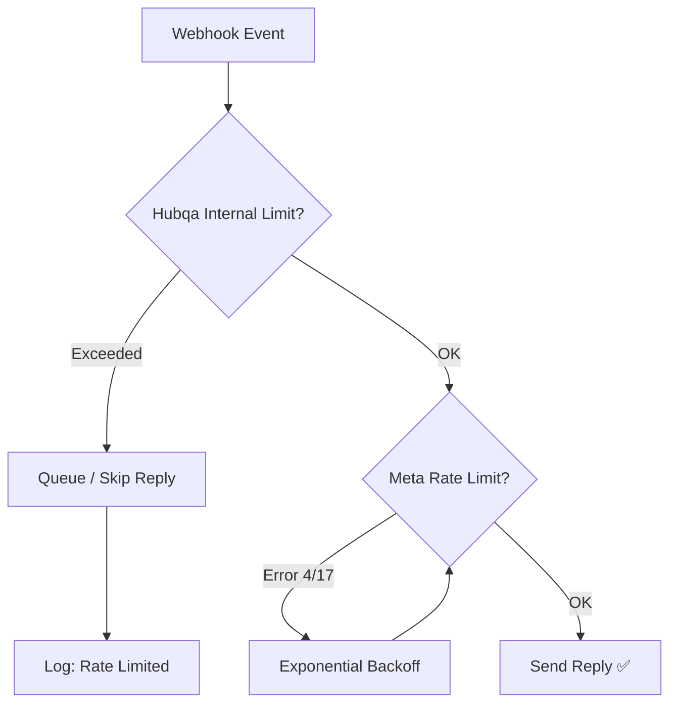

# 09 - مرجع حدود المعدل (Rate Limits Reference)

> [!NOTE]
> هذا المرجع يغطي جميع حدود المعدل (Rate Limits) في Meta APIs مع استراتيجيات التعامل معها وكيفية تطبيقها في مشروع Hubqa.
> آخر تحديث: يوليو 2026 | Graph API v25.0

---

## جدول المحتويات

1. [نظرة عامة على حدود المعدل](#نظرة-عامة-على-حدود-المعدل)
2. [حدود مستوى التطبيق (App-Level)](#حدود-مستوى-التطبيق-app-level)
3. [حدود مستوى الصفحة (Page-Level)](#حدود-مستوى-الصفحة-page-level)
4. [حدود Business Use Case (BUC)](#حدود-business-use-case-buc)
5. [حدود Instagram](#حدود-instagram)
6. [حدود WhatsApp](#حدود-whatsapp)
7. [مراقبة الحدود (Monitoring Headers)](#مراقبة-الحدود-monitoring-headers)
8. [أفضل الممارسات](#أفضل-الممارسات)
9. [حدود Hubqa الداخلية](#حدود-hubqa-الداخلية)

---

## نظرة عامة على حدود المعدل

### لماذا توجد حدود المعدل؟

Meta تفرض حدوداً على عدد الاستدعاءات لحماية البنية التحتية ومنع إساءة الاستخدام. تجاوز هذه الحدود يؤدي إلى:
- **Error Code 4**: App request limit reached
- **Error Code 17**: User request limit reached
- **حظر مؤقت**: عادةً 1-24 ساعة
- **حظر دائم**: في حالات الإساءة المتكررة

### أنواع الحدود

```
┌─────────────────────────────────────────────────────┐
│                  Meta Rate Limits                    │
├─────────────────┬───────────────────────────────────┤
│ App-Level       │ 200 × DAU per hour                │
│ Page-Level      │ Per-page quota (24h window)       │
│ BUC-Level       │ Formula-based per use case        │
│ Instagram       │ 200 calls/user/hour               │
│ WhatsApp Msg    │ Tiered (250 → Unlimited)          │
│ WhatsApp API    │ 80-1000 msg/sec throughput        │
└─────────────────┴───────────────────────────────────┘
```

---

## حدود مستوى التطبيق (App-Level)

### الصيغة

```
الحد = 200 × عدد المستخدمين النشطين يومياً (DAU)
الفترة = ساعة واحدة (sliding window)
```

### أمثلة

| DAU | الحد بالساعة | مثال |
|---|---|---|
| 1 (تطوير) | 200 calls/hour | كافي للتطوير |
| 100 | 20,000 calls/hour | تطبيق صغير |
| 1,000 | 200,000 calls/hour | تطبيق متوسط |
| 10,000 | 2,000,000 calls/hour | تطبيق كبير |

### ملاحظات مهمة

> [!WARNING]
> - **DAU** يُحسب تلقائياً من Meta — لا يمكنك التحكم فيه
> - تطبيقات التطوير الجديدة: الحد الأدنى **200 calls/hour**
> - لا يشمل WhatsApp Cloud API calls (لها نظام منفصل)
> - الـ batch requests تُحسب كاستدعاءات متعددة (كل عنصر = استدعاء)

### ماذا يحدث عند تجاوز الحد

```json
{
  "error": {
    "message": "Application request limit reached",
    "type": "OAuthException",
    "code": 4,
    "fbtrace_id": "AbCdEfGhIjK"
  }
}
```

### الاستجابة الصحيحة

```
1. توقف عن إرسال الطلبات
2. انتظر (exponential backoff)
3. تحقق من header: X-App-Usage
4. استأنف عندما تنخفض النسبة
```

---

## حدود مستوى الصفحة (Page-Level)

### كيف تعمل

كل صفحة Facebook لها حصة منفصلة تعتمد على عدد المتابعين ونشاط الصفحة.

| الخاصية | التفصيل |
|---|---|
| **الفترة** | 24 ساعة (sliding window) |
| **الحساب** | بناءً على حجم الصفحة ونشاطها |
| **النطاق** | يؤثر على الصفحة فقط، لا على التطبيق |
| **Header** | `X-Page-Usage` |

### ملاحظات

```
⚠️ حدود الصفحة منفصلة عن حدود التطبيق
⚠️ كل صفحة لها حصة مستقلة
⚠️ الحد لا يُعلن رسمياً (يعتمد على حجم الصفحة)
⚠️ صفحات صغيرة = حدود أقل
```

### ماذا يحدث عند تجاوز الحد

```json
{
  "error": {
    "message": "(#32) Page request limit reached",
    "type": "OAuthException",
    "code": 32,
    "fbtrace_id": "AbCdEfGhIjK"
  }
}
```

---

## حدود Business Use Case (BUC)

### ما هي BUC Rate Limits؟

نظام أحدث من Meta يحدد الحدود بناءً على **حالة الاستخدام** (Use Case) وليس فقط التطبيق.

### الصيغة

```
الحد يعتمد على:
├── نوع الـ Use Case (Messaging, Ads, Pages, etc.)
├── مستوى الوصول (Standard / Advanced)
├── حجم الأعمال (Business size)
└── تاريخ الاستخدام (Usage history)
```

### BUC Categories

| Category | أمثلة على الاستدعاءات |
|---|---|
| **Messaging** | Send/receive messages, manage conversations |
| **Page Management** | Page settings, subscriptions, posts |
| **Content Publishing** | Create/edit/delete posts and media |
| **Analytics** | Page insights, post metrics |
| **Ads Management** | Ad creation, campaign management |

### مراقبة BUC

```
Header: X-Business-Use-Case-Usage
```

```json
{
  "BUSINESS_ID": [
    {
      "type": "messenger",
      "call_count": 45,
      "total_cputime": 120,
      "total_time": 85,
      "estimated_time_to_regain_access": 0
    }
  ]
}
```

---

## حدود Instagram

### Instagram Graph API

| الحد | القيمة | الملاحظات |
|---|---|---|
| **API Calls** | 200 calls/user/hour | صارم جداً |
| **Content Publishing** | 25 posts/day | لكل حساب IG |
| **Comment Replies** | ضمن الـ 200 calls | كل رد = call |
| **Hashtag Search** | 30 unique hashtags/7 days | لكل مستخدم |

> [!CAUTION]
> **حد Instagram صارم جداً:** 200 استدعاء/مستخدم/ساعة يشمل جميع أنواع الاستدعاءات (قراءة + كتابة). في تطبيق Auto-Reply، كل رد على تعليق = استدعاء واحد. مع 200 تعليق/ساعة، تستنفد الحصة بالكامل!

### حساب الاستهلاك لـ Hubqa

```
سيناريو: صفحة Instagram نشطة
├── قراءة التعليقات: ~10 calls/hour (عبر Webhooks = 0!)
├── الرد على التعليقات: 1 call/reply
├── إرسال DM: 1 call/message
├── قراءة بيانات المنشور: ~5 calls/hour
└── المجموع المتاح للردود: ~185 reply/hour

✅ ميزة Webhooks: لا تُحسب ضمن Rate Limit!
```

---

## حدود WhatsApp

### مستويات المراسلة (Messaging Tiers)

WhatsApp يستخدم نظام مستويات للحد من عدد العملاء الفريدين الذين يمكنك مراسلتهم خلال 24 ساعة.

| المستوى (Tier) | عدد العملاء الفريدين / 24 ساعة | متطلبات الترقية |
|---|---|---|
| **Unverified** | 250 | — |
| **Tier 1** | 1,000 | Business Verification |
| **Tier 2** | 10,000 | Quality rating + volume |
| **Tier 3** | 100,000 | Quality rating + volume |
| **Unlimited** | بلا حدود | Quality rating + sustained volume |

> [!IMPORTANT]
> **العملاء الفريدون وليس الرسائل!** يمكنك إرسال عدد غير محدود من الرسائل لنفس العميل. الحد هو على **عدد العملاء المختلفين** الذين تبدأ محادثة معهم.

### آلية الترقية التلقائية

```
الشروط للترقية:
1. الحفاظ على Quality Rating = High أو Medium
2. إرسال رسائل لعدد عملاء ≥ ضعف الحد الحالي خلال 7 أيام
3. لا تنبيهات جودة حديثة

مثال الترقية من Tier 1 → Tier 2:
  → أرسل لـ ≥ 2,000 عميل فريد خلال 7 أيام
  → مع quality rating عالي
  → تتم الترقية تلقائياً
```

### آلية التخفيض

```
أسباب التخفيض:
├── Quality Rating = Low
├── معدل حظر/بلاغات عالي
├── انتهاك سياسات WhatsApp
└── إرسال رسائل spam

النتيجة:
├── تخفيض المستوى
├── تقييد إرسال الرسائل
└── في الحالات الشديدة: تعليق الحساب
```

### حدود الإنتاجية (Throughput)

| النوع | المعدل | الملاحظات |
|---|---|---|
| **Standard** | 80 messages/second | لمعظم الحسابات |
| **High Throughput** | حتى 1,000 messages/second | يتطلب تقديم طلب خاص |

### حدود Template Messages

| الحد | القيمة |
|---|---|
| **إنشاء قوالب** | 100 template/hour per WABA |
| **عدد القوالب** | 250 template per WABA (default) |
| **حذف القوالب** | لا حد معلن |

### حدود إضافية

| العملية | الحد |
|---|---|
| **Media Upload** | 500 uploads/minute |
| **Webhook Verification** | 2 requests/second |
| **Phone Number Registration** | 10/minute |

### رسائل أخطاء WhatsApp Rate Limit

```json
{
  "error": {
    "message": "(#130429) Rate limit hit",
    "type": "OAuthException",
    "code": 130429,
    "error_data": {
      "messaging_product": "whatsapp",
      "details": "Too many messages sent to this phone number"
    },
    "fbtrace_id": "AbCdEfGhIjK"
  }
}
```

---

## مراقبة الحدود (Monitoring Headers)

### Headers المتوفرة

Meta ترسل headers مع كل استجابة API تُظهر حالة الاستهلاك:

#### 1. `X-App-Usage`

```
X-App-Usage: {"call_count":28,"total_cputime":15,"total_time":24}
```

| الحقل | المعنى | الحد الحرج |
|---|---|---|
| `call_count` | نسبة الاستدعاءات المستخدمة (%) | > 90% ⚠️ |
| `total_cputime` | نسبة وقت CPU المستخدم (%) | > 90% ⚠️ |
| `total_time` | نسبة الوقت الإجمالي المستخدم (%) | > 90% ⚠️ |

#### 2. `X-Page-Usage`

```
X-Page-Usage: {"call_count":15,"total_cputime":8,"total_time":12}
```

نفس هيكل `X-App-Usage` لكن على مستوى الصفحة.

#### 3. `X-Business-Use-Case-Usage`

```json
{
  "BUSINESS_ID": [
    {
      "type": "messenger",
      "call_count": 45,
      "total_cputime": 120,
      "total_time": 85,
      "estimated_time_to_regain_access": 0
    }
  ]
}
```

| الحقل | المعنى |
|---|---|
| `type` | نوع الـ Use Case |
| `call_count` | نسبة الاستدعاءات (%) |
| `total_cputime` | نسبة CPU (%) |
| `total_time` | نسبة الوقت (%) |
| `estimated_time_to_regain_access` | الوقت المتبقي بالدقائق (0 = لم يتم التجاوز) |

### مثال مراقبة Headers

```typescript
import { AxiosResponse } from 'axios';

interface UsageMetrics {
  call_count: number;
  total_cputime: number;
  total_time: number;
}

function checkRateLimitHeaders(response: AxiosResponse): void {
  // 1. فحص App-Level Usage
  const appUsage = response.headers['x-app-usage'];
  if (appUsage) {
    const usage: UsageMetrics = JSON.parse(appUsage);
    
    if (usage.call_count > 80) {
      console.warn(`⚠️ App call_count at ${usage.call_count}% — approaching limit!`);
    }
    if (usage.call_count > 95) {
      console.error(`🛑 App call_count at ${usage.call_count}% — THROTTLE NOW!`);
      // تفعيل التباطؤ
      enableThrottling('app', usage);
    }
  }

  // 2. فحص Page-Level Usage
  const pageUsage = response.headers['x-page-usage'];
  if (pageUsage) {
    const usage: UsageMetrics = JSON.parse(pageUsage);
    
    if (usage.call_count > 80) {
      console.warn(`⚠️ Page call_count at ${usage.call_count}%`);
    }
  }

  // 3. فحص BUC Usage
  const bucUsage = response.headers['x-business-use-case-usage'];
  if (bucUsage) {
    const bucData = JSON.parse(bucUsage);
    for (const [businessId, useCases] of Object.entries(bucData)) {
      for (const uc of useCases as any[]) {
        if (uc.estimated_time_to_regain_access > 0) {
          console.error(
            `🛑 BUC ${uc.type} throttled! Regain access in ${uc.estimated_time_to_regain_access} min`
          );
        }
      }
    }
  }
}
```

---

## أفضل الممارسات

### 1. Exponential Backoff

```typescript
async function callWithBackoff<T>(
  fn: () => Promise<T>,
  maxRetries: number = 5
): Promise<T> {
  for (let attempt = 0; attempt < maxRetries; attempt++) {
    try {
      return await fn();
    } catch (error: any) {
      const errorCode = error?.response?.data?.error?.code;
      
      // فقط retry على أخطاء Rate Limit
      if (errorCode === 4 || errorCode === 17 || errorCode === 32) {
        const delay = Math.min(1000 * Math.pow(2, attempt), 60000);
        const jitter = Math.random() * 1000;
        
        console.warn(
          `⏳ Rate limited (code ${errorCode}). ` +
          `Retry ${attempt + 1}/${maxRetries} in ${(delay + jitter) / 1000}s`
        );
        
        await new Promise(resolve => setTimeout(resolve, delay + jitter));
      } else {
        throw error; // لا تعيد المحاولة لأخطاء أخرى
      }
    }
  }
  throw new Error('Max retries exceeded');
}
```

### 2. Batch Requests

```bash
# بدلاً من 3 استدعاءات منفصلة...
POST https://graph.facebook.com/v25.0/
Content-Type: application/json

{
  "access_token": "{access_token}",
  "batch": [
    { "method": "GET", "relative_url": "page-id-1?fields=name,fan_count" },
    { "method": "GET", "relative_url": "page-id-2?fields=name,fan_count" },
    { "method": "GET", "relative_url": "page-id-3?fields=name,fan_count" }
  ]
}
```

> [!TIP]
> **Batch requests تُحسب كاستدعاءات متعددة** في Rate Limit (كل عنصر = استدعاء). لكنها تقلل الـ latency وتبسط الكود.

### 3. التخزين المؤقت (Caching)

```typescript
// تخزين مؤقت لبيانات لا تتغير كثيراً
class GraphApiCache {
  private cache = new Map<string, { data: any; expiresAt: number }>();

  async getPageInfo(pageId: string, token: string): Promise<any> {
    const cacheKey = `page:${pageId}`;
    const cached = this.cache.get(cacheKey);

    if (cached && cached.expiresAt > Date.now()) {
      return cached.data; // لا استدعاء API
    }

    const data = await graphApi.get(`/${pageId}?fields=name,picture`, token);
    this.cache.set(cacheKey, {
      data,
      expiresAt: Date.now() + 3600000 // ساعة واحدة
    });

    return data;
  }
}
```

### 4. Webhooks بدلاً من Polling

```
❌ Polling (سيء):
  → كل 30 ثانية: GET /{page-id}/feed
  → 120 calls/hour لصفحة واحدة
  → 10 صفحات = 1,200 calls/hour
  → بيانات أغلبها لم تتغير

✅ Webhooks (جيد):
  → 0 calls للقراءة (Meta يرسل لك)
  → فقط calls للردود (1 per reply)
  → أسرع (real-time)
  → أوفر (أقل استدعاءات)
```

### 5. جدول ملخص الممارسات

| الممارسة | الأولوية | التأثير |
|---|---|---|
| استخدام Webhooks | 🔴 حرج | يلغي الحاجة لـ polling |
| Exponential Backoff | 🔴 حرج | يمنع تفاقم الحظر |
| مراقبة Usage Headers | 🟡 مهم | إنذار مبكر |
| Caching | 🟡 مهم | يقلل الاستدعاءات 50-80% |
| Batch Requests | 🟢 مفيد | يقلل latency |
| Request Queuing | 🟢 مفيد | يوزع الحمل بالتساوي |

---

## حدود Hubqa الداخلية

### لماذا حدود داخلية إضافية؟

حدود Meta سخية نسبياً، لكن Hubqa يخدم عدة عملاء على نفس التطبيق. الحدود الداخلية تمنع عميل واحد من استهلاك حصة التطبيق بالكامل.

> [!IMPORTANT]
> **الحدود الداخلية في Hubqa هي throttles لمنع الحظر من Meta، وهي منفصلة تماماً عن حدود Meta الرسمية.**

### حدود الخطط

| الخطة | حد بالساعة | حد شهري | الملاحظات |
|---|---|---|---|
| **STARTER** | 20 reply/hour | 100 reply/month | للتجربة والمشاريع الصغيرة |
| **PRO** | 120 reply/hour | Unlimited | للشركات المتوسطة |
| **ENTERPRISE** | 300 reply/hour | Unlimited | للشركات الكبيرة |

### ملف التنفيذ

```
backend/src/common/plan-limits.ts
```

### هيكل التنفيذ

```typescript
// plan-limits.ts
export enum PlanType {
  STARTER = 'STARTER',
  PRO = 'PRO',
  ENTERPRISE = 'ENTERPRISE',
}

export interface PlanLimits {
  maxRepliesPerHour: number;
  maxRepliesPerMonth: number | null; // null = unlimited
  maxChannels: number;
  maxRulesPerChannel: number;
}

export const PLAN_LIMITS: Record<PlanType, PlanLimits> = {
  [PlanType.STARTER]: {
    maxRepliesPerHour: 20,
    maxRepliesPerMonth: 100,
    maxChannels: 2,
    maxRulesPerChannel: 5,
  },
  [PlanType.PRO]: {
    maxRepliesPerHour: 120,
    maxRepliesPerMonth: null, // unlimited
    maxChannels: 10,
    maxRulesPerChannel: 50,
  },
  [PlanType.ENTERPRISE]: {
    maxRepliesPerHour: 300,
    maxRepliesPerMonth: null, // unlimited
    maxChannels: 50,
    maxRulesPerChannel: 200,
  },
};
```

### مقارنة الحدود

```
Meta Limits (لكل التطبيق):
├── App-Level: 200 × DAU / hour
├── Page-Level: Dynamic / 24h
└── Instagram: 200 / user / hour

Hubqa Internal Limits (لكل عميل):
├── STARTER:    20/hour,  100/month
├── PRO:       120/hour,  unlimited
└── ENTERPRISE: 300/hour, unlimited

الحدود الأكثر تقييداً = الحدود الداخلية (مصممة هكذا عمداً)
```

### مخطط التدفق



---

> [!NOTE]
> لأكواد الأخطاء المتعلقة بحدود المعدل (Code 4, 17, 32)، راجع [10-error-codes.md](./10-error-codes.md).
> لتفاصيل تنفيذ الحدود الداخلية في المشروع، راجع [12-project-integration.md](./12-project-integration.md).
