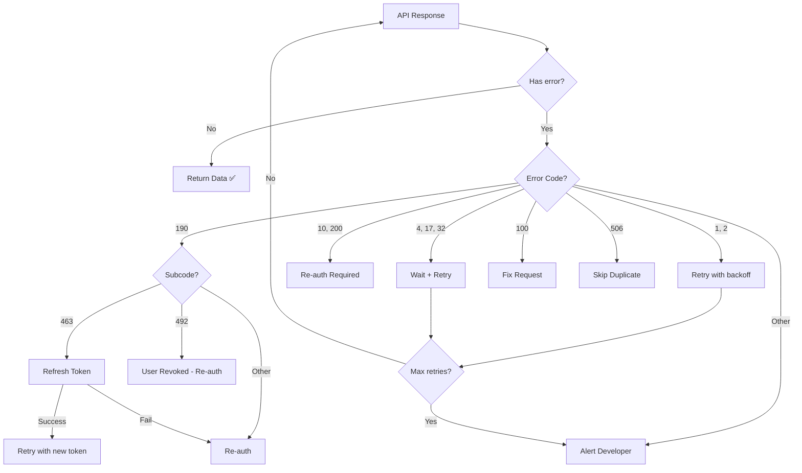

# 10 - مرجع أكواد الأخطاء (Error Codes Reference)

> [!NOTE]
> هذا المرجع يوثق جميع أكواد الأخطاء الشائعة في Meta Graph API مع استراتيجيات التعامل مع كل خطأ.
> آخر تحديث: يوليو 2026 | Graph API v25.0

---

## جدول المحتويات

1. [هيكل الخطأ (Error Response Structure)](#هيكل-الخطأ-error-response-structure)
2. [أكواد الأخطاء الشائعة](#أكواد-الأخطاء-الشائعة)
3. [أخطاء OAuth والـ Access Token](#أخطاء-oauth-والـ-access-token)
4. [أخطاء الأذونات](#أخطاء-الأذونات)
5. [أخطاء حدود المعدل](#أخطاء-حدود-المعدل)
6. [أخطاء WhatsApp الخاصة](#أخطاء-whatsapp-الخاصة)
7. [أخطاء Instagram الخاصة](#أخطاء-instagram-الخاصة)
8. [استراتيجيات معالجة الأخطاء](#استراتيجيات-معالجة-الأخطاء)
9. [ملاحظات مشروع Hubqa](#ملاحظات-مشروع-hubqa)

---

## هيكل الخطأ (Error Response Structure)

### الهيكل القياسي

كل خطأ من Meta Graph API يأتي بنفس الشكل:

```json
{
  "error": {
    "message": "Human readable error description",
    "type": "OAuthException",
    "code": 190,
    "error_subcode": 463,
    "error_user_title": "Login Required",
    "error_user_msg": "Your session has expired. Please log in again.",
    "fbtrace_id": "AbCdEfGhIjKlMnOpQr"
  }
}
```

### شرح الحقول

| الحقل | النوع | الوصف | مثال |
|---|---|---|---|
| `message` | string | وصف الخطأ (للمطورين) | `"Invalid OAuth access token"` |
| `type` | string | نوع الخطأ | `"OAuthException"`, `"GraphMethodException"` |
| `code` | number | كود الخطأ الرئيسي | `190`, `100`, `4` |
| `error_subcode` | number | كود فرعي للتفصيل | `463`, `492` |
| `error_user_title` | string | عنوان للمستخدم (اختياري) | `"Login Required"` |
| `error_user_msg` | string | رسالة للمستخدم (اختياري) | `"Your session has expired"` |
| `fbtrace_id` | string | معرف التتبع الفريد | `"AbCdEfGhIjK"` |

> [!IMPORTANT]
> **قواعد التعامل مع الأخطاء:**
> 1. **ابنِ المنطق على `code` + `error_subcode`** وليس على `message` (النص قد يتغير)
> 2. **احتفظ دائماً بـ `fbtrace_id`** — مطلوب عند التواصل مع دعم Meta
> 3. **اعرض `error_user_msg`** للمستخدم إذا كان موجوداً (مُترجم ومناسب)

---

## أكواد الأخطاء الشائعة

### جدول شامل

| Code | المعنى | الإجراء المطلوب | قابل لإعادة المحاولة |
|---|---|---|---|
| **1** | Unknown error | أعد المحاولة مع backoff | ✅ نعم |
| **2** | Service temporarily unavailable | انتظر وأعد المحاولة | ✅ نعم |
| **4** | Application request limit reached | تباطؤ، تحقق من `X-App-Usage` | ✅ نعم (بعد انتظار) |
| **10** | Permission denied | تحقق من الأذونات/scopes | ❌ لا |
| **17** | User request limit reached | انتظر وأعد المحاولة | ✅ نعم (بعد انتظار) |
| **100** | Invalid parameter | تحقق من معاملات الطلب | ❌ لا |
| **102** | Session key invalid | أعد المصادقة | ❌ لا |
| **104** | Incorrect signature | تحقق من App Secret | ❌ لا |
| **190** | Invalid access token | الـ token منتهي/ملغي | ❌ لا (أعد المصادقة) |
| **200** | Permission error | ينقص إذن محدد | ❌ لا |
| **506** | Duplicate post | غيّر المحتوى | ❌ لا |

---

### تفصيل كل كود

---

#### Code 1 — Unknown Error

```json
{
  "error": {
    "message": "An unknown error occurred",
    "type": "OAuthException",
    "code": 1,
    "fbtrace_id": "AbCdEfGhIjK"
  }
}
```

**الأسباب:**
- خطأ داخلي مؤقت في Meta
- مشكلة في البنية التحتية

**الإجراء:**
```typescript
// أعد المحاولة بعد 1-5 ثوانٍ
if (error.code === 1) {
  await delay(randomBetween(1000, 5000));
  return retry(request);
}
```

---

#### Code 2 — Service Temporarily Unavailable

```json
{
  "error": {
    "message": "Service temporarily unavailable",
    "type": "OAuthException",
    "code": 2,
    "fbtrace_id": "AbCdEfGhIjK"
  }
}
```

**الأسباب:**
- صيانة مجدولة من Meta
- حمل زائد على الخوادم
- مشكلة مؤقتة في خدمة معينة

**الإجراء:**
```typescript
// انتظر أطول قبل إعادة المحاولة
if (error.code === 2) {
  await delay(randomBetween(5000, 30000));
  return retry(request);
}
```

---

#### Code 4 — Application Request Limit Reached

```json
{
  "error": {
    "message": "(#4) Application request limit reached",
    "type": "OAuthException",
    "code": 4,
    "fbtrace_id": "AbCdEfGhIjK"
  }
}
```

**الأسباب:**
- تجاوزت حد `200 × DAU` استدعاء بالساعة
- حمل مفاجئ على التطبيق

**الإجراء:**
```typescript
if (error.code === 4) {
  // 1. تحقق من X-App-Usage header
  const appUsage = JSON.parse(response.headers['x-app-usage'] || '{}');
  
  // 2. إذا call_count > 100%: انتظر حتى تنخفض
  if (appUsage.call_count >= 100) {
    console.error('🛑 App rate limited. Pausing all requests.');
    await delay(300000); // 5 دقائق
  }
  
  // 3. فعّل التباطؤ على مستوى التطبيق
  enableAppThrottling();
}
```

> [!WARNING]
> **لا تعد المحاولة فوراً** عند Error 4! كل محاولة تُحسب وتزيد الأمور سوءاً. انتظر 5-15 دقيقة.

---

#### Code 10 — Permission Denied

```json
{
  "error": {
    "message": "(#10) Permission denied",
    "type": "OAuthException",
    "code": 10,
    "fbtrace_id": "AbCdEfGhIjK"
  }
}
```

**الأسباب:**
- الإذن المطلوب غير ممنوح
- التطبيق لا يملك Advanced Access

**الإجراء:**
```typescript
if (error.code === 10) {
  // 1. تحقق من الأذونات الممنوحة
  const permissions = await checkGrantedPermissions(accessToken);
  
  // 2. حدد الإذن المفقود
  console.error('Missing permission. Granted:', permissions);
  
  // 3. اطلب من المستخدم إعادة المصادقة
  notifyUserToReauth(userId, missingPermission);
}
```

---

#### Code 17 — User Request Limit Reached

```json
{
  "error": {
    "message": "(#17) User request limit reached",
    "type": "OAuthException",
    "code": 17,
    "fbtrace_id": "AbCdEfGhIjK"
  }
}
```

**الأسباب:**
- المستخدم الفردي تجاوز حد الاستدعاءات
- شائع في Instagram (200 calls/user/hour)

**الإجراء:**
```typescript
if (error.code === 17) {
  // انتظر 15-30 دقيقة
  await delay(randomBetween(900000, 1800000));
  return retry(request);
}
```

---

#### Code 100 — Invalid Parameter

```json
{
  "error": {
    "message": "(#100) Invalid parameter",
    "type": "OAuthException",
    "code": 100,
    "error_subcode": 33,
    "fbtrace_id": "AbCdEfGhIjK"
  }
}
```

**الأسباب:**
- معامل مفقود أو بقيمة خاطئة
- ID غير صالح
- URL غير صالح
- نوع بيانات خاطئ

**الإجراء:**
```typescript
if (error.code === 100) {
  // لا تعد المحاولة — أصلح الطلب
  console.error('Invalid parameter:', error.message);
  logRequestDetails(request); // سجل تفاصيل الطلب للتحليل
}
```

**Subcodes شائعة لـ Code 100:**

| Subcode | المعنى |
|---|---|
| 33 | هذا العنصر غير موجود أو لا يمكنك مشاهدته |
| 2018001 | الكائن لا يمكن تحميله (object cannot be loaded) |

---

#### Code 102 — Session Key Invalid

```json
{
  "error": {
    "message": "Session key invalid or no longer valid",
    "type": "OAuthException",
    "code": 102,
    "fbtrace_id": "AbCdEfGhIjK"
  }
}
```

**الأسباب:**
- الجلسة انتهت
- المستخدم سحب الصلاحيات

**الإجراء:**
```typescript
if (error.code === 102) {
  // أعد المصادقة بالكامل
  await revokeStoredToken(userId);
  notifyUserToReauth(userId);
}
```

---

#### Code 104 — Incorrect Signature

```json
{
  "error": {
    "message": "Incorrect signature",
    "type": "OAuthException",
    "code": 104,
    "fbtrace_id": "AbCdEfGhIjK"
  }
}
```

**الأسباب:**
- App Secret خاطئ
- تم تغيير App Secret (rotation)
- خطأ في حساب الـ hash

**الإجراء:**
```typescript
if (error.code === 104) {
  // تحقق من App Secret
  console.error('🔑 App Secret mismatch! Check environment variables.');
  // لا تعد المحاولة — أصلح الإعدادات
}
```

---

#### Code 190 — Invalid Access Token

```json
{
  "error": {
    "message": "Invalid OAuth access token - Cannot parse access token",
    "type": "OAuthException",
    "code": 190,
    "error_subcode": 463,
    "fbtrace_id": "AbCdEfGhIjK"
  }
}
```

**هذا أهم كود خطأ في OAuth.** الـ `error_subcode` يحدد السبب الدقيق.

---

## أخطاء OAuth والـ Access Token

### Code 190 Subcodes

| Subcode | المعنى | الإجراء |
|---|---|---|
| **460** | Password changed | أعد المصادقة |
| **463** | Token expired | جدد الـ token |
| **464** | Session invalidated (uninstall) | المستخدم أزال التطبيق |
| **467** | Token no longer valid | أعد المصادقة |
| **492** | Permission/impersonation issue | تحقق من الصلاحيات وأعد المصادقة |

### تفصيل Subcodes المهمة

---

#### Subcode 463 — Token Expired

```json
{
  "error": {
    "message": "Error validating access token: Session has expired",
    "type": "OAuthException",
    "code": 190,
    "error_subcode": 463,
    "fbtrace_id": "AbCdEfGhIjK"
  }
}
```

**أوقات انتهاء الـ Tokens:**

| نوع الـ Token | مدة الصلاحية |
|---|---|
| Short-lived User Token | ~1-2 ساعة |
| Long-lived User Token | ~60 يوم |
| Page Access Token (from long-lived) | **لا ينتهي** |
| App Access Token | **لا ينتهي** |

**الإجراء:**
```typescript
if (error.code === 190 && error.error_subcode === 463) {
  // 1. حاول تجديد الـ token
  try {
    const newToken = await refreshLongLivedToken(storedToken);
    await updateStoredToken(userId, newToken);
    return retry(request, newToken);
  } catch {
    // 2. إذا فشل التجديد: اطلب إعادة المصادقة
    notifyUserToReauth(userId);
  }
}
```

---

#### Subcode 492 — Permission/Impersonation Issue

```json
{
  "error": {
    "message": "Error validating access token: The user has not authorized application",
    "type": "OAuthException",
    "code": 190,
    "error_subcode": 492,
    "fbtrace_id": "AbCdEfGhIjK"
  }
}
```

**الأسباب:**
- المستخدم سحب الصلاحيات من إعدادات حسابه
- تم حذف دور المستخدم في الصفحة
- مشكلة في token impersonation (استخدام token مستخدم للوصول لصفحة)

**الإجراء:**
```typescript
if (error.code === 190 && error.error_subcode === 492) {
  // المستخدم سحب الصلاحيات — يجب إعادة المصادقة
  await markChannelDisconnected(channelId);
  notifyUserToReconnect(userId, channelId);
}
```

---

## أخطاء الأذونات

### Code 200 — Permission Error

```json
{
  "error": {
    "message": "(#200) Requires extended permission: publish_pages",
    "type": "OAuthException",
    "code": 200,
    "fbtrace_id": "AbCdEfGhIjK"
  }
}
```

**الفرق بين Code 10 و Code 200:**

| Code | المعنى | السبب |
|---|---|---|
| **10** | Permission denied (عام) | التطبيق لا يملك الإذن |
| **200** | Requires specific permission | إذن محدد مفقود في الـ Token |

**Subcodes شائعة لـ Code 200:**

| Subcode | المعنى |
|---|---|
| 299 | تحتاج إذن محدد أو أذونات App Review |
| 2018001 | لا يمكنك القيام بهذا الإجراء |

**الإجراء:**
```typescript
if (error.code === 200) {
  // استخرج اسم الإذن المفقود من الرسالة
  const match = error.message.match(/Requires (?:extended )?permission: (\w+)/);
  const missingPermission = match?.[1];

  if (missingPermission) {
    console.error(`Missing permission: ${missingPermission}`);
    // اطلب من المستخدم منح الإذن المفقود
    promptReauthorization(userId, [missingPermission]);
  }
}
```

---

## أخطاء حدود المعدل

### ملخص أكواد Rate Limit

| Code | المستوى | مدة الانتظار المقترحة |
|---|---|---|
| **4** | Application-level | 5-15 دقيقة |
| **17** | User-level | 15-30 دقيقة |
| **32** | Page-level | 30-60 دقيقة |
| **613** | Custom rate limit (legacy) | 10-30 دقيقة |

### Code 32 — Page Rate Limit

```json
{
  "error": {
    "message": "(#32) Page request limit reached",
    "type": "OAuthException",
    "code": 32,
    "fbtrace_id": "AbCdEfGhIjK"
  }
}
```

**الإجراء:**
```typescript
if (error.code === 32) {
  // حد الصفحة أبطأ في التعافي
  const pageId = extractPageId(request);
  await pausePageRequests(pageId, 1800000); // 30 دقيقة
  console.warn(`Page ${pageId} rate limited. Pausing for 30 minutes.`);
}
```

---

## أخطاء WhatsApp الخاصة

### أكواد WhatsApp Cloud API

| Code | المعنى | الإجراء |
|---|---|---|
| **130429** | Rate limit hit | تباطؤ وأعد المحاولة |
| **131000** | Generic error | أعد المحاولة |
| **131005** | Permission denied | تحقق من WABA permissions |
| **131008** | Required parameter missing | تحقق من الطلب |
| **131009** | Invalid parameter | أصلح المعاملات |
| **131016** | Service unavailable | أعد المحاولة لاحقاً |
| **131021** | Recipient not on WhatsApp | لا ترسل لهذا الرقم |
| **131026** | Message undeliverable | الرقم محظور أو غير متاح |
| **131042** | Business eligibility issue | تحقق من حالة WABA |
| **131047** | Re-engagement message | خارج نافذة 24 ساعة |
| **131048** | Spam rate limit | جودة الرسائل منخفضة |
| **131051** | Unsupported message type | نوع الرسالة غير مدعوم |
| **132000** | Template parameter mismatch | عدد/نوع المعاملات خاطئ |
| **132001** | Template does not exist | اسم القالب خاطئ |
| **132005** | Template hydration failed | فشل تعبئة القالب |
| **132007** | Template format incorrect | تنسيق القالب خاطئ |
| **132012** | Template paused | القالب معلق بسبب الجودة |
| **132015** | Template disabled | القالب معطل |
| **133000** | Phone number not registered | سجل الرقم أولاً |
| **133004** | Server busy | أعد المحاولة |
| **133005** | Too many PIN guesses | انتظر قبل المحاولة |
| **133010** | Phone number already registered | الرقم مسجل مسبقاً |

### مثال خطأ WhatsApp

```json
{
  "error": {
    "message": "(#131047) Re-engagement message",
    "type": "OAuthException",
    "code": 131047,
    "error_data": {
      "messaging_product": "whatsapp",
      "details": "Message failed to send because more than 24 hours have passed since the customer last replied to this number."
    },
    "error_subcode": 2494010,
    "fbtrace_id": "AbCdEfGhIjK"
  }
}
```

> [!WARNING]
> **خطأ 131047 (Re-engagement):** بعد 24 ساعة من آخر رسالة من العميل، يجب استخدام **Template Message** فقط. لا يمكن إرسال رسائل حرة.

---

## أخطاء Instagram الخاصة

### أكواد Instagram Graph API

| Code | المعنى | الإجراء |
|---|---|---|
| **24** | Too many calls to this API | تباطؤ (200 calls/user/hour) |
| **36003** | Invalid media | تحقق من الوسيط |
| **36004** | Cannot reply to deleted comment | التعليق محذوف |
| **100 (sub: 33)** | Object does not exist | العنصر محذوف أو غير مرئي |

### مثال خطأ Instagram

```json
{
  "error": {
    "message": "(#36004) Cannot reply to a deleted comment",
    "type": "OAuthException",
    "code": 36004,
    "fbtrace_id": "AbCdEfGhIjK"
  }
}
```

---

## Code 506 — Duplicate Post

```json
{
  "error": {
    "message": "(#506) Duplicate status message",
    "type": "OAuthException",
    "code": 506,
    "fbtrace_id": "AbCdEfGhIjK"
  }
}
```

**الأسباب:**
- محاولة نشر نفس المحتوى النصي مرتين بتتابع
- الرد بنفس النص على نفس التعليق

**الإجراء:**
```typescript
if (error.code === 506) {
  // غيّر المحتوى قليلاً أو تجاهل
  console.warn('Duplicate content detected. Skipping.');
  // لا تعد المحاولة بنفس المحتوى
}
```

> [!TIP]
> **لتجنب Error 506 في Auto-Reply:**
> - أضف طابع زمني أو معرف فريد لكل رد
> - استخدم قوالب متعددة وقم بالتدوير بينها
> - أضف اسم المستخدم في الرد لجعله فريداً

---

## استراتيجيات معالجة الأخطاء

### 1. معالج أخطاء شامل

```typescript
interface GraphApiError {
  message: string;
  type: string;
  code: number;
  error_subcode?: number;
  fbtrace_id: string;
  error_user_msg?: string;
}

enum ErrorAction {
  RETRY = 'RETRY',               // أعد المحاولة
  RETRY_AFTER_DELAY = 'DELAY',   // انتظر ثم أعد
  REAUTH = 'REAUTH',             // أعد المصادقة
  FIX_REQUEST = 'FIX',           // أصلح الطلب
  SKIP = 'SKIP',                 // تجاهل
  ALERT = 'ALERT',               // تنبيه المطور
}

function classifyError(error: GraphApiError): {
  action: ErrorAction;
  delayMs?: number;
  userMessage?: string;
} {
  switch (error.code) {
    // ═══ Transient Errors (أعد المحاولة) ═══
    case 1:
      return { action: ErrorAction.RETRY, delayMs: 2000 };
    case 2:
      return { action: ErrorAction.RETRY_AFTER_DELAY, delayMs: 15000 };

    // ═══ Rate Limits (انتظر وأعد) ═══
    case 4:
      return {
        action: ErrorAction.RETRY_AFTER_DELAY,
        delayMs: 300000, // 5 دقائق
        userMessage: 'تم تجاوز حد الطلبات. سنعاود المحاولة قريباً.'
      };
    case 17:
      return { action: ErrorAction.RETRY_AFTER_DELAY, delayMs: 900000 };
    case 32:
      return { action: ErrorAction.RETRY_AFTER_DELAY, delayMs: 1800000 };

    // ═══ Permission Errors ═══
    case 10:
    case 200:
      return {
        action: ErrorAction.REAUTH,
        userMessage: 'يرجى إعادة ربط حسابك لمنح الأذونات المطلوبة.'
      };

    // ═══ Token Errors ═══
    case 190:
      if (error.error_subcode === 463) {
        return {
          action: ErrorAction.REAUTH,
          userMessage: 'انتهت صلاحية الجلسة. يرجى إعادة تسجيل الدخول.'
        };
      }
      if (error.error_subcode === 492) {
        return {
          action: ErrorAction.REAUTH,
          userMessage: 'تم سحب الصلاحيات. يرجى إعادة ربط الحساب.'
        };
      }
      return { action: ErrorAction.REAUTH };

    // ═══ Request Errors ═══
    case 100:
      return { action: ErrorAction.FIX_REQUEST };
    case 102:
      return { action: ErrorAction.REAUTH };
    case 104:
      return { action: ErrorAction.ALERT };

    // ═══ Duplicate ═══
    case 506:
      return { action: ErrorAction.SKIP };

    // ═══ WhatsApp Specific ═══
    case 131047:
      return {
        action: ErrorAction.SKIP,
        userMessage: 'تجاوزت نافذة 24 ساعة. استخدم Template Message.'
      };
    case 131021:
      return { action: ErrorAction.SKIP };
    case 130429:
      return { action: ErrorAction.RETRY_AFTER_DELAY, delayMs: 60000 };

    default:
      return { action: ErrorAction.ALERT };
  }
}
```

### 2. Middleware للتعامل مع الأخطاء

```typescript
async function graphApiRequest(
  url: string,
  options: RequestOptions,
  maxRetries: number = 3
): Promise<any> {
  for (let attempt = 0; attempt <= maxRetries; attempt++) {
    try {
      const response = await fetch(url, options);
      const data = await response.json();

      if (data.error) {
        const { action, delayMs, userMessage } = classifyError(data.error);

        // سجل الخطأ مع fbtrace_id
        logError({
          code: data.error.code,
          subcode: data.error.error_subcode,
          message: data.error.message,
          fbtrace_id: data.error.fbtrace_id,
          attempt,
          action,
        });

        switch (action) {
          case ErrorAction.RETRY:
            if (attempt < maxRetries) continue;
            break;

          case ErrorAction.RETRY_AFTER_DELAY:
            if (attempt < maxRetries && delayMs) {
              await delay(delayMs);
              continue;
            }
            break;

          case ErrorAction.REAUTH:
            throw new ReauthRequiredError(data.error, userMessage);

          case ErrorAction.FIX_REQUEST:
            throw new InvalidRequestError(data.error);

          case ErrorAction.SKIP:
            return null; // تجاهل بهدوء

          case ErrorAction.ALERT:
            await notifyDeveloper(data.error);
            throw new GraphApiError(data.error);
        }
      }

      return data;
    } catch (networkError) {
      if (attempt < maxRetries) {
        await delay(Math.pow(2, attempt) * 1000);
        continue;
      }
      throw networkError;
    }
  }
}
```

### 3. مخطط تدفق معالجة الأخطاء



---

## ملاحظات مشروع Hubqa

### الوضع الحالي

> [!WARNING]
> **حالياً في `webhooks.service.ts`:** الأخطاء تُسجَّل فقط (log) بدون تحليل أكواد الأخطاء. هذا يجب إصلاحه.

### ما يجب تنفيذه

```typescript
// الوضع الحالي ❌
try {
  await graphApi.post(`/${commentId}/comments`, { message });
} catch (error) {
  console.error('Error replying to comment:', error);
  // لا تحليل! لا إعادة محاولة! لا إشعار!
}

// ما يجب تنفيذه ✅
try {
  await graphApiRequest(`/${commentId}/comments`, {
    method: 'POST',
    body: { message },
  });
} catch (error) {
  if (error instanceof ReauthRequiredError) {
    await markChannelNeedsReauth(channelId);
    await notifyUser(userId, error.userMessage);
  } else if (error instanceof InvalidRequestError) {
    await logFailedReply(commentId, error);
  }
  // Rate limit errors handled automatically by graphApiRequest
}
```

### قائمة التحسينات المطلوبة

| # | التحسين | الأولوية | الملف |
|---|---|---|---|
| 1 | تحليل `error.code` في كل استدعاء | 🔴 حرج | `webhooks.service.ts` |
| 2 | تنفيذ `classifyError()` centrally | 🔴 حرج | `common/graph-api-errors.ts` |
| 3 | إعادة المحاولة التلقائية (retry) | 🟡 مهم | `common/graph-api.ts` |
| 4 | إشعار المستخدم عند فشل Token | 🟡 مهم | `channels.service.ts` |
| 5 | تخزين `fbtrace_id` للأخطاء | 🟢 مفيد | `webhooks.service.ts` |
| 6 | Dashboard لعرض الأخطاء | 🟢 مفيد | Frontend |

---

### مرجع سريع: ماذا تفعل لكل كود

```
Code 1    → أعد المحاولة (2s)
Code 2    → انتظر (15s) وأعد
Code 4    → توقف (5min) ← Rate Limit!
Code 10   → تحقق الأذونات
Code 17   → انتظر (15min)
Code 32   → انتظر (30min) ← Page Limit!
Code 100  → أصلح الطلب
Code 102  → أعد المصادقة
Code 104  → تحقق App Secret
Code 190  → token منتهي → جدد أو أعد المصادقة
Code 200  → إذن مفقود
Code 506  → محتوى مكرر → غيّر النص
```

---

> [!NOTE]
> للمزيد حول حدود المعدل وأكواد 4/17/32، راجع [09-rate-limits.md](./09-rate-limits.md).
> للأذونات المتعلقة بأكواد 10/200، راجع [08-permissions-reference.md](./08-permissions-reference.md).
