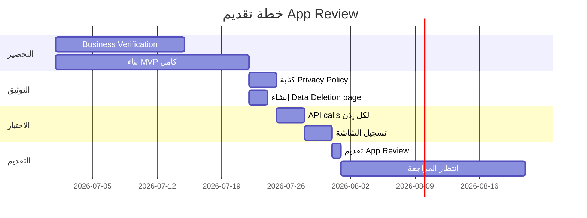

# 11 - مرجع عملية مراجعة التطبيق (App Review Process)

> [!NOTE]
> هذا المرجع يغطي كل ما تحتاج معرفته عن عملية App Review في Meta — من التحضير إلى التقديم والموافقة.
> آخر تحديث: يوليو 2026

---

## جدول المحتويات

1. [نظرة عامة](#نظرة-عامة)
2. [متى تحتاج App Review؟](#متى-تحتاج-app-review)
3. [المتطلبات المسبقة](#المتطلبات-المسبقة)
4. [الوثائق المطلوبة](#الوثائق-المطلوبة)
5. [Business Verification](#business-verification)
6. [أسباب الرفض الشائعة](#أسباب-الرفض-الشائعة)
7. [استراتيجية التقديم الموصى بها](#استراتيجية-التقديم-الموصى-بها)
8. [إعدادات التطبيق المطلوبة](#إعدادات-التطبيق-المطلوبة)
9. [الجدول الزمني](#الجدول-الزمني)
10. [حالات خاصة](#حالات-خاصة)

---

## نظرة عامة

### ما هو App Review؟

App Review هي عملية مراجعة من Meta للتأكد أن تطبيقك:
- يستخدم الأذونات بشكل صحيح ومبرر
- يحترم خصوصية المستخدمين
- يلتزم بسياسات Meta
- يوفر تجربة مستخدم حقيقية

### لماذا يجب عليك المرور بها؟

```
بدون App Review:
├── ❌ فقط مستخدمو أدوار التطبيق يمكنهم استخدامه (حتى 5 أشخاص)
├── ❌ لا يمكن لأي مستخدم خارجي ربط حسابه
├── ❌ بيانات محدودة وأذونات مقيدة
└── ❌ لا يمكن الإطلاق التجاري

بعد App Review:
├── ✅ أي مستخدم Facebook يمكنه استخدام تطبيقك
├── ✅ Advanced Access لجميع الأذونات المعتمدة
├── ✅ بيانات كاملة بدون قيود
└── ✅ جاهز للإطلاق التجاري
```

---

## متى تحتاج App Review؟

### الحالات التي تتطلب App Review

| السيناريو | يتطلب App Review؟ | السبب |
|---|---|---|
| SaaS لعملاء خارجيين (مثل Hubqa) | ✅ **نعم** | مستخدمون خارجيون |
| تطبيق لشركتك فقط (internal) | ⚠️ **يعتمد** | بعض الأذونات تتطلبه |
| تطوير واختبار | ❌ **لا** | Standard Access كافي |
| WhatsApp Business (direct developer) | ⚠️ **قد لا** | بعض الاستثناءات |

### Hubqa تحديداً

> [!IMPORTANT]
> **Hubqa كمنصة SaaS تحتاج App Review بالتأكيد** لأن:
> 1. مستخدمون خارجيون سيربطون صفحاتهم وحساباتهم
> 2. التطبيق يصل لبيانات مستخدمين (تعليقات، رسائل)
> 3. يرسل رسائل نيابة عن الصفحات
> 4. يحتاج Advanced Access لكل الأذونات

---

## المتطلبات المسبقة

### قبل التقديم، يجب توفر:

#### 1. بيئة اختبار عاملة

```
✅ تطبيق يعمل ويمكن الوصول إليه عبر الإنترنت
✅ بيانات اعتماد اختبارية يمكن لفريق Meta استخدامها
✅ صفحة Facebook اختبارية مربوطة
✅ جميع الأذونات المطلوبة تعمل مع بيانات حقيقية
```

> [!WARNING]
> **يجب أن يكون التطبيق يعمل فعلاً!** لا تقدم تطبيقاً تحت التطوير أو "قريباً". فريق المراجعة سيختبره.

#### 2. استدعاءات API ناجحة

```
✅ على الأقل استدعاء ناجح واحد لكل إذن خلال آخر 30 يوماً
✅ يظهر في App Dashboard → API Explorer → Recent Activity
```

**كيف تتحقق:**
```bash
# تحقق من نشاط API الأخير في
https://developers.facebook.com/apps/{APP_ID}/dashboard/
```

#### 3. صفحات الامتثال (Compliance Pages)

| الصفحة | المتطلبات | مثال URL |
|---|---|---|
| **Privacy Policy** | عامة، باللغة الإنجليزية، تشرح البيانات المجموعة | `https://hubqa.com/privacy` |
| **Terms of Service** | عامة، تشرح شروط الاستخدام | `https://hubqa.com/terms` |
| **Data Deletion** | رابط يعمل لطلب حذف البيانات | `https://hubqa.com/data-deletion` |

> [!CAUTION]
> **صفحة سياسة الخصوصية يجب أن تكون:**
> - متاحة للعامة (بدون تسجيل دخول)
> - باللغة الإنجليزية (أو مع ترجمة إنجليزية)
> - تذكر تحديداً: Facebook، Instagram، وWhatsApp
> - تشرح: ما البيانات المجموعة، كيف تُستخدم، كيف تُحذف
> - **ليست صفحة placeholder أو "Coming Soon"!**

#### 4. تسجيلات الشاشة (Screencasts)

```
✅ تسجيل شاشة لكل إذن مطلوب
✅ باللغة الإنجليزية أو مع ترجمة/تعليقات إنجليزية
✅ يظهر بوضوح كيف يُستخدم كل إذن
✅ مدة كافية لإظهار العملية كاملة (عادة 1-5 دقائق لكل إذن)
```

---

## الوثائق المطلوبة

### 1. تسجيلات الشاشة (Screencasts) — الأهم

#### متطلبات كل تسجيل

| المتطلب | التفصيل |
|---|---|
| **الصيغة** | MP4، MOV، أو رابط فيديو (YouTube/Vimeo) |
| **اللغة** | إنجليزي أو مع subtitles إنجليزية |
| **الجودة** | واضح بما يكفي لقراءة النصوص |
| **المحتوى** | يظهر استخدام الإذن في التطبيق الحقيقي |
| **المدة** | 1-5 دقائق لكل إذن |

#### ما يجب تسجيله لكل إذن

---

##### `pages_show_list`
```
📹 أظهر:
1. المستخدم يضغط "Connect Facebook Page"
2. OAuth Dialog يظهر مع قائمة الأذونات
3. المستخدم يوافق
4. قائمة الصفحات تظهر في التطبيق
5. المستخدم يختار صفحة
```

##### `pages_manage_metadata`
```
📹 أظهر:
1. الصفحة المختارة في لوحة التحكم
2. عملية تسجيل Webhook (يمكن إظهار الـ logs)
3. تأكيد نجاح التسجيل
```

##### `pages_read_engagement`
```
📹 أظهر:
1. قائمة منشورات الصفحة في التطبيق
2. التعليقات ظاهرة على المنشورات
3. استخدام هذه البيانات (مثل: عرض التعليقات للرد عليها)
```

##### `pages_manage_engagement`
```
📹 أظهر:
1. تعليق جديد يظهر
2. القاعدة التلقائية تتطابق
3. الرد يُرسل تلقائياً
4. الرد يظهر تحت التعليق في Facebook
```

##### `pages_messaging`
```
📹 أظهر:
1. مستخدم يرسل رسالة للصفحة عبر Messenger
2. الرسالة تظهر في التطبيق (أو logs)
3. الرد التلقائي يُرسل
4. الرد يظهر في Messenger
```

##### `instagram_basic`
```
📹 أظهر:
1. ربط حساب Instagram
2. معلومات الحساب تظهر في لوحة التحكم
3. المنشورات/الوسائط تظهر
```

##### `instagram_manage_comments`
```
📹 أظهر:
1. تعليق Instagram جديد
2. القاعدة تتطابق
3. الرد التلقائي يُرسل
4. الرد يظهر في Instagram
```

##### `instagram_manage_messages`
```
📹 أظهر:
1. مستخدم يرسل DM لحساب Instagram
2. الرسالة تصل للتطبيق
3. الرد التلقائي يُرسل
4. أيضاً: Story mention يظهر ويُعالج
```

---

### 2. بيانات الاعتماد الاختبارية

```
يجب توفير:
├── رابط التطبيق: https://app.hubqa.com
├── بيانات اختبارية:
│   ├── Email: test@hubqa.com
│   └── Password: TestPassword123!
├── تعليمات الاستخدام خطوة بخطوة
└── ملاحظة: الحساب مربوط بصفحة اختبارية جاهزة
```

> [!TIP]
> **نصيحة ذهبية:** أنشئ حساب اختبار خاص لفريق Meta، مربوط مسبقاً بصفحة Facebook اختبارية وحساب Instagram اختبار. هذا يسهل عملية المراجعة كثيراً.

### 3. وصف الاستخدام

لكل إذن، يجب كتابة وصف واضح:

```
Permission: pages_manage_engagement
Usage: Our platform (Hubqa) allows business owners to set up 
auto-reply rules for their Facebook Page comments. When a new 
comment matches a rule's keywords, our system automatically 
posts a reply to that comment using the Pages API. This helps 
businesses respond to customers quickly even outside business 
hours. The reply is posted as the Page, not as an individual user.
```

---

## Business Verification

### ما هو Business Verification؟

عملية منفصلة عن App Review تتحقق من هوية شركتك القانونية.

### المتطلبات

| المتطلب | التفصيل |
|---|---|
| **الحساب** | Meta Business Suite (Business Manager) |
| **المدة** | 10-14 يوم عمل |
| **المستندات** | وثائق رسمية تثبت هوية الشركة |

### المستندات المقبولة

يجب تقديم **وثيقتين على الأقل** من القائمة:

| الوثيقة | ماذا تثبت | ملاحظات |
|---|---|---|
| **شهادة تأسيس الشركة** (Certificate of Incorporation) | الاسم القانوني | مطلوبة عادةً |
| **رخصة تجارية** (Business License) | نشاط الشركة | حسب البلد |
| **شهادة تسجيل ضريبي** (Tax Registration) | الرقم الضريبي | مقبولة في معظم الدول |
| **فاتورة خدمات** (Utility Bill) | العنوان الفعلي | حديثة (آخر 3 أشهر) |
| **كشف حساب بنكي** (Bank Statement) | العنوان والاسم | حديث (آخر 3 أشهر) |
| **فاتورة هاتف** (Phone Bill) | العنوان | حديثة |

> [!CAUTION]
> **التناسق أمر حاسم (CONSISTENCY):**
> - اسم الشركة يجب أن يتطابق **حرفياً** في جميع الوثائق
> - العنوان يجب أن يتطابق **حرفياً** في جميع الوثائق
> - أي اختلاف (حتى في الترتيب أو الاختصارات) = **رفض**
> 
> **مثال على التناسق:**
> ```
> ✅ صحيح:
>   شهادة التأسيس: "Hubqa Technology LLC"
>   فاتورة الخدمات: "Hubqa Technology LLC"
> 
> ❌ خاطئ:
>   شهادة التأسيس: "Hubqa Technology LLC"
>   فاتورة الخدمات: "HUBQA TECH LLC"  ← اختلاف!
> ```

### البريد الإلكتروني المهني

```
✅ استخدم بريداً على نطاق شركتك: admin@hubqa.com
❌ لا تستخدم: hubqa.company@gmail.com
```

> [!TIP]
> البريد الإلكتروني على نطاق الشركة (`@hubqa.com`) يسرّع عملية التحقق لأن Meta يمكنها التحقق من ملكية النطاق.

### خطوات Business Verification

```
1. اذهب إلى: Meta Business Suite → Settings → Business Info
2. ابدأ عملية التحقق (Start Verification)
3. أدخل بيانات الشركة:
   ├── الاسم القانوني
   ├── العنوان
   ├── رقم الهاتف
   └── الموقع الإلكتروني
4. ارفع المستندات المطلوبة
5. انتظر التحقق (10-14 يوم عمل)
6. قد يُطلب مستندات إضافية
```

---

## أسباب الرفض الشائعة

### 1. تسجيل الشاشة لا يُظهر الإذن ❌

```
المشكلة: الفيديو لا يُظهر بوضوح كيف يُستخدم الإذن المطلوب
الحل: سجل فيديو جديد يُظهر بوضوح:
  ├── الخطوة التي تحتاج الإذن
  ├── البيانات التي يصل إليها التطبيق
  └── كيف يستخدمها التطبيق لصالح المستخدم
```

### 2. طلب أذونات غير ضرورية ❌

```
المشكلة: طلب أذونات لا يستخدمها التطبيق فعلاً
مثال: طلب instagram_content_publish بدون خاصية النشر في التطبيق
الحل: اطلب فقط الأذونات التي تستخدمها فعلاً
  ├── لا تطلب أذونات "للمستقبل"
  └── يمكنك طلب أذونات إضافية لاحقاً عند الحاجة
```

### 3. التطبيق غير متاح للاختبار ❌

```
المشكلة: فريق Meta لا يستطيع الوصول للتطبيق أو استخدامه
أسباب شائعة:
  ├── التطبيق يتطلب تسجيل دخول لكن لا توجد بيانات اختبارية
  ├── التطبيق على localhost أو شبكة داخلية
  ├── التطبيق معطل/متوقف
  └── SSL certificate منتهي
الحل:
  ├── وفر بيانات اختبار تعمل
  ├── التطبيق على رابط عام HTTPS
  └── تأكد أنه يعمل 24/7 خلال فترة المراجعة
```

### 4. صفحات الامتثال مفقودة أو غير مكتملة ❌

```
المشكلة: Privacy Policy أو Data Deletion غير موجودة أو placeholder
أسباب شائعة:
  ├── صفحة "Coming Soon"
  ├── رابط معطل (404)
  ├── محتوى لا يذكر Facebook/Instagram/WhatsApp
  └── لا توجد طريقة لحذف البيانات
الحل:
  ├── اكتب سياسة خصوصية حقيقية وشاملة
  ├── اذكر تحديداً البيانات من Meta APIs
  ├── وفر نموذج حذف بيانات يعمل فعلاً
  └── تأكد أن جميع الروابط تعمل
```

### 5. لا نشاط API حديث ❌

```
المشكلة: لا استدعاءات API ناجحة خلال آخر 30 يوماً
الحل:
  ├── قبل التقديم: قم باستدعاء API واحد على الأقل لكل إذن
  ├── استخدم Graph API Explorer إذا لزم الأمر
  └── تحقق من Dashboard → Recent Activity
```

### 6. تطبيق غير مكتمل أو تحت التطوير ❌

```
المشكلة: التطبيق في مرحلة MVP غير مكتمل
علامات:
  ├── صفحات "Under Construction"
  ├── ميزات لا تعمل
  ├── أخطاء ظاهرة للمستخدم
  └── واجهة غير احترافية
الحل:
  ├── أكمل البناء قبل التقديم
  ├── اختبر جميع المسارات
  └── أصلح جميع الأخطاء الظاهرة
```

### ملخص أسباب الرفض

| # | السبب | التكرار | الخطورة |
|---|---|---|---|
| 1 | تسجيل شاشة لا يُظهر الإذن | 🔴 شائع جداً | حرج |
| 2 | أذونات غير ضرورية | 🟡 شائع | متوسط |
| 3 | التطبيق غير متاح | 🔴 شائع جداً | حرج |
| 4 | صفحات الامتثال | 🟡 شائع | حرج |
| 5 | لا نشاط API | 🟢 أقل شيوعاً | متوسط |
| 6 | تطبيق غير مكتمل | 🟡 شائع | حرج |

---

## استراتيجية التقديم الموصى بها

### الخطة المثالية (4-6 أسابيع)



### الخطوات بالتفصيل

#### الأسبوع 1-2: التحضير

```
□ ابدأ Business Verification (يأخذ 10-14 يوم)
□ أكمل بناء MVP مع جميع الميزات الأساسية
□ تأكد من عمل جميع الأذونات في Development mode
□ أنشئ حسابات اختبارية
```

#### الأسبوع 2-3: التوثيق والامتثال

```
□ اكتب Privacy Policy شاملة
□ اكتب Terms of Service
□ أنشئ Data Deletion Request endpoint
□ تأكد من عمل جميع الروابط
□ تأكد أن Privacy Policy تذكر:
  ├── Facebook Data
  ├── Instagram Data
  ├── WhatsApp Data (إذا مطلوب)
  ├── كيف تُجمع البيانات
  ├── كيف تُستخدم
  ├── كيف تُحذف
  └── حقوق المستخدم
```

#### الأسبوع 3: الاختبار والتسجيل

```
□ قم باستدعاء API ناجح لكل إذن:
  ├── pages_show_list: GET /me/accounts
  ├── pages_manage_metadata: POST /{page}/subscribed_apps
  ├── pages_read_engagement: GET /{page}/posts
  ├── pages_manage_engagement: POST /{comment}/comments
  ├── pages_messaging: POST /me/messages
  ├── instagram_basic: GET /{ig-user}
  ├── instagram_manage_comments: POST /{comment}/replies
  └── instagram_manage_messages: POST /{ig-user}/messages

□ سجل فيديو لكل إذن:
  ├── تأكد من الوضوح والجودة
  ├── أضف subtitles إنجليزية إذا لزم
  ├── حمّل على YouTube/Vimeo (unlisted)
  └── تأكد من أن الروابط تعمل
```

#### الأسبوع 3-4: التقديم

```
□ اذهب إلى: App Dashboard → App Review → Permissions and Features
□ لكل إذن:
  ├── اضغط "Request Advanced Access"
  ├── اكتب وصف الاستخدام (بالإنجليزية)
  ├── أرفق رابط الفيديو
  ├── أضف بيانات الاختبار
  └── أضف رابط التطبيق
□ راجع كل شيء مرة أخيرة
□ اضغط "Submit for Review"
```

#### الأسبوع 4-7: الانتظار

```
□ انتظر ~20 يوم عمل
□ راقب البريد الإلكتروني لأي استفسارات من Meta
□ لا تغيّر أي شيء في التطبيق خلال المراجعة
□ تأكد أن السيرفر يعمل 24/7
□ إذا طُلبت معلومات إضافية: رد بسرعة (خلال 5 أيام عمل)
```

---

## إعدادات التطبيق المطلوبة

### في App Dashboard

| الإعداد | المكان | القيمة | مطلوب |
|---|---|---|---|
| **App ID** | Settings → Basic | يُنشأ تلقائياً | ✅ |
| **App Secret** | Settings → Basic | يُنشأ تلقائياً | ✅ |
| **Valid OAuth Redirect URIs** | Facebook Login → Settings | `https://api.hubqa.com/auth/facebook/callback` | ✅ |
| **Deauthorize Callback URL** | Facebook Login → Settings | `https://api.hubqa.com/auth/deauthorize` | ✅ |
| **Data Deletion Request URL** | Facebook Login → Settings | `https://api.hubqa.com/auth/data-deletion` | ✅ |
| **Privacy Policy URL** | Settings → Basic | `https://hubqa.com/privacy` | ✅ |
| **Terms of Service URL** | Settings → Basic | `https://hubqa.com/terms` | ✅ |
| **App Icon** | Settings → Basic | 1024×1024 PNG | ✅ |
| **App Category** | Settings → Basic | Business | ✅ |
| **Business Use** | Settings → Basic | Support my own business / Provide services to other businesses | ✅ |

### Webhook Configuration

```
Settings → Webhooks:
├── Callback URL: https://api.hubqa.com/webhooks
├── Verify Token: {WEBHOOK_VERIFY_TOKEN}
└── Subscriptions:
    ├── Page: feed, messages, messaging_postbacks, messaging_referrals
    ├── Instagram: comments, messages, story_insights
    └── WhatsApp Business Account: messages
```

### Facebook Login Settings

```
Facebook Login → Settings:
├── Client OAuth Login: Yes
├── Web OAuth Login: Yes
├── Force Web OAuth Reauthentication: No
├── Use Strict Mode for Redirect URIs: Yes
├── Enforce HTTPS: Yes
├── Embedded Browser OAuth Login: No
├── Valid OAuth Redirect URIs:
│   ├── https://api.hubqa.com/auth/facebook/callback
│   └── https://api.hubqa.com/auth/instagram/callback
├── Deauthorize Callback URL: https://api.hubqa.com/auth/deauthorize
└── Data Deletion Request URL: https://api.hubqa.com/auth/data-deletion
```

### متغيرات البيئة المرتبطة

```bash
# App Credentials
FACEBOOK_APP_ID=your_app_id
FACEBOOK_APP_SECRET=your_app_secret     # أو APP_SECRET
FACEBOOK_REDIRECT_URI=https://api.hubqa.com/auth/facebook/callback

# Instagram (قد يكون نفس التطبيق أو تطبيق منفصل)
INSTAGRAM_APP_ID=your_instagram_app_id
INSTAGRAM_APP_SECRET=your_instagram_app_secret
INSTAGRAM_REDIRECT_URI=https://api.hubqa.com/auth/instagram/callback

# Webhook
WEBHOOK_VERIFY_TOKEN=your_random_verify_token

# Encryption
ENCRYPTION_KEY=your_256_bit_encryption_key
```

---

## الجدول الزمني

### المدة المتوقعة (2026)

| المرحلة | المدة | ملاحظات |
|---|---|---|
| **Business Verification** | 10-14 يوم عمل | ابدأ بها أولاً! |
| **App Review** | ~20 يوم عمل | بعد اكتمال التحضير |
| **إذا طُلبت تعديلات** | +5-10 أيام عمل | لكل دورة مراجعة إضافية |
| **المدة الإجمالية** | 4-6 أسابيع | من البداية للموافقة |

### نصائح لتسريع العملية

```
🚀 نصائح:
├── ابدأ Business Verification بالتوازي مع بناء التطبيق
├── اكتب أوصاف الأذونات بوضوح (وفّر وقت المراجع)
├── سجل فيديوهات عالية الجودة (لا تجعل المراجع يخمن)
├── وفر بيانات اختبار جاهزة (لا تجعل المراجع يسجل حساب)
├── رد على الاستفسارات بسرعة (خلال 24 ساعة)
└── لا تقدم في أيام العطل أو نهاية الأسبوع
```

---

## حالات خاصة

### WhatsApp — Direct Developers

```
إذا كنت "Direct Developer" (تستخدم WhatsApp لشركتك فقط):
├── قد لا تحتاج App Review لبعض الأذونات
├── لكن تحتاج Business Verification دائماً
├── هذا لا ينطبق على Hubqa (SaaS = Not Direct Developer)
└── للتأكد: تحقق من App Dashboard → WhatsApp → Getting Started
```

### إعادة التقديم بعد الرفض

```
إذا تم رفض التطبيق:
1. اقرأ سبب الرفض بعناية
2. أصلح المشاكل المذكورة
3. لا تعد التقديم فوراً — انتظر 24 ساعة على الأقل
4. أعد تسجيل الفيديوهات إذا لزم الأمر
5. أضف ملاحظة توضح التغييرات التي أجريتها
6. المدة: ~20 يوم عمل أخرى
```

### الاستئناف

```
إذا اعتقدت أن الرفض خاطئ:
1. اضغط "Appeal" في App Dashboard
2. اشرح بوضوح لماذا تعتقد أن الرفض خاطئ
3. وفر أدلة إضافية
4. المدة: ~10 أيام عمل
```

---

### قائمة مراجعة نهائية قبل التقديم

```
✅ Checklist:
├── Business Verification ✅
├── MVP يعمل بالكامل ✅
├── Privacy Policy (عامة، شاملة) ✅
├── Terms of Service ✅
├── Data Deletion endpoint (يعمل) ✅
├── API calls ناجحة لكل إذن (آخر 30 يوم) ✅
├── تسجيلات شاشة لكل إذن ✅
├── بيانات اختبارية جاهزة ✅
├── App icon (1024×1024) ✅
├── جميع URLs تعمل ✅
├── SSL certificates صالحة ✅
├── السيرفر يعمل 24/7 ✅
└── وصف واضح لكل إذن ✅
```

---

> [!NOTE]
> لقائمة الأذونات المطلوبة بالتفصيل، راجع [08-permissions-reference.md](./08-permissions-reference.md).
> لربط هذه الإعدادات بالكود، راجع [12-project-integration.md](./12-project-integration.md).
