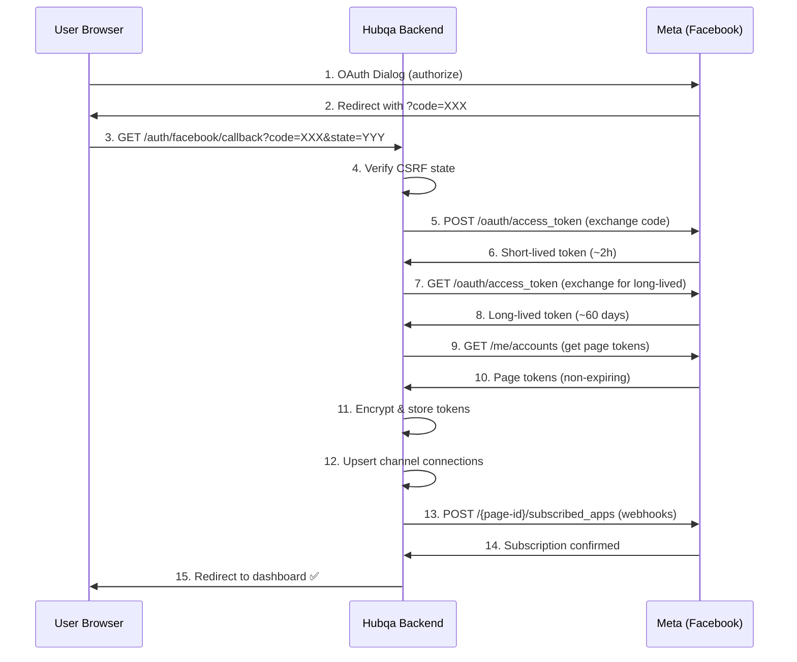
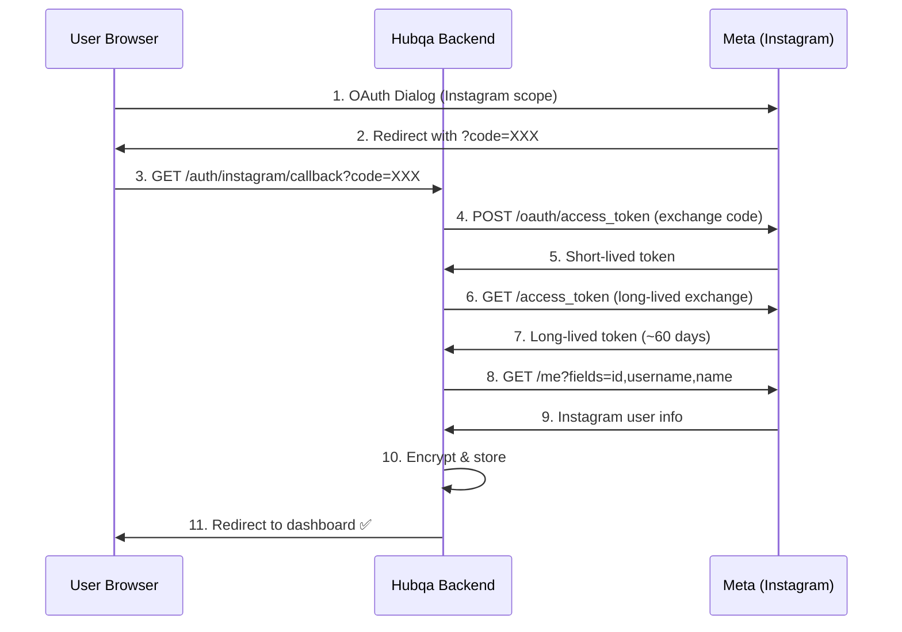
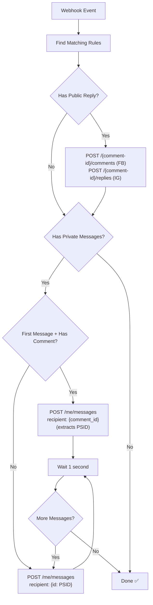
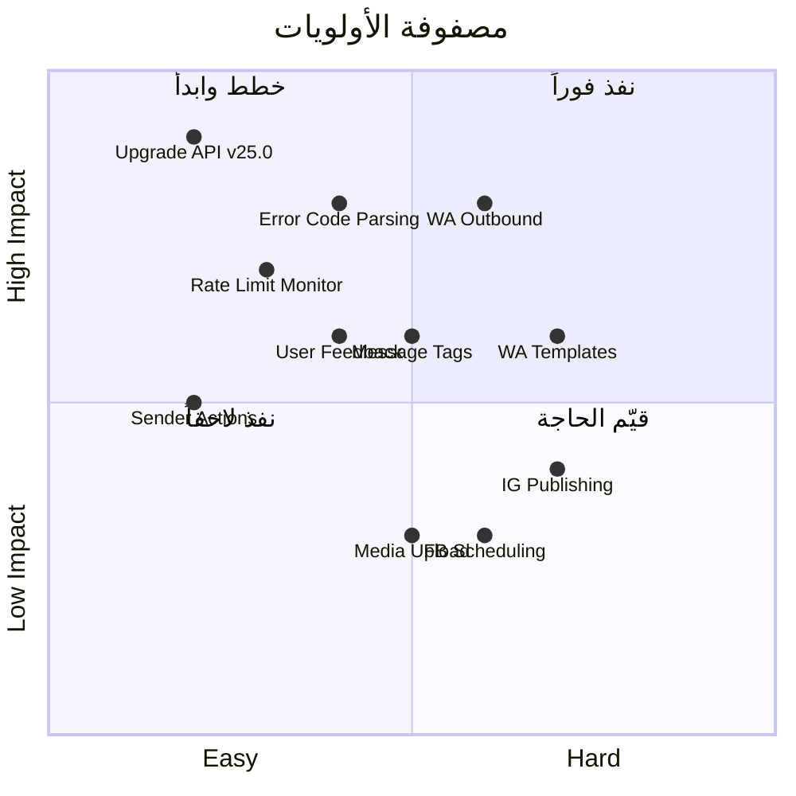

# 12 - مرجع تكامل المشروع (Project Integration Reference)

> [!NOTE]
> هذا المرجع يوثق كيف يستخدم مشروع **Hubqa** واجهات Meta APIs — خريطة كاملة من الكود إلى الـ API endpoints.
> آخر تحديث: يوليو 2026

---

## جدول المحتويات

1. [إصدار Graph API](#إصدار-graph-api)
2. [تدفق OAuth](#تدفق-oauth)
3. [معالجة Webhooks](#معالجة-webhooks)
4. [إدارة القنوات (Channel Management)](#إدارة-القنوات-channel-management)
5. [تنفيذ القواعد (Rule Execution / Auto-Reply)](#تنفيذ-القواعد-rule-execution--auto-reply)
6. [الأمان (Security)](#الأمان-security)
7. [متغيرات البيئة](#متغيرات-البيئة)
8. [المفقود والمطلوب (TODO)](#المفقود-والمطلوب-todo)

---

## إصدار Graph API

### الملف

```
backend/src/common/graph-api.ts
```

### الوضع الحالي

> [!CAUTION]
> **الإصدار الحالي: v21.0 — منتهي الصلاحية!**
> 
> Meta تسحب الإصدارات القديمة تدريجياً. الإصدار v21.0 قد لا يعمل أو يعمل بشكل غير متوقع.

### الإجراء المطلوب

```diff
// backend/src/common/graph-api.ts
- const GRAPH_API_VERSION = 'v21.0';
+ const GRAPH_API_VERSION = 'v25.0';

- const GRAPH_API_BASE = 'https://graph.facebook.com/v21.0';
+ const GRAPH_API_BASE = 'https://graph.facebook.com/v25.0';
```

### سياسة إصدارات Meta

```
Graph API Versioning Policy:
├── كل إصدار يعمل لمدة ~2 سنوات بعد إصداره
├── إصدارات جديدة كل ~3-4 أشهر
├── يجب الترقية قبل انتهاء الصلاحية
└── الإصدار الحالي المستقر: v25.0 (يوليو 2026)

جدول الإصدارات:
├── v21.0: ❌ منتهي
├── v22.0: ⚠️ سينتهي قريباً
├── v23.0: ✅ مدعوم
├── v24.0: ✅ مدعوم
└── v25.0: ✅ الأحدث (موصى به)
```

> [!TIP]
> **عند الترقية:** ابحث في الكود عن كل مكان يحتوي `v21.0` واستبدله بـ `v25.0`. قد يكون في ملفات متعددة.

---

## تدفق OAuth

### الملف الرئيسي

```
backend/src/channels/channels.service.ts
```

### Facebook OAuth Flow

#### الدالة: `handleFacebookCallback()`



#### تفصيل كل خطوة

##### الخطوة 5: تبادل الـ Code بـ Token

```typescript
// Exchange authorization code for short-lived token
const tokenResponse = await axios.get(
  `https://graph.facebook.com/v25.0/oauth/access_token`, {
    params: {
      client_id: process.env.FACEBOOK_APP_ID,
      client_secret: process.env.FACEBOOK_APP_SECRET,
      redirect_uri: process.env.FACEBOOK_REDIRECT_URI,
      code: authorizationCode,
    }
  }
);

const shortLivedToken = tokenResponse.data.access_token;
// expires_in: ~5184000 (if already long-lived) or ~3600 (short-lived)
```

##### الخطوة 7: تحويل إلى Long-Lived Token

```typescript
// Exchange short-lived token for long-lived token
const longLivedResponse = await axios.get(
  `https://graph.facebook.com/v25.0/oauth/access_token`, {
    params: {
      grant_type: 'fb_exchange_token',
      client_id: process.env.FACEBOOK_APP_ID,
      client_secret: process.env.FACEBOOK_APP_SECRET,
      fb_exchange_token: shortLivedToken,
    }
  }
);

const longLivedToken = longLivedResponse.data.access_token;
// expires_in: ~5184000 (~60 days)
```

##### الخطوة 9: الحصول على Page Tokens

```typescript
// Get page access tokens
const pagesResponse = await axios.get(
  `https://graph.facebook.com/v25.0/me/accounts`, {
    params: {
      access_token: longLivedToken,
      fields: 'id,name,access_token,category,picture',
    }
  }
);

// Page tokens derived from long-lived user token = NON-EXPIRING
const pages = pagesResponse.data.data;
// [
//   {
//     id: "PAGE_ID",
//     name: "My Page",
//     access_token: "PAGE_ACCESS_TOKEN (non-expiring)",
//     category: "Software",
//     picture: { data: { url: "..." } }
//   }
// ]
```

##### الخطوة 13: تسجيل Webhooks

```typescript
// Subscribe page to webhooks
await axios.post(
  `https://graph.facebook.com/v25.0/${pageId}/subscribed_apps`, {
    subscribed_fields: 'feed,messages,messaging_postbacks',
    access_token: pageAccessToken,
  }
);
```

---

### Instagram OAuth Flow

#### الدالة: `handleInstagramCallback()`



> [!NOTE]
> Instagram OAuth يستخدم نفس Facebook Login dialog لكن مع أذونات Instagram (`instagram_basic`, `instagram_manage_comments`, `instagram_manage_messages`).

---

### تجديد الـ Token

#### الدالة: `refreshExpiringTokens()`

```typescript
// Runs daily at 3:00 AM via @Cron('0 3 * * *')
@Cron('0 3 * * *')
async refreshExpiringTokens(): Promise<void> {
  // 1. ابحث عن tokens ستنتهي خلال 7 أيام
  const expiringChannels = await this.channelRepo.find({
    where: {
      tokenExpiresAt: LessThan(
        new Date(Date.now() + 7 * 24 * 60 * 60 * 1000)
      ),
      platform: In(['facebook', 'instagram']),
    }
  });

  for (const channel of expiringChannels) {
    try {
      // 2. فك تشفير الـ token الحالي
      const currentToken = this.decrypt(channel.encryptedAccessToken);

      // 3. استبدل بـ token جديد
      const response = await axios.get(
        `https://graph.facebook.com/v25.0/oauth/access_token`, {
          params: {
            grant_type: 'fb_exchange_token',
            client_id: process.env.FACEBOOK_APP_ID,
            client_secret: process.env.FACEBOOK_APP_SECRET,
            fb_exchange_token: currentToken,
          }
        }
      );

      // 4. شفّر وخزّن الـ token الجديد
      channel.encryptedAccessToken = this.encrypt(response.data.access_token);
      channel.tokenExpiresAt = new Date(
        Date.now() + response.data.expires_in * 1000
      );
      await this.channelRepo.save(channel);

      console.log(`✅ Token refreshed for channel ${channel.id}`);
    } catch (error) {
      console.error(`❌ Token refresh failed for channel ${channel.id}:`, error);
      // إشعار المستخدم بضرورة إعادة الربط
      await this.notifyTokenExpiring(channel);
    }
  }
}
```

> [!IMPORTANT]
> **Page Access Tokens المشتقة من Long-Lived User Token لا تنتهي!** لكن User Token نفسه ينتهي بعد ~60 يوم. التجديد يجب أن يكون لـ User Token فقط.

---

### حماية OAuth State (CSRF Protection)

#### الدالة: `generateOAuthState()`

```typescript
// توليد State لحماية CSRF
function generateOAuthState(userId: string): string {
  const data = JSON.stringify({
    userId,
    timestamp: Date.now(),
    nonce: crypto.randomBytes(16).toString('hex'),
  });

  // توقيع بـ HMAC-SHA256
  const signature = crypto
    .createHmac('sha256', process.env.APP_SECRET)
    .update(data)
    .digest('hex');

  // Base64 encode: data + signature
  return Buffer.from(`${data}.${signature}`).toString('base64url');
}

// التحقق من State عند العودة
function verifyOAuthState(state: string): { userId: string } | null {
  try {
    const decoded = Buffer.from(state, 'base64url').toString();
    const [data, signature] = decoded.split('.');

    // تحقق من التوقيع
    const expectedSignature = crypto
      .createHmac('sha256', process.env.APP_SECRET)
      .update(data)
      .digest('hex');

    if (!crypto.timingSafeEqual(
      Buffer.from(signature),
      Buffer.from(expectedSignature)
    )) {
      return null; // التوقيع غير صالح
    }

    const parsed = JSON.parse(data);

    // تحقق من أن الـ state ليس قديماً (15 دقيقة)
    if (Date.now() - parsed.timestamp > 15 * 60 * 1000) {
      return null; // انتهت الصلاحية
    }

    return { userId: parsed.userId };
  } catch {
    return null;
  }
}
```

---

## معالجة Webhooks

### الملفات

```
backend/src/webhooks/webhooks.controller.ts   ← HTTP layer
backend/src/webhooks/webhooks.service.ts      ← Business logic
```

### Controller Layer

#### `GET /webhooks` — التحقق

```typescript
// webhooks.controller.ts
@Get('webhooks')
verifyWebhook(
  @Query('hub.mode') mode: string,
  @Query('hub.verify_token') token: string,
  @Query('hub.challenge') challenge: string,
): string {
  return this.webhooksService.verifyWebhook(mode, token, challenge);
}
```

#### `POST /webhooks` — استقبال الأحداث

```typescript
// webhooks.controller.ts - lines 60-98
@Post('webhooks')
async handleIncomingEvent(
  @Body() body: any,
  @Headers('x-hub-signature-256') signature: string,
  @Req() req: RawBodyRequest<Request>,
): Promise<string> {
  // 1. التحقق من التوقيع
  const rawBody = req.rawBody;
  if (!this.verifySignature(rawBody, signature)) {
    throw new ForbiddenException('Invalid signature');
  }

  // 2. إرجاع 200 فوراً
  // (NestJS يرجع 200 تلقائياً)

  // 3. معالجة الحدث بشكل غير متزامن
  this.webhooksService.handleIncomingEvent(body).catch(err => {
    this.logger.error('Error processing webhook:', err);
  });

  return 'EVENT_RECEIVED';
}
```

### Service Layer — التوجيه الرئيسي

#### `handleIncomingEvent()` — lines 63-109

```typescript
// webhooks.service.ts
async handleIncomingEvent(body: any): Promise<void> {
  // التوجيه حسب المنصة
  if (body.object === 'page') {
    for (const entry of body.entry) {
      // ═══ Messenger Messages (messaging[]) ═══
      // lines 70-91
      if (entry.messaging) {
        for (const event of entry.messaging) {
          // line 73: تجاهل echo messages
          if (event.message && !event.message.is_echo) {
            await this.processPrivateDM(event, 'facebook');
          }
          
          // lines 75-91: تحويل Postback إلى message
          if (event.postback) {
            const syntheticMessage = {
              sender: event.sender,
              recipient: event.recipient,
              timestamp: event.timestamp,
              message: {
                mid: `postback_${event.timestamp}`,
                text: event.postback.payload || event.postback.title,
              },
            };
            await this.processPrivateDM(syntheticMessage, 'facebook');
          }
        }
      }

      // ═══ Feed Changes (changes[]) ═══
      // lines 93-98
      if (entry.changes) {
        for (const change of entry.changes) {
          if (change.field === 'feed' && change.value.item === 'comment') {
            await this.processComment(change.value, entry.id, 'facebook');
          }
        }
      }
    }
  }

  // ═══ Instagram ═══
  else if (body.object === 'instagram') {
    for (const entry of body.entry) {
      if (entry.changes) {
        for (const change of entry.changes) {
          if (change.field === 'comments') {
            await this.processComment(change.value, entry.id, 'instagram');
          }
        }
      }
      if (entry.messaging) {
        for (const event of entry.messaging) {
          // كشف Story mentions
          if (event.message?.attachments?.[0]?.type === 'story_mention') {
            await this.handleStoryEvent(event, entry.id);
          } else {
            await this.processPrivateDM(event, 'instagram');
          }
        }
      }
    }
  }

  // ═══ WhatsApp ═══
  else if (body.object === 'whatsapp_business_account') {
    for (const entry of body.entry) {
      for (const change of entry.changes) {
        if (change.field === 'messages' && change.value.messages) {
          for (const message of change.value.messages) {
            await this.processWhatsAppMessage(
              message,
              change.value.metadata.phone_number_id,
              change.value.contacts?.[0]?.profile?.name,
            );
          }
        }
      }
    }
  }
}
```

### Service Layer — معالجة التعليقات

#### `processComment()` — line 356

```typescript
// webhooks.service.ts
async processComment(
  value: any,
  pageId: string,
  platform: 'facebook' | 'instagram',
): Promise<void> {
  // line 356: تجاهل غير الإضافات
  if (value.verb !== 'add') {
    this.logger.debug(`Ignoring comment with verb: ${value.verb}`);
    return;
  }

  // إزالة التكرار
  const commentId = value.comment_id || value.id;
  if (await this.isDuplicate(commentId)) {
    this.logger.debug(`Duplicate comment ignored: ${commentId}`);
    return;
  }
  await this.markProcessed(commentId);

  // البحث عن القناة
  const channel = await this.findChannel(pageId, platform);
  if (!channel) return;

  // البحث عن قواعد مطابقة
  const rules = await this.findMatchingRules(
    channel.id,
    value.message,
    'comment',
  );

  // تنفيذ كل قاعدة مطابقة
  for (const rule of rules) {
    await this.executeRule(rule, {
      commentId,
      postId: value.post_id || value.media?.id,
      userId: value.from.id,
      userName: value.from.name || value.from.username,
      text: value.message,
      platform,
    });
  }
}
```

### Service Layer — معالجة الرسائل الخاصة

#### `processPrivateDM()`

```typescript
// webhooks.service.ts
async processPrivateDM(
  event: any,
  platform: 'facebook' | 'instagram',
): Promise<void> {
  const messageId = event.message.mid;

  // إزالة التكرار
  if (await this.isDuplicate(messageId)) return;
  await this.markProcessed(messageId);

  // البحث عن القناة
  const channel = await this.findChannel(event.recipient.id, platform);
  if (!channel) return;

  // البحث عن قواعد مطابقة
  const rules = await this.findMatchingRules(
    channel.id,
    event.message.text,
    'dm',
  );

  // تنفيذ القواعد
  for (const rule of rules) {
    await this.executeRule(rule, {
      senderId: event.sender.id,
      text: event.message.text,
      platform,
      type: 'dm',
    });
  }
}
```

### Service Layer — معالجة WhatsApp

#### `processWhatsAppMessage()`

```typescript
// webhooks.service.ts
async processWhatsAppMessage(
  message: any,
  phoneNumberId: string,
  senderName: string,
): Promise<void> {
  const messageId = message.id; // wamid.XXX

  // إزالة التكرار
  if (await this.isDuplicate(messageId)) return;
  await this.markProcessed(messageId);

  // استخراج نص الرسالة حسب النوع
  let text: string;
  switch (message.type) {
    case 'text':
      text = message.text.body;
      break;
    case 'button':
      text = message.button.text;
      break;
    case 'interactive':
      text = message.interactive?.button_reply?.title
        || message.interactive?.list_reply?.title
        || '';
      break;
    default:
      text = '';
  }

  // البحث عن القناة
  const channel = await this.findChannel(phoneNumberId, 'whatsapp');
  if (!channel) return;

  // البحث عن قواعد مطابقة
  const rules = await this.findMatchingRules(channel.id, text, 'dm');

  // تنفيذ القواعد
  for (const rule of rules) {
    await this.executeRule(rule, {
      senderId: message.from,
      senderName,
      text,
      phoneNumberId,
      platform: 'whatsapp',
      type: 'dm',
    });
  }
}
```

### Service Layer — معالجة Stories

#### `handleStoryEvent()`

```typescript
// webhooks.service.ts
async handleStoryEvent(event: any, igUserId: string): Promise<void> {
  const channel = await this.findChannel(igUserId, 'instagram');
  if (!channel) return;

  // البحث عن قواعد story
  const rules = await this.findMatchingRules(
    channel.id,
    '', // Stories غالباً لا تحتوي نص
    'story_mention',
  );

  for (const rule of rules) {
    await this.executeRule(rule, {
      senderId: event.sender.id,
      storyUrl: event.message.attachments[0].payload.url,
      platform: 'instagram',
      type: 'story_mention',
    });
  }
}
```

---

## إدارة القنوات (Channel Management)

### الملف

```
backend/src/channels/channels.service.ts
```

### الدوال ونقاط النهاية

#### `getChannelDetails()` — معلومات الصفحة/الحساب

```typescript
// API Call:
// GET /{page-id}?fields=name,about,picture,fan_count
// أو
// GET /{ig-user-id}?fields=id,username,name,profile_picture_url,followers_count

async getChannelDetails(channel: Channel): Promise<ChannelDetails> {
  if (channel.platform === 'facebook') {
    const response = await this.graphApi.get(
      `/${channel.platformId}`,
      {
        fields: 'name,about,picture{url},fan_count,category',
        access_token: this.decrypt(channel.encryptedAccessToken),
      }
    );
    return {
      name: response.name,
      description: response.about,
      picture: response.picture?.data?.url,
      followers: response.fan_count,
      category: response.category,
    };
  }

  if (channel.platform === 'instagram') {
    const response = await this.graphApi.get(
      `/${channel.platformId}`,
      {
        fields: 'id,username,name,profile_picture_url,followers_count,media_count',
        access_token: this.decrypt(channel.encryptedAccessToken),
      }
    );
    return {
      name: response.name || response.username,
      username: response.username,
      picture: response.profile_picture_url,
      followers: response.followers_count,
      mediaCount: response.media_count,
    };
  }
}
```

#### `getChannelPosts()` — منشورات الصفحة

```typescript
// Facebook: GET /{page-id}/posts?fields=message,created_time,full_picture
// Instagram: GET /{ig-user-id}/media?fields=id,caption,media_type,media_url,timestamp

async getChannelPosts(
  channel: Channel,
  limit: number = 25,
): Promise<Post[]> {
  const token = this.decrypt(channel.encryptedAccessToken);

  if (channel.platform === 'facebook') {
    const response = await this.graphApi.get(
      `/${channel.platformId}/posts`,
      {
        fields: 'id,message,created_time,full_picture,permalink_url,shares,likes.summary(true),comments.summary(true)',
        limit,
        access_token: token,
      }
    );
    return response.data;
  }

  if (channel.platform === 'instagram') {
    const response = await this.graphApi.get(
      `/${channel.platformId}/media`,
      {
        fields: 'id,caption,media_type,media_url,thumbnail_url,permalink,timestamp,like_count,comments_count',
        limit,
        access_token: token,
      }
    );
    return response.data;
  }
}
```

#### `getWebhookStatus()` — حالة الاشتراك

```typescript
// GET /{page-id}/subscribed_apps

async getWebhookStatus(channel: Channel): Promise<WebhookStatus> {
  const response = await this.graphApi.get(
    `/${channel.platformId}/subscribed_apps`,
    {
      access_token: this.decrypt(channel.encryptedAccessToken),
    }
  );

  return {
    isSubscribed: response.data.length > 0,
    subscribedFields: response.data[0]?.subscribed_fields || [],
  };
}
```

#### `subscribeWebhook()` — تسجيل الاشتراك

```typescript
// POST /{page-id}/subscribed_apps

async subscribeWebhook(channel: Channel): Promise<void> {
  const fields = channel.platform === 'facebook'
    ? 'feed,messages,messaging_postbacks,messaging_referrals'
    : 'comments,messages,story_insights';

  await this.graphApi.post(
    `/${channel.platformId}/subscribed_apps`,
    {
      subscribed_fields: fields,
      access_token: this.decrypt(channel.encryptedAccessToken),
    }
  );
}
```

---

## تنفيذ القواعد (Rule Execution / Auto-Reply)

### الدالة الرئيسية: `executeRule()`

```typescript
// webhooks.service.ts
async executeRule(rule: Rule, context: EventContext): Promise<void> {
  const token = this.decrypt(rule.channel.encryptedAccessToken);

  // ═══ 1. رد عام على التعليق ═══
  if (rule.publicReply && context.commentId) {
    await this.sendCommentReply(
      context.commentId,
      rule.publicReply,
      context.platform,
      token,
    );
  }

  // ═══ 2. رسالة خاصة (DM) ═══
  if (rule.privateMessages && rule.privateMessages.length > 0) {
    let recipientId: string;

    if (context.commentId && context.platform === 'facebook') {
      // في Facebook: أول رسالة باستخدام comment_id لاستخراج PSID
      recipientId = context.commentId;
    } else {
      recipientId = context.senderId;
    }

    // إرسال الرسائل بالتتابع مع تأخير 1 ثانية
    for (let i = 0; i < rule.privateMessages.length; i++) {
      const msg = rule.privateMessages[i];

      if (i === 0 && context.commentId && context.platform === 'facebook') {
        // أول رسالة: استخدم comment_id كـ recipient
        await this.sendPrivateReply(
          context.commentId,
          msg,
          context.platform,
          token,
        );
      } else {
        // الرسائل التالية: استخدم PSID
        await this.sendDM(
          recipientId,
          msg,
          context.platform,
          token,
        );
      }

      // تأخير 1 ثانية بين الرسائل
      if (i < rule.privateMessages.length - 1) {
        await new Promise(resolve => setTimeout(resolve, 1000));
      }
    }
  }
}
```

### أنواع الرسائل

#### 1. رد عام على تعليق

```typescript
// Facebook: POST /{comment-id}/comments
// Instagram: POST /{comment-id}/replies   ← فرق مهم!

async sendCommentReply(
  commentId: string,
  message: string,
  platform: string,
  token: string,
): Promise<void> {
  const endpoint = platform === 'facebook'
    ? `/${commentId}/comments`    // Facebook
    : `/${commentId}/replies`;    // Instagram

  await this.graphApi.post(endpoint, {
    message,
    access_token: token,
  });
}
```

#### 2. رسالة خاصة من تعليق (Private Reply)

```typescript
// POST /me/messages
// recipient: { comment_id: "COMMENT_ID" }
// هذا يستخرج PSID تلقائياً ويرسل DM

async sendPrivateReply(
  commentId: string,
  msg: MessageContent,
  platform: string,
  token: string,
): Promise<void> {
  await this.graphApi.post('/me/messages', {
    recipient: { comment_id: commentId },
    message: this.formatMessage(msg),
    access_token: token,
  });
}
```

#### 3. رسالة متابعة (Follow-up DM)

```typescript
// POST /me/messages
// recipient: { id: "USER_PSID" }

async sendDM(
  recipientId: string,
  msg: MessageContent,
  platform: string,
  token: string,
): Promise<void> {
  await this.graphApi.post('/me/messages', {
    recipient: { id: recipientId },
    message: this.formatMessage(msg),
    access_token: token,
  });
}
```

### تنسيق أنواع الرسائل

#### `formatMessage()`

```typescript
function formatMessage(msg: MessageContent): any {
  switch (msg.type) {
    // ═══ نص عادي ═══
    case 'TEXT':
      return { text: msg.text };

    // ═══ صورة مع تعليق ═══
    case 'IMAGE':
      return {
        attachment: {
          type: 'image',
          payload: {
            url: msg.imageUrl,
            is_reusable: true,
          },
        },
        // Note: caption ليس مدعوماً رسمياً في Messenger
        // يُرسل كرسالة منفصلة إذا لزم
      };

    // ═══ Carousel (Generic Template) ═══
    case 'CAROUSEL':
      return {
        attachment: {
          type: 'template',
          payload: {
            template_type: 'generic',
            elements: msg.cards.map(card => ({
              title: card.title,
              subtitle: card.subtitle,
              image_url: card.imageUrl,
              default_action: card.url ? {
                type: 'web_url',
                url: card.url,
              } : undefined,
              buttons: card.buttons?.map(btn => ({
                type: btn.url ? 'web_url' : 'postback',
                title: btn.title,
                url: btn.url,
                payload: btn.payload,
              })),
            })),
          },
        },
      };

    // ═══ Quick Replies ═══
    case 'QUICK_REPLIES':
      return {
        text: msg.text,
        quick_replies: msg.quickReplies.map(qr => ({
          content_type: 'text',
          title: qr.title,
          payload: qr.payload,
        })),
      };
  }
}
```

### مخطط تدفق تنفيذ القاعدة



---

## الأمان (Security)

### 1. تشفير الـ Tokens

```typescript
// AES-256-CBC encryption
import * as crypto from 'crypto';

const ALGORITHM = 'aes-256-cbc';
const IV_LENGTH = 16;

function encrypt(text: string): string {
  const key = Buffer.from(process.env.ENCRYPTION_KEY, 'hex'); // 32 bytes
  const iv = crypto.randomBytes(IV_LENGTH);
  const cipher = crypto.createCipheriv(ALGORITHM, key, iv);
  
  let encrypted = cipher.update(text, 'utf8', 'hex');
  encrypted += cipher.final('hex');
  
  // IV + encrypted (IV needed for decryption)
  return iv.toString('hex') + ':' + encrypted;
}

function decrypt(encryptedText: string): string {
  const key = Buffer.from(process.env.ENCRYPTION_KEY, 'hex');
  const [ivHex, encrypted] = encryptedText.split(':');
  const iv = Buffer.from(ivHex, 'hex');
  const decipher = crypto.createDecipheriv(ALGORITHM, key, iv);
  
  let decrypted = decipher.update(encrypted, 'hex', 'utf8');
  decrypted += decipher.final('utf8');
  
  return decrypted;
}
```

> [!CAUTION]
> **مفتاح التشفير (`ENCRYPTION_KEY`):**
> - يجب أن يكون 256-bit (64 hex characters)
> - لا تشاركه أبداً
> - إذا فقدته = تفقد كل الـ tokens المخزنة
> - احتفظ بنسخة احتياطية آمنة

### 2. التحقق من Webhook Signature

```typescript
// HMAC-SHA256 with App Secret
function verifyWebhookSignature(rawBody: Buffer, signature: string): boolean {
  const expectedSignature = 'sha256=' + crypto
    .createHmac('sha256', process.env.FACEBOOK_APP_SECRET)
    .update(rawBody)
    .digest('hex');

  return crypto.timingSafeEqual(
    Buffer.from(signature),
    Buffer.from(expectedSignature),
  );
}
```

### 3. حماية OAuth State

```typescript
// HMAC-SHA256 with APP_SECRET for CSRF protection
// See OAuth section above for full implementation
```

### ملخص الأمان

| الآلية | الخوارزمية | المفتاح | الغرض |
|---|---|---|---|
| Token Encryption | AES-256-CBC | `ENCRYPTION_KEY` | تخزين آمن للـ tokens |
| Webhook Signature | HMAC-SHA256 | `APP_SECRET` | التحقق من مصدر الـ webhook |
| OAuth State | HMAC-SHA256 | `APP_SECRET` | حماية CSRF |

---

## متغيرات البيئة

### القائمة الكاملة

```bash
# ═══════════════════════════════════════════
# Facebook App Credentials
# ═══════════════════════════════════════════
FACEBOOK_APP_ID=123456789012345
FACEBOOK_APP_SECRET=abcdef1234567890abcdef1234567890
# أو APP_SECRET (بعض أجزاء الكود تستخدم هذا)
FACEBOOK_REDIRECT_URI=https://api.hubqa.com/auth/facebook/callback

# ═══════════════════════════════════════════
# Instagram App Credentials
# (قد يكون نفس Facebook App أو تطبيق منفصل)
# ═══════════════════════════════════════════
INSTAGRAM_APP_ID=123456789012345
INSTAGRAM_APP_SECRET=abcdef1234567890abcdef1234567890
INSTAGRAM_REDIRECT_URI=https://api.hubqa.com/auth/instagram/callback

# ═══════════════════════════════════════════
# Security
# ═══════════════════════════════════════════
# مفتاح AES-256 لتشفير الـ tokens (64 hex chars = 32 bytes)
ENCRYPTION_KEY=0123456789abcdef0123456789abcdef0123456789abcdef0123456789abcdef

# Token عشوائي للتحقق من Webhooks
WEBHOOK_VERIFY_TOKEN=my_super_secret_verify_token_123

# ═══════════════════════════════════════════
# Optional / Future
# ═══════════════════════════════════════════
# WHATSAPP_PHONE_NUMBER_ID=1234567890
# WHATSAPP_ACCESS_TOKEN=your_whatsapp_token
```

### إنشاء `ENCRYPTION_KEY`

```bash
# Linux/Mac
openssl rand -hex 32

# Node.js
node -e "console.log(require('crypto').randomBytes(32).toString('hex'))"

# PowerShell
[System.BitConverter]::ToString([System.Security.Cryptography.RandomNumberGenerator]::GetBytes(32)).Replace('-','').ToLower()
```

### إنشاء `WEBHOOK_VERIFY_TOKEN`

```bash
# أي سلسلة عشوائية قوية
node -e "console.log(require('crypto').randomBytes(24).toString('base64url'))"
```

> [!WARNING]
> **ملاحظة على المتغيرات:**
> - الكود يستخدم أحياناً `APP_SECRET` وأحياناً `FACEBOOK_APP_SECRET` — يجب توحيدهم
> - تأكد من تعيين **كلا** المتغيرين أو إصلاح الكود ليستخدم واحداً فقط

---

## المفقود والمطلوب (TODO)

### قائمة المهام المطلوبة

> [!IMPORTANT]
> هذه قائمة بالميزات والتحسينات التي يجب تنفيذها لاكتمال تكامل Hubqa مع Meta APIs.

#### 🔴 أولوية حرجة

- [ ] **ترقية Graph API من v21.0 إلى v25.0**
  - الملف: `backend/src/common/graph-api.ts`
  - السبب: v21.0 منتهي الصلاحية
  - الإجراء: استبدل كل مرجع لـ `v21.0` بـ `v25.0`
  - البحث: `grep -r "v21.0" backend/src/`

- [ ] **تحليل أكواد الأخطاء (Error Code Parsing)**
  - الملف: `backend/src/webhooks/webhooks.service.ts`
  - السبب: حالياً الأخطاء تُسجل فقط بدون تحليل
  - الإجراء: تنفيذ `classifyError()` من [10-error-codes.md](./10-error-codes.md)
  - ملف جديد: `backend/src/common/graph-api-errors.ts`

#### 🟡 أولوية مهمة

- [ ] **إرسال رسائل WhatsApp (Outbound)**
  - الحالة: فقط الاستقبال منفذ
  - الإجراء: تنفيذ `POST /{phone-number-id}/messages`
  - الأنواع: text, image, template, interactive

- [ ] **Sender Actions (typing_on)**
  - الغرض: إظهار "جاري الكتابة..." قبل الرد التلقائي
  - API: `POST /me/messages` مع `sender_action: 'typing_on'`
  - التأثير: تجربة مستخدم أفضل وأكثر طبيعية
  ```typescript
  // مثال التنفيذ
  await graphApi.post('/me/messages', {
    recipient: { id: psid },
    sender_action: 'typing_on',
    access_token: token,
  });
  await delay(1500); // انتظر لتبدو طبيعية
  await sendMessage(psid, message, token);
  ```

- [ ] **Message Tags (خارج نافذة 24 ساعة)**
  - الحالة: غير منفذ
  - الغرض: إرسال رسائل بعد 24 ساعة من آخر تفاعل
  - Tags المتاحة:
    - `CONFIRMED_EVENT_UPDATE`
    - `POST_PURCHASE_UPDATE`
    - `ACCOUNT_UPDATE`
    - `HUMAN_AGENT` (خلال 7 أيام)

- [ ] **مراقبة Rate Limit Headers**
  - الحالة: غير منفذ
  - الإجراء: إضافة interceptor يقرأ `X-App-Usage` و `X-Page-Usage`
  - التأثير: إنذار مبكر قبل الوصول للحد

#### 🟢 أولوية متوسطة

- [ ] **Template Messages لـ WhatsApp**
  - الحالة: غير منفذ
  - الإجراء: تنفيذ إرسال Template messages
  - مطلوب لـ: الرسائل خارج نافذة 24 ساعة

- [ ] **Instagram Content Publishing**
  - الحالة: غير منفذ
  - الإجراء: تنفيذ عملية النشر من خطوتين (create container → publish)
  - يتطلب: إذن `instagram_content_publish`

- [ ] **Facebook Post Scheduling/Publishing**
  - الحالة: غير منفذ
  - API: `POST /{page-id}/feed` مع `scheduled_publish_time`
  - يتطلب: إذن `pages_manage_posts`

- [ ] **Media Upload Endpoint**
  - الحالة: غير منفذ
  - الإجراء: تنفيذ رفع الوسائط لإعادة استخدامها
  - API: `POST /me/message_attachments`

- [ ] **تغذية راجعة للمستخدم عن الأخطاء (User Feedback)**
  - الحالة: غير منفذ
  - الإجراء: عند فشل Token أو إذن: إشعار المستخدم في Dashboard
  - التأثير: المستخدم يعرف أن هناك مشكلة ويصلحها

### مخطط الأولويات



---

### خريطة الملفات الكاملة

```
backend/src/
├── common/
│   ├── graph-api.ts              ← إعداد Graph API + base URL
│   ├── plan-limits.ts            ← حدود الخطط الداخلية
│   └── graph-api-errors.ts       ← ❌ مفقود (TODO)
│
├── channels/
│   ├── channels.controller.ts    ← HTTP endpoints للقنوات
│   ├── channels.service.ts       ← OAuth + Channel management
│   └── channels.module.ts        ← Module registration
│
├── webhooks/
│   ├── webhooks.controller.ts    ← GET/POST /webhooks
│   ├── webhooks.service.ts       ← Event processing + Rule execution
│   └── webhooks.module.ts        ← Module registration
│
└── models/
    ├── channel.entity.ts         ← Channel model (tokens, platform, etc.)
    ├── rule.entity.ts            ← Auto-reply rule model
    └── webhook-dedup.entity.ts   ← Deduplication model (TTL: 48h)
```

---

> [!NOTE]
> هذا المرجع يكمل سلسلة توثيق Meta APIs لمشروع Hubqa. للمراجع الأخرى:
> - [07-webhooks.md](./07-webhooks.md) — مرجع Webhooks الشامل
> - [08-permissions-reference.md](./08-permissions-reference.md) — مرجع الأذونات
> - [09-rate-limits.md](./09-rate-limits.md) — مرجع حدود المعدل
> - [10-error-codes.md](./10-error-codes.md) — مرجع أكواد الأخطاء
> - [11-app-review.md](./11-app-review.md) — مرجع مراجعة التطبيق
